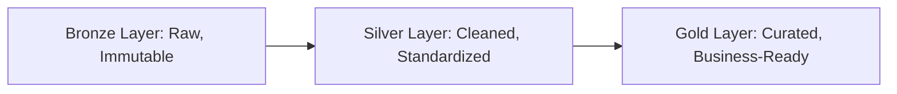
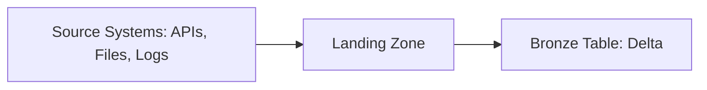
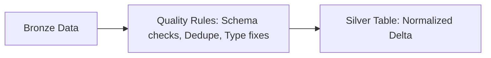
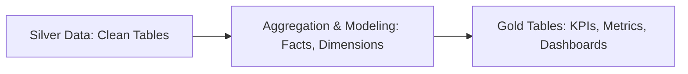
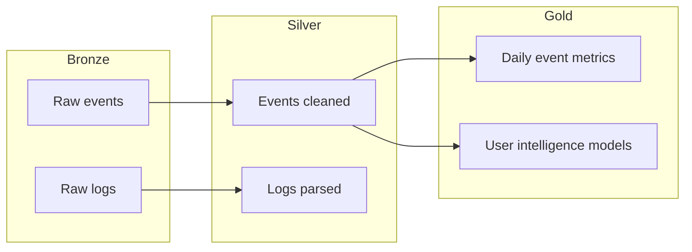

# Bronze–Silver–Gold Architecture

This document explains the Bronze–Silver–Gold (BSG) data refinement pattern used in lakehouse architectures. It includes diagrams, definitions, and Python/SQL examples tailored for Databricks and Delta Lake.

---

## High-level flow



The flow is strictly forward. Reprocessing always goes from Bronze upward.

---

## Layer definitions

### 1. Bronze layer (Raw)

Purpose: Store raw data exactly as ingested. Preserve original fields, schema, and content.

Characteristics:

* No business logic.
* No deduplication.
* Append-only (except controlled repair).
* Contains ingestion metadata.

Storage: Typically Delta, partitioned by date or load batch.

Example schema snapshot:

```text
{
  "event_id": "1234-xyz",
  "payload": "{... raw json ...}",
  "source_file": "events_20250101.json",
  "ingest_ts": "2025-01-01T12:15:00Z"
}
```

Example ingestion code:

```python
from pyspark.sql import functions as F

bronze_df = (
    spark.read.json("dbfs:/landing/events_raw/")
    .withColumn("ingest_ts", F.current_timestamp())
    .withColumn("source_file", F.input_file_name())
)

bronze_df.write.format("delta").mode("append").save("dbfs:/bronze/events")
```

Visualization of Bronze ingestion:



---

### 2. Silver layer (Clean)

Purpose: Convert raw input into validated, structured, and deduplicated datasets.

Characteristics:

* Enforces schema.
* Fixes types.
* Removes duplicates.
* Handles nulls and malformed rows.
* Adds business-aligned columns (e.g., timestamps, IDs).

Transformation example:

```python
from pyspark.sql import functions as F

bronze = spark.read.format("delta").load("dbfs:/bronze/events")

silver = (
    bronze
    .filter(F.col("payload").isNotNull())
    .dropDuplicates(["event_id"])
    .withColumn("event_ts", F.to_timestamp(F.col("payload.event_time")))
    .withColumn("user_id", F.col("payload.user.id"))
)

silver.write.format("delta").mode("overwrite").save("dbfs:/silver/events_clean")
```

Schema evolution example:

```sql
ALTER TABLE silver.events_clean SET TBLPROPERTIES(
  delta.schema.autoMerge.enabled = true
);
```

Visualization of Silver transformation:



---

### 3. Gold layer (Curated / Business)

Purpose: Build optimized domain models for analytics, ML features, and dashboards.

Characteristics:

* Aggregated or denormalized.
* High performance.
* Business terminology.
* Stable schema contracts.

Typical forms:

* Fact tables.
* Dimension tables.
* Weekly/daily aggregates.
* KPI calculations.

Example Gold aggregation:

```python
from pyspark.sql import functions as F

silver = spark.read.format("delta").load("dbfs:/silver/events_clean")

gold = (
    silver
    .groupBy("user_id", F.to_date("event_ts").alias("event_date"))
    .agg(F.count("*").alias("daily_events"))
)

gold.write.format("delta").mode("overwrite").save("dbfs:/gold/daily_user_events")
```

Example SQL view for BI:

```sql
CREATE OR REPLACE VIEW gold.user_metrics AS
SELECT
  user_id,
  event_date,
  daily_events,
  CASE WHEN daily_events > 10 THEN 1 ELSE 0 END AS is_active
FROM gold.daily_user_events;
```

Visualization of **Gold** modeling:



---

## Full architecture map



---

## Complete worked example: Event pipeline

### Input (Raw JSON)

```json
{
  "event_id": "a1",
  "user": {"id": 42},
  "time": "2025-01-01T10:00:00Z"
}
```

### Bronze

```python
bronze = spark.read.json("dbfs:/landing/events/")
bronze.write.format("delta").mode("append").save("dbfs:/bronze/events")
```

### Silver

```python
from pyspark.sql import functions as F

silver = (
    bronze
    .dropDuplicates(["event_id"])
    .withColumn("event_ts", F.to_timestamp("time"))
    .withColumn("user_id", F.col("user.id"))
    .select("event_id", "user_id", "event_ts")
)

silver.write.format("delta").mode("overwrite").save("dbfs:/silver/events")
```

### Gold

```python
gold = (
    silver
    .groupBy("user_id", F.to_date("event_ts").alias("event_date"))
    .agg(F.count("*").alias("events"))
)

gold.write.format("delta").mode("overwrite").save("dbfs:/gold/events_daily")
```

---

## Benefits summary

* Immutable raw history.
* Clear separation of concerns.
* Clean and validated intermediate datasets.
* Stable, consumer-oriented business models.
* Easier debugging and replay.
* Strong lineage with Delta time travel.
