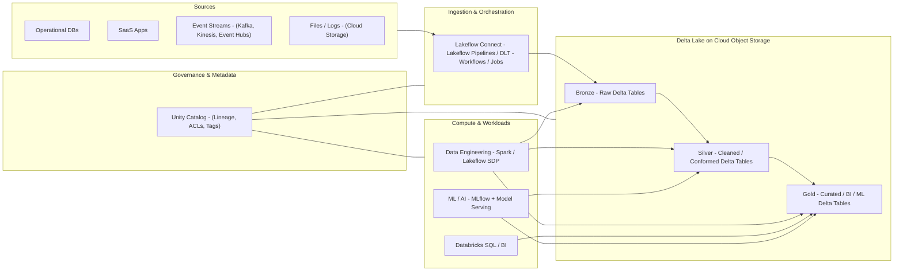
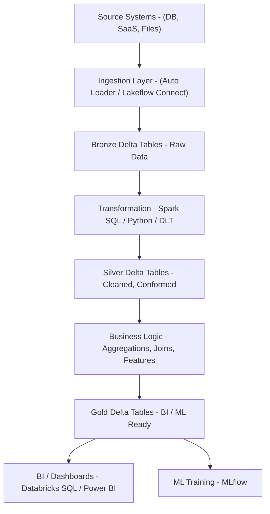
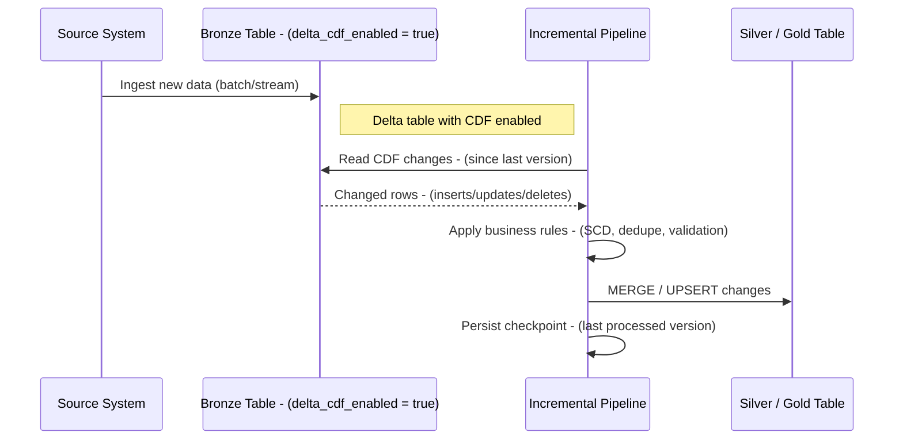
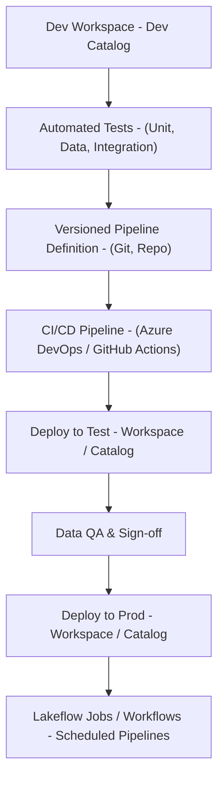
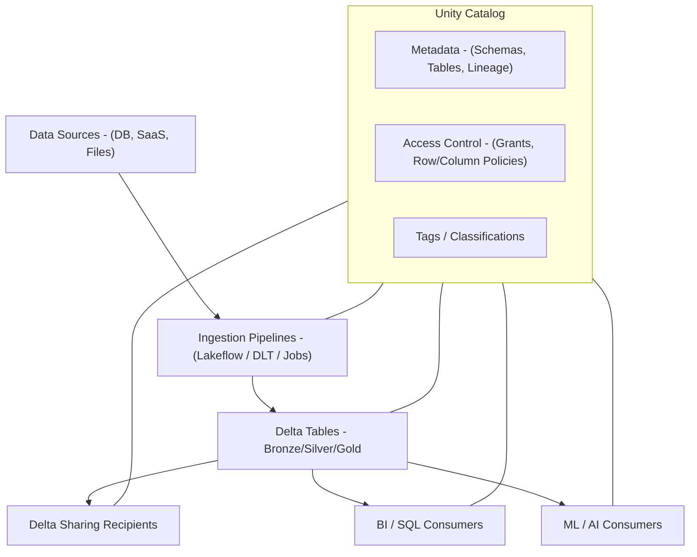

# Databricks

## Databricks Lakehouse Platform

The Databricks Lakehouse Platform unifies the best elements of data lakes and data warehouses in a single, open, cloud-native architecture. It allows enterprises to store structured, semi-structured, and unstructured data in open formats (Delta Lake on cloud object storage) while supporting analytics and AI workloads with full ACID transactions and elastic scalability.

The platform is built around a set of core components:

* Apache Spark: Distributed compute engine for batch and streaming.
* Delta Lake: Transactional storage layer on top of cloud object storage, providing ACID, schema enforcement, time travel, and scalable metadata.
* MLflow: Experiment tracking, model registry, and deployment workflows for ML and AI.
* Unity Catalog: Centralized governance for data, AI assets, and permissions across workspaces and clouds.
* Lakeflow (Pipelines, Declarative Pipelines, Connect, Jobs): Unified ingestion, transformation, and orchestration layer for batch and streaming pipelines. ([docs.databricks.com][1])

Data is typically organized using the medallion architecture:

* Bronze: Raw, append-only data from source systems (minimal transformation).
* Silver: Cleaned, conformed, and quality-checked data; standardized schemas.
* Gold: Curated, business-ready aggregates and feature tables for BI and ML.

This architecture supports SQL analytics, BI, data science, streaming, and ML/AI workloads on a single copy of data. ([Microsoft Learn][2])

### Lakehouse High-Level Architecture 

---

## ETL with Spark SQL and Python

Databricks provides several patterns to implement ETL (and ELT) workloads using Spark SQL and Python:

1. Notebook-driven ETL:

   * Imperative code in notebooks, scheduled with Jobs or Lakeflow Jobs.
   * Good for ad hoc work, prototypes, and smaller pipelines.

2. Delta Live Tables (DLT) and Lakeflow Spark Declarative Pipelines:

   * Declarative pipelines expressed in SQL or Python.
   * Engine handles incremental processing, orchestration, auto-scaling, retries, and data quality checks.
   * Supports streaming and batch, as well as time-travel backfills and Auto-Optimize behaviors. ([Databricks][3])

3. Lakeflow Connect:

   * Managed connectors for SaaS applications and databases (for example Salesforce, Workday, SQL Server, etc.).
   * Fully governed by Unity Catalog and typically powered by serverless compute, simplifying ingestion pipelines. ([Microsoft Learn][4])

4. Classic Jobs + Spark:

   * Jobs orchestrate notebooks, Python scripts, SQL queries, and JAR tasks.
   * Flexible for combining compute tasks (SQL, ETL, ML training, model scoring).

### Key ETL Capabilities

* Batch, streaming, and micro-batch processing with Structured Streaming.
* Auto Loader for incremental file ingestion from cloud storage based on directory listings or notifications.
* Schema evolution and enforcement for Delta tables.
* Idempotent job design using checkpoints, write modes, and transactional Delta updates.
* Built-in data quality enforcement with expectations (in DLT/Lakeflow pipelines).
* Orchestration with Lakeflow Jobs / Workflows for complex DAGs.

### Example: ETL Flow 

### Spark SQL / Python Patterns

Typical patterns:

* Read source data:

  * Files: `spark.read.format("cloud_files")` or `read_files()` in SQL for Auto Loader.
  * JDBC / connectors: `spark.read.format("jdbc")` or managed Lakeflow connectors.
* Apply transformations using DataFrame API or SQL:

  * Joins, filters, window functions, aggregations.
  * Standardization of data types, null handling, and business rules.
* Write to Delta tables:

  * `df.write.format("delta").mode("append").saveAsTable("catalog.schema.table")`.
  * Use `MERGE INTO` for upserts where appropriate.

---

## Incremental Data Processing

Incremental processing is fundamental for cost-effective, low-latency pipelines. Instead of reprocessing entire datasets, pipelines process only new or changed records.

### Change Data Feed (CDF)

Delta Lake Change Data Feed (CDF) captures row-level inserts, updates, and deletes for a table, including:

* Operation type (insert, update, delete).
* Change version (table version).
* Change timestamp.
* Before and after images (for updates, depending on configuration).

To use CDF:

1. Enable CDF on the table (for example via table property).
2. Read changes using the `table_changes` APIs or specific SQL functions.
3. Track high-watermark (last processed version or timestamp) in a checkpoint or metadata table.
4. Apply changes downstream (for example via MERGE/UPSERT logic into target tables).

Key benefits:

* Efficient incremental updates for downstream tables.
* Accurate handling of deletes and updates.
* Lower compute cost than full reloads for large tables.

CDF is particularly useful for:

* Slowly changing dimensions (SCD) and dimensional modeling.
* Replicating changes from operational databases into the lakehouse.
* Maintaining materialized aggregates and feature tables.

### Lakeflow Incremental Flows

Lakeflow Spark Declarative Pipelines introduce an incremental model based on flows: ([docs.databricks.com][1])

* Append flows:

  * Incrementally append new data to target tables.
  * Suitable for log-style or event data where records are immutable.

* Auto CDC flows:

  * Automatically process change data capture feeds, typically into streaming tables.
  * Handle inserts, updates, and deletes across multiple runs or in continuous mode.
  * Allow multiple auto CDC flows to target a single streaming table.

* Streaming tables and materialized views:

  * Streaming tables: Delta tables with native support for incremental processing and continuous execution.
  * Materialized views: Derived tables with incremental refresh semantics, often powered by serverless pipelines.

Incremental ETL provides:

* Lower latency for consuming systems.
* Better cost efficiency by avoiding full recomputation.
* Resilient recovery from failures (replay only the missing changes).
* Clear separation of data tiers (bronze, silver, gold) with atomic updates. ([Databricks][3])

### Incremental Pipeline Sequence 

---

## Production Pipelines

Production-grade pipelines on Databricks must address performance, reliability, observability, and governance.

### Design Principles

* Clear separation of environments:

  * At minimum: dev, test, prod workspaces or catalogs.
  * Use different Unity Catalog catalogs or schemas to isolate environments.

* Medallion architecture:

  * Bronze: source-of-truth ingestion.
  * Silver: curated, validated, conformed entities.
  * Gold: business-level aggregates and application-specific models.

* Incremental-first design:

  * Prefer streaming or micro-batch pipelines.
  * Use CDF, streaming tables, or watermark-based filters instead of full reloads.

### Performance and Storage

* Partitioning:

  * Partition on columns with high cardinality but not too high (for example date, region, tenant).
  * Avoid over-partitioning (too many small files).
  * For large tables, combine partitioning with ZORDER for common filter/join keys.

* File sizing:

  * Use Auto Optimize or `OPTIMIZE` operations to maintain target file sizes (for example 128 MB+).
  * Compact small files created by small micro-batches.

* Streaming-specific tuning:

  * Configure trigger intervals (processing time or continuous).
  * Use RocksDB state store where large aggregations or joins are required.
  * Manage state retention with watermarks.

### Reliability and Orchestration

* Checkpointing:

  * Use durable checkpoint locations in cloud storage for all streaming jobs.
  * Avoid sharing checkpoints across unrelated queries.

* Orchestration:

  * Use Lakeflow Jobs / Workflows to define DAGs across pipelines, notebooks, and SQL.
  * Implement branching, retries, timeout policies, and alerting on failures. ([Databricks][3])

* Backfills and reprocessing:

  * Design pipelines so that backfills can be launched by re-running historical time windows or older table versions (using Delta time travel).
  * Store configuration (for example date ranges) in parameters or control tables.

### Observability and Data Quality

* Data quality checks:

  * In DLT/Lakeflow pipelines, define expectations (for example `EXPECT col IS NOT NULL ON VIOLATION DROP ROW`).
  * Track expectation metrics per run.

* Monitoring:

  * Use Lakehouse Monitoring or equivalent metrics dashboards for:

    * Latency and throughput.
    * Error rates and failed batches.
    * Data volume anomalies.

* Lineage:

  * Rely on Unity Catalog lineage graphs to see end-to-end data flows (sources, intermediate tables, downstream consumers).

### CI/CD and Deployment 

---

## Data Governance

Unity Catalog is the centralized governance layer for Databricks:

* Three-level namespace:

  * `catalog.schema.table`, shared across workspaces.
* Securable objects:

  * Catalogs, schemas, tables, views, functions.
  * Volumes, connections, pipelines, and ML models.
* Access control:

  * Fine-grained privileges at catalog, schema, table, column, and row levels.
  * ANSI SQL GRANT/REVOKE syntax integrated with identity providers.
* Data lineage:

  * Automatic tracking of read and write dependencies between tables, views, and jobs.
  * Visual lineage graphs for impact analysis and audits.
* Tags and classifications:

  * Ability to classify and tag data (for example GDPR, PII) and apply policies.

Unity Catalog integrates tightly with Lakeflow, DLT, and Lakeflow Connect so that ingestion pipelines, streaming tables, and materialized views are governed consistently. ([Microsoft Learn][4])

### Lakehouse Federation

Lakehouse Federation allows queries against external SQL sources (for example, other databases or warehouses) under Unity Catalog governance:

* External data remains in place.
* Access is controlled through Unity Catalog.
* Lineage includes federated queries as part of the same governance graph.

### Delta Sharing

Delta Sharing provides secure data sharing capabilities:

* Share Delta tables across workspaces, organizations, or platforms.
* Recipients can consume shared tables without needing to copy data.
* Shares are governed centrally, with revocable access.

### Governance Overview 

---

## Enhanced Preparation Content Summary

| Area                   | Enhancement Highlights                                                                                                                             |
| ---------------------- | -------------------------------------------------------------------------------------------------------------------------------------------------- |
| Lakehouse Platform     | Added medallion architecture, clarified core components (Spark, Delta, MLflow, Unity Catalog, Lakeflow), and end-to-end architecture diagram.      |
| ETL (Spark SQL/Python) | Detailed ETL patterns (notebooks, DLT, Lakeflow Declarative Pipelines, Lakeflow Connect) and provided pipeline flow diagram.                       |
| Incremental Processing | Expanded on CDF semantics, streaming tables, Auto CDC flows, and added incremental sequence diagram and pipeline design guidance.                  |
| Production Pipelines   | Added environment strategy, performance tuning, backfills, data quality, observability, and CI/CD deployment diagram.                              |
| Governance             | Deepened Unity Catalog coverage (3-level namespace, ACLs, lineage, tags, federation, Delta Sharing) and linked governance to pipelines end-to-end. |

---

## Prerequisites

Recommended prerequisites for working effectively with Databricks Lakehouse:

* SQL:

  * DDL and DML: CREATE TABLE, ALTER TABLE, INSERT, UPDATE, MERGE, DELETE.
  * Window functions, aggregations, joins, and common table expressions.

* Python and Spark:

  * Spark DataFrame API (transformations and actions).
  * Basic familiarity with PySpark Structured Streaming.
  * Notebook execution, cluster configuration, and Job setup.

* Data engineering fundamentals:

  * File-based storage (Parquet, JSON, CSV) and partitioning.
  * Incremental ingestion patterns (watermarks, CDC, CDF).
  * Batch vs streaming trade-offs.
  * Basic DevOps concepts: CI/CD, environment promotion, parameterization.

* Governance and security basics:

  * Role-based access control.
  * Data sensitivity classification.
  * Regulatory requirements relevant to the organization (for example GDPR, HIPAA, PCI).

---

[1]: https://docs.databricks.com/aws/en/ldp/flows?utm_source=chatgpt.com "Load and process data incrementally with Lakeflow Spark ... - Databricks"
[2]: https://learn.microsoft.com/en-us/azure/databricks/lakehouse-architecture/reference?utm_source=chatgpt.com "Lakehouse reference architectures (download) - Azure Databricks ..."
[3]: https://www.databricks.com/blog/introducing-databricks-lakeflow?utm_source=chatgpt.com "Introducing Databricks Lakeflow: A unified, intelligent solution for ..."
[4]: https://learn.microsoft.com/en-us/azure/databricks/ingestion/lakeflow-connect/?utm_source=chatgpt.com "Managed connectors in Lakeflow Connect - Azure Databricks"
