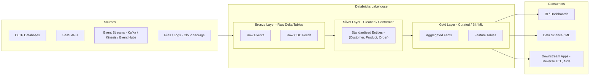
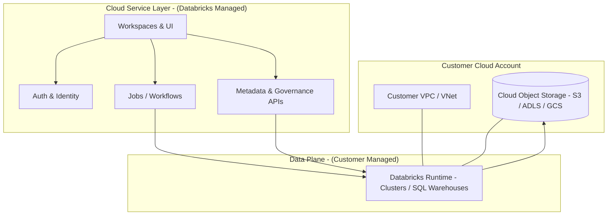
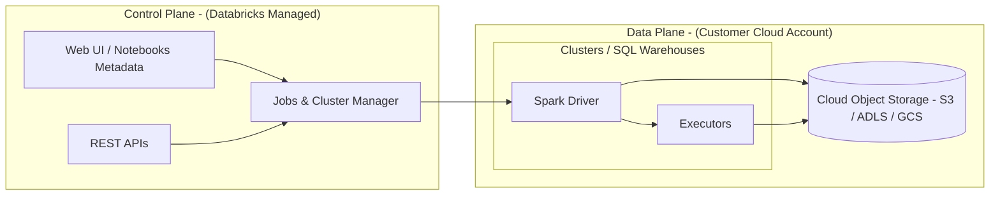
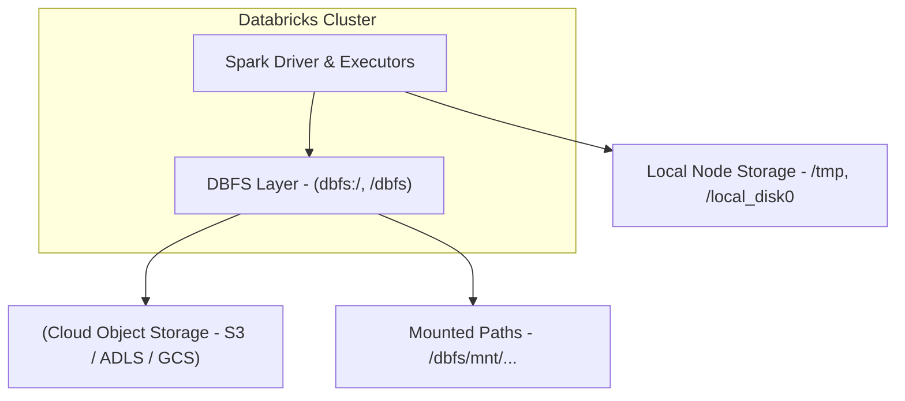
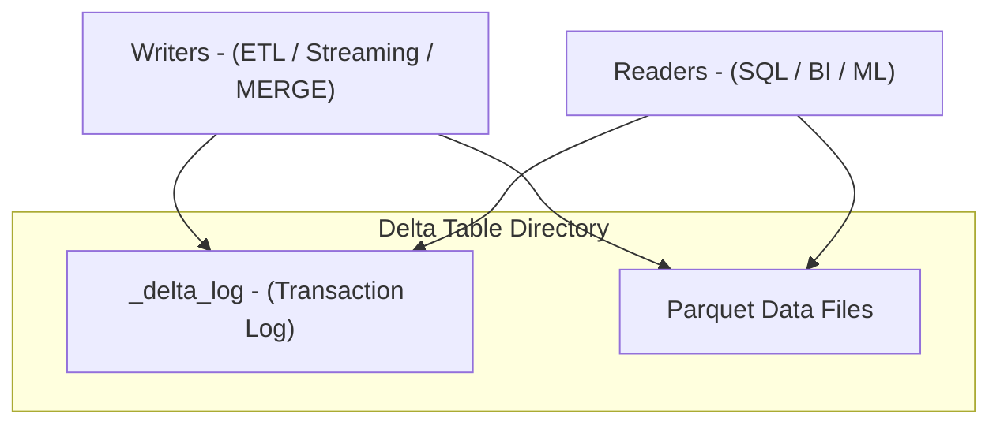
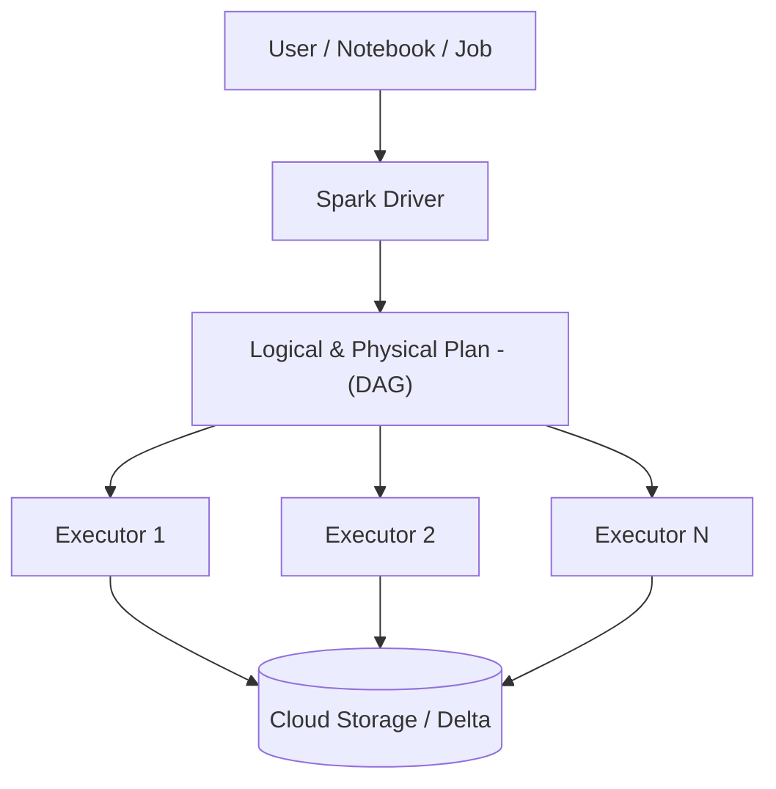
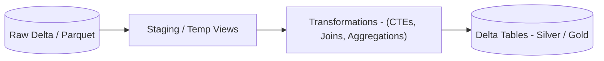
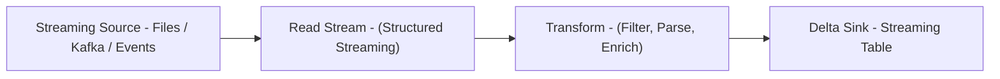

# Databricks Lakehouse Platform

The Databricks Lakehouse Platform is a multi-cloud data and AI platform based on Apache Spark. It unifies data engineering, data science, analytics, and machine learning (ML) using the Lakehouse architecture. This model combines the openness and flexibility of data lakes with the governance, performance, and semantics of data warehouses, while running directly on cloud object storage.

---

## 1. Lakehouse Architecture

### 1.1 Characteristics

A Lakehouse architecture integrates capabilities from both data lakes and data warehouses.

**Data Lake Capabilities**

* Schema-on-read and schema-on-write support
* Storage of raw, semi-structured, and unstructured data
* Native support for ML and AI tooling on top of files
* Use of open file formats (Parquet, ORC, JSON, etc.)
* Direct integration with cloud object storage (S3, ADLS, GCS)

**Data Warehouse Capabilities**

* ACID transactions via Delta Lake transaction logs
* Indexing and caching for query acceleration
* Fine-grained access control, often via Unity Catalog
* High-performance SQL query engine and BI optimizations
* Time travel and reproducible analytics

### 1.2 Medallion Architecture (Bronze / Silver / Gold)

Databricks commonly uses a medallion (multi-hop) architecture:

* **Bronze**: Raw ingested data, minimally processed, append-only.
* **Silver**: Cleaned, conformed, and quality-checked data; standardized schemas.
* **Gold**: Business-level, curated data products; aggregates for BI and ML.

This layered approach isolates raw data from business logic, simplifies lineage, and supports incremental processing.

### 1.3 Lakehouse Overview 



### 1.4 Use Cases

Typical lakehouse use cases:

* Unified ETL/ELT pipelines across batch and streaming
* Interactive dashboards for business stakeholders
* Ad hoc analytics and exploration
* ML feature engineering, model training, and model serving
* Data sharing across teams and external partners

---

## 2. Platform Architecture

Databricks is structured across three primary architectural layers that sit on top of the customer’s cloud account.

### 2.1 Cloud Service Layer

**Purpose**: Central control and management plane.

**Responsibilities**:

* Workspace and user management
* Authentication and SSO integration (IdPs, SCIM, etc.)
* Web-based UI and REST APIs
* Job orchestration and scheduling
* Cluster, SQL warehouse, and pipeline lifecycle management
* Central configuration and governance integration

Supports deployment on:

* AWS
* Azure
* Google Cloud Platform

### 2.2 Databricks Runtime

The Databricks Runtime is the optimized execution environment for compute clusters and SQL warehouses.

**Core Components**:

* Apache Spark (optimized)
* Delta Lake libraries
* Structured Streaming
* Built-in system libraries and connectors
* Optional ML runtimes with MLlib, popular Python libraries, and GPU support

**Key Features**:

* High-performance batch and stream processing
* Native support for:

  * Languages: SQL, Python, Scala, Java, R
  * Workloads: ETL, ML, BI, streaming, feature engineering
* Integration with Unity Catalog for secure data access

### 2.3 Databricks Workspace

**Purpose**: End-user experience and collaboration surface.

**Capabilities**:

* Interactive notebooks (SQL, Python, Scala, R)
* Repos integration for Git-based workflows
* Jobs and Workflows for scheduled pipelines
* Visualizations and dashboards
* Experiment tracking and model management (with MLflow)
* Asset management: queries, dashboards, alerts, models, functions

### 2.4 Platform Architecture Diagram 



---

## 3. Control Plane vs Data Plane

Databricks uses a shared responsibility model separating the control plane from the data plane for security and isolation.

### 3.1 Control Plane (Databricks Managed)

Resides in Databricks-owned cloud accounts.

Contains:

* Web UI and notebooks metadata
* Job scheduler, cluster manager, and orchestration services
* Workspace configurations, access policies, and some metadata
* REST APIs and management services

This plane does not store user data files; it stores metadata and configuration.

### 3.2 Data Plane (Customer Managed)

Resides in the customer’s cloud account.

Contains:

* Compute VMs (clusters, SQL warehouses)
* Spark drivers and executors
* Databricks Runtime
* Cloud object storage buckets/containers used as primary data storage
* DBFS root and mounted paths

All data processing and data access happen in this plane. Databricks services do not directly read user data; instead, they instruct compute in the customer’s account to perform operations.

### 3.3 Control vs Data Plane Diagram 



---

## 4. Databricks File System (DBFS)

### 4.1 Definition

DBFS is a distributed file system abstraction layer over the underlying cloud storage. It presents a POSIX-like file system to clusters, while backing data by object storage.

### 4.2 Characteristics

* Auto-mounted in all clusters under `/dbfs` on the driver.
* Accessible via CLI, notebooks, and APIs.
* Paths prefixed with `dbfs:/` represent locations in object storage managed or referenced by DBFS.
* Supports mounting external storage locations (for example `dbfs:/mnt/...`).

### 4.3 DBFS Features

* Auto-mounted and always available in Databricks clusters.
* Persistent across cluster lifecycles when backed by cloud storage.
* Unified access to:

  * DBFS root
  * Mounted external sources
  * Local ephemeral paths on cluster nodes (for temporary data)

### 4.4 DBFS Diagram 



### 4.5 Example: Copying to DBFS

```sql
-- Copy a CSV file from external storage into DBFS path
COPY INTO 'dbfs:/mnt/mydata/data.csv'
FROM 's3://mybucket/data/data.csv'
FILEFORMAT = CSV;
```

---

## 5. Delta Lake Integration

### 5.1 Overview

Delta Lake is the transactional storage layer that brings reliability and warehouse-like features to data lakes.

Key properties:

* ACID transactions on cloud object storage
* Schema enforcement and evolution
* Time travel using table versions or timestamps
* Scalable metadata and efficient file management

### 5.2 Delta Table Structure

A Delta table consists of:

* A directory of Parquet data files
* A `_delta_log` directory containing:

  * JSON and checkpoint files describing table changes
  * Transaction logs recording adds/removes and schema changes

### 5.3 Delta Operations

Common operations:

* `CREATE TABLE ... USING DELTA`
* `MERGE INTO` for upserts
* `VACUUM` for old file cleanup
* `OPTIMIZE` for file compaction
* `DESCRIBE HISTORY` for version inspection

### 5.4 Delta Lake Diagram 



### 5.5 Example: Creating a Delta Table

```sql
CREATE TABLE delta_table
USING DELTA
LOCATION 'dbfs:/mnt/delta/my_table'
AS
SELECT *
FROM parquet.`dbfs:/mnt/raw/input_data`;
```

---

## 6. Apache Spark Integration

Databricks is tightly integrated with Apache Spark and ships an optimized runtime.

### 6.1 Spark Features

* In-memory distributed computation
* DAG-based execution engine and query planner
* Adaptive Query Execution (AQE) for dynamic optimizations (join strategies, shuffle partitions)
* Support for:

  * Spark SQL
  * DataFrame API
  * MLlib
  * GraphX
  * Structured Streaming

### 6.2 Supported Data Types

* Structured:

  * CSV, Parquet, Avro, Delta
* Semi-structured:

  * JSON, XML
* Unstructured:

  * Binary files, images, video, free-form text, logs

### 6.3 Spark Execution Diagram 



This illustrates driver-based coordination with multiple executors reading and writing distributed data.

---

## 7. SQL Operations in Databricks

Databricks SQL extends standard ANSI SQL with Delta-specific semantics and cloud-native features.

### 7.1 CTAS (Create Table As Select)

CTAS is used to create a new table and populate it with the result of a query.

```sql
CREATE TABLE sales_summary
USING DELTA
AS
SELECT product_id, SUM(revenue) AS total_revenue
FROM sales_data
GROUP BY product_id;
```

Notes:

* In some runtime configurations, CTAS may have limited support for advanced options such as explicit partitioning, table properties, or specific storage locations. In those cases, the standard pattern is:

  * `CREATE TABLE` with schema, options, and location.
  * `INSERT INTO` to populate.

### 7.2 DDL and DML Support

Databricks supports standard DDL (Data Definition Language):

* `CREATE TABLE`, `CREATE VIEW`
* `ALTER TABLE` (rename, add/drop column, set location)
* `DROP TABLE`, `DROP VIEW`

And DML (Data Manipulation Language):

* `INSERT INTO`, `INSERT OVERWRITE`
* `UPDATE`
* `DELETE`
* `MERGE INTO` (Delta specific)

### 7.3 Example: MERGE INTO for Upserts

```sql
MERGE INTO target_table AS t
USING updates_table AS u
ON t.id = u.id
WHEN MATCHED THEN
  UPDATE SET t.value = u.value
WHEN NOT MATCHED THEN
  INSERT (id, value) VALUES (u.id, u.value);
```

This pattern is typically used in CDC ingestion, dimension table maintenance, and incremental aggregation flows.

### 7.4 SQL ETL Pipeline Diagram 



---

## 8. Streaming Workloads

Databricks supports real-time processing using Spark Structured Streaming and Delta.

### 8.1 Core Concepts

* Input sources:

  * Auto Loader on cloud files
  * Kafka, Event Hubs, Kinesis
  * Socket and custom sources
* Output sinks:

  * Delta tables
  * Memory, console (for debugging)
  * Other connectors where applicable
* Incremental processing:

  * Only new data since the previous trigger is processed.
* Exactly-once semantics (when using Delta sinks).

### 8.2 Example: Read Stream (Files via Auto Loader)

```sql
CREATE OR REPLACE TEMP VIEW live_data
USING cloudFiles
OPTIONS (
  path "dbfs:/mnt/streaming/input/",
  format "json"
);
```

### 8.3 Example: Write Stream (Delta Live Tables style)

```sql
CREATE STREAMING LIVE TABLE cleaned_data
AS
SELECT *
FROM STREAM(live_data)
WHERE is_valid = TRUE;
```

This represents a streaming transformation that continuously filters valid records into a managed Delta table.

### 8.4 Structured Streaming Pipeline Diagram 



---

## Summary

This extended documentation formalizes the Databricks Lakehouse Platform from architectural and operational perspectives:

* The Lakehouse combines data lake flexibility with warehouse-grade reliability using Delta Lake and a medallion architecture.
* Platform architecture separates control and data planes, with Databricks managing orchestration while data and compute remain in the customer’s cloud account.
* DBFS provides a convenient, unified file system abstraction on top of cloud storage.
* Delta Lake enables ACID, time travel, schema enforcement, and efficient upserts.
* Apache Spark in Databricks Runtime powers distributed batch, streaming, and ML workloads.
* Databricks SQL supports full DDL/DML, CTAS, and MERGE patterns for robust ETL/ELT design.
* Structured Streaming and Delta integration allow unified batch and streaming processing against the same tables.

The included Mermaid diagrams provide a visual reference for lakehouse layers, platform architecture, control vs data plane, DBFS, Delta internals, Spark execution, SQL pipelines, and streaming flows.
