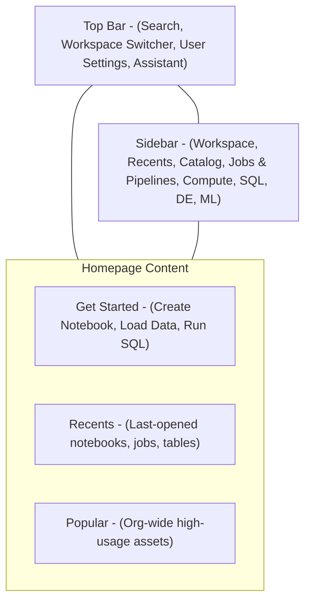
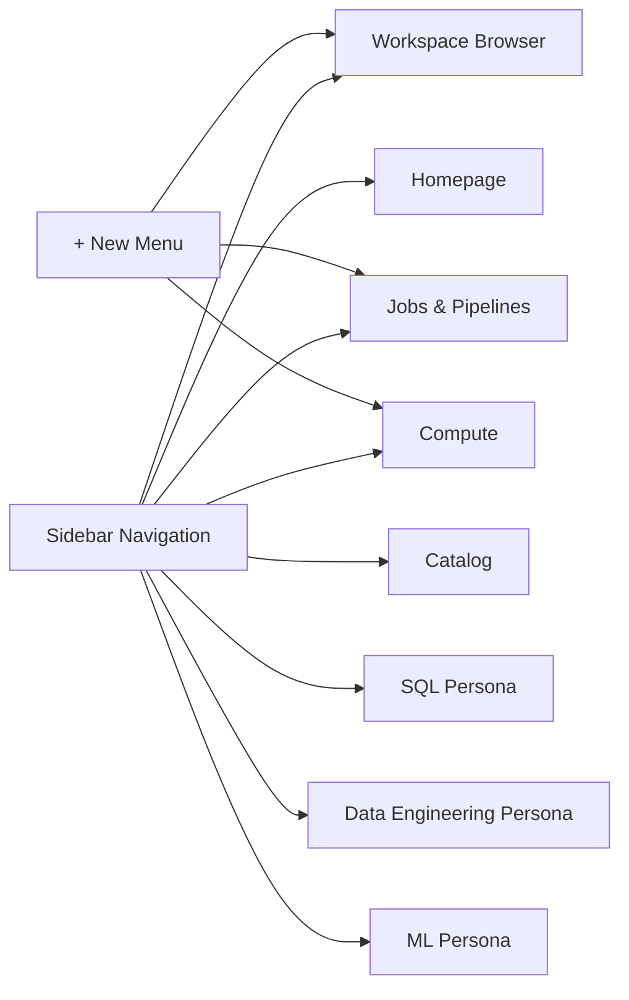
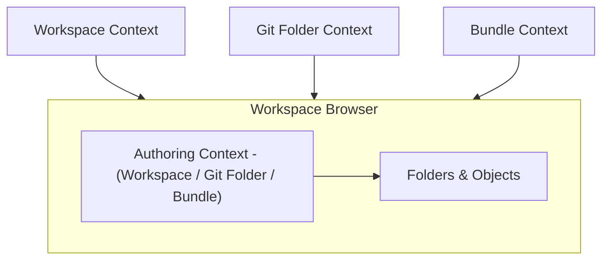
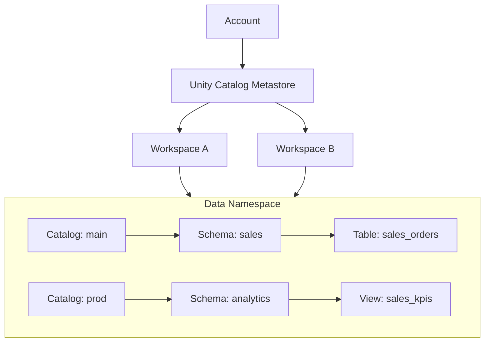
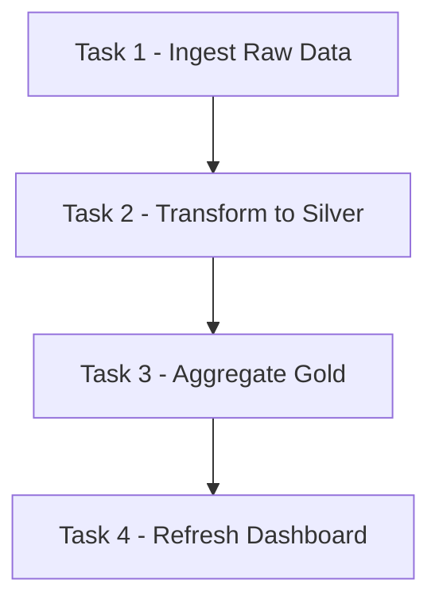
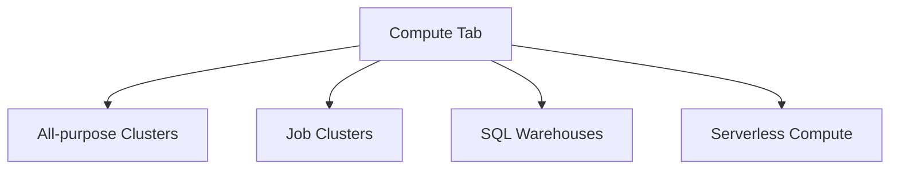
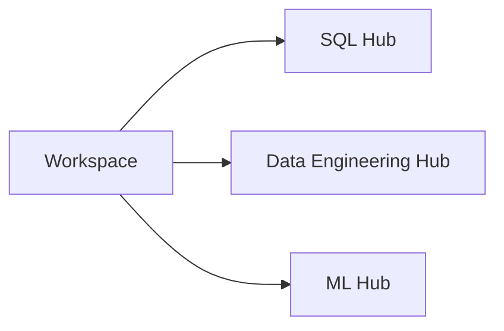
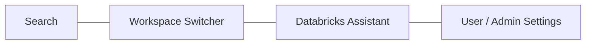
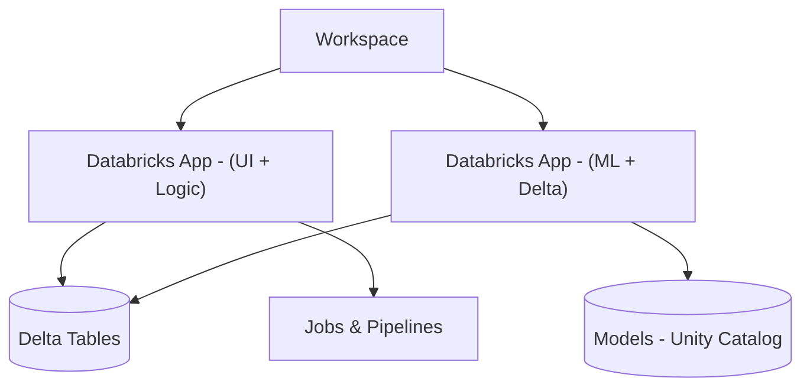
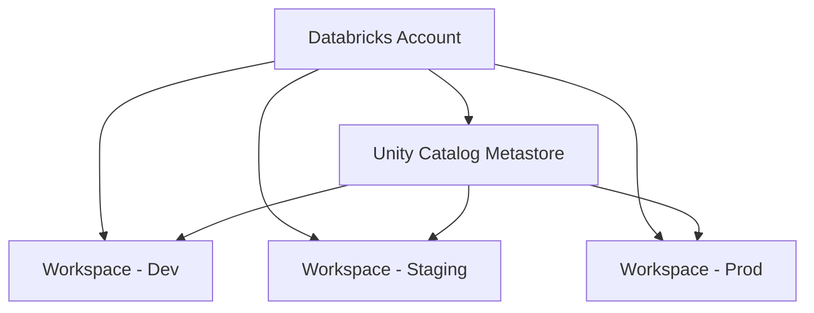

# Databricks Workspace Overview

## 1. Workspace Homepage

The Workspace homepage is the primary landing page for users in a Databricks workspace. It is persona-aware and entitlement-aware, meaning what you see depends on your role and enabled features. ([docs.databricks.com][1])

Typical tiles and sections:

* Get started

  * Quick links to create a notebook, ingest data, open SQL editor, or explore samples.
* Recents

  * Objects you interacted with recently: notebooks, dashboards, jobs, tables, ML experiments, etc.
* Popular

  * Frequently accessed assets across your organization over the last 30 days (entitlement-aware).
* Learning / Help / Docs

  * Links to product documentation, tutorials, and release notes.

### 1.1 Homepage Layout 

---

## 2. Sidebar Navigation and + New Menu

The unified sidebar provides consistent navigation across personas (SQL, Data Engineering, Machine Learning). Items requiring extra entitlements are shown with a lock icon. ([docs.databricks.com][1])

Core sidebar sections:

* Workspace: Notebooks, folders, repos, dashboards, apps, and other workspace objects.
* Recents: Cross-object recent activity.
* Catalog: Unity Catalog assets (catalogs, schemas, tables, views, models, volumes).
* Jobs & Pipelines: Orchestration of jobs, Lakeflow pipelines, and SQL pipelines.
* Compute: Clusters, SQL warehouses, serverless compute, and policies.
* Marketplace: Partner connectors, data products, and extensions (where enabled).
* Persona hubs: SQL, Data Engineering, Machine Learning.

The + New menu is context-aware:

* Workspace objects: Notebook, Dashboard, SQL Query, Alert, Repo, App.
* Orchestration: Job, Pipeline.
* Compute: Cluster, SQL warehouse (subject to permissions). ([docs.databricks.com][1])

### 2.1 Navigation Model 

---

## 3. Workspace Browser and Object Management

The workspace browser is the central file-tree style view for all workspace objects. ([docs.databricks.com][2])

Supported objects include:

* Notebooks
* Folders and Git folders
* SQL queries, dashboards, and alerts
* MLflow experiments and models
* Databricks apps
* Files and libraries
* Asset bundles (where enabled)

Key behaviors:

* Nested folders with drag-and-drop reorganization.
* Git folders and bundles appear alongside workspace folders, but with a distinct authoring context.
* Context menus support:

  * Rename, move, delete.
  * Permissions (sharing with users, groups, service principals).
  * Export/import.
* Name uniqueness:

  * Full filenames (with extensions) must be unique within a folder.

### 3.1 Authoring Contexts 

The authoring context determines which files are visible and which repo or bundle you are editing. Switching between Workspace / Git / Bundle contexts is supported via a context dropdown. ([docs.databricks.com][2])

---

## 4. Recents and Popular Sections

* Recents:

  * Shows objects you interacted with recently (across personas).
  * Includes notebooks, dashboards, tables, jobs, pipelines, alerts, ML experiments, and models. ([docs.databricks.com][1])

* Popular:

  * Shows org-wide highly interacted objects over the last 30 days.
  * Useful for discovering canonical dashboards, notebooks, and tables.

Typical usage in a team:

* Navigate via Recents during active development.
* Use Popular to locate shared, de facto standard assets (production dashboards, canonical pipelines).

---

## 5. Catalog Tab (Unity Catalog Integration)

The Catalog tab surfaces Unity Catalog’s three-level namespace and extended asset types. ([docs.databricks.com][3])

Visible objects:

* Catalogs
* Schemas
* Tables and views
* Volumes
* Functions and models (Unity Catalog models)
* External locations, connections (with privileges)

Key capabilities:

* Centralized access policies enforced per catalog, schema, table, column, and sometimes row (ABAC/row filters where enabled).
* Lineage visualization:

  * See upstream and downstream dependencies for tables and queries.
* Data discovery:

  * Search and filter assets by name, tag, owner, and type.

### 5.1 Unity Catalog Hierarchy 

---

## 6. Jobs & Pipelines (Workflows) Tab

This tab centralizes orchestration for:

* Jobs (multi-task or single-task).
* Lakeflow Spark Declarative Pipelines / Data ingestion flows.
* SQL pipelines (where available). ([Microsoft Learn][4])

Capabilities:

* Create jobs that chain notebooks, SQL queries, Python scripts, or JAR tasks.
* Define task dependencies (DAG), retries, timeout policies, and notifications.
* Monitor job runs, logs, metrics, and run history.
* Configure triggers:

  * Schedule (cron/interval).
  * Continuous or triggered on source updates (where supported).
* Manage Lakeflow pipelines, including sources, transformations, and targets.

### 6.1 Job DAG 

This corresponds directly to the Jobs & Pipelines UI, where each node is a task and edges represent dependencies.

---

## 7. Compute Tab

The Compute tab manages all execution environments. ([docs.databricks.com][1])

Types:

* All-purpose clusters:

  * Interactive development, notebooks, ad hoc jobs.
  * Support autoscaling, spot/low-priority instances, and various access modes.
* Job clusters:

  * Created per job run, destroyed when complete.
  * Reduce configuration drift and idle costs.
* SQL warehouses:

  * Optimized for SQL/BI queries.
  * Can be serverless or classic (depending on cloud and account configuration).

Key features:

* Cluster policies:

  * Limit instance types, autoscaling bounds, libraries, network settings.
  * Enforce cost and security constraints per persona or team.
* Autoscaling:

  * Scale based on workload.
* Retention and pinning:

  * Inactive compute resources are cleaned up after retention windows; pinning prevents automatic deletion of certain configurations (for example favorite clusters). ([docs.databricks.com][5])

### 7.1 Compute View 

---

## 8. SQL, Data Engineering, Machine Learning Tabs

These persona-based hubs provide focused experiences over the same underlying workspace.

* SQL:

  * SQL editor, query history, dashboards, alerts, and SQL endpoints.
  * Tailored for BI developers and data analysts.

* Data Engineering:

  * Focus on Jobs & Pipelines, ingestion flows, and monitoring pipeline runs.
  * Quick access to compute and core engineering workflows.

* Machine Learning:

  * MLflow experiments, registered models, feature store, and model serving endpoints.
  * Typically out of scope for the basic Data Engineer Associate exam but highly relevant in production ML setups. ([docs.databricks.com][1])

### 8.1 Persona Hubs 

Each hub is essentially a filtered lens over the same object graph (jobs, queries, tables, etc).

---

## 9. Top Bar Controls

The top bar is global across the workspace and provides:

* Search:

  * Unified search over notebooks, repos, tables, dashboards, jobs, pipelines, apps, experiments, and more.
  * Filtering by type, owner, time, and tags. ([docs.databricks.com][1])
* Workspace switcher:

  * Fast switching between workspaces in the same account.
  * Commonly used to move between dev, test, and prod workspaces. ([docs.databricks.com][6])
* User / Settings menu:

  * Personal settings: theme, language, default landing page.
  * Access tokens, SSH keys (where applicable), email preferences.
  * Admins see workspace-level settings and admin consoles. ([docs.databricks.com][5])
* Databricks Assistant:

  * AI assistant integrated into notebooks, SQL, and other views.
  * Assists with code generation, query optimization, documentation lookup, and troubleshooting (but should be cross-checked against docs for critical workflows). ([Microsoft Learn][7])

### 9.1 Top Bar Diagram 

---

## 10. Workspace-Level Controls and Security

Admins use workspace settings to enforce behavior, security posture, and feature access. ([docs.databricks.com][5])

Important categories:

* Storage and notebooks:

  * Configure notebook result storage locations.
  * Purge workspace storage.
  * Control DBFS browser availability and optionally disable DBFS root and mounts for strict environments. ([docs.databricks.com][5])
* Security:

  * Security headers and workspace access for Databricks personnel.
  * Enforce instance metadata service configurations.
  * Manage instance profiles and access modes.
* Compute and terminals:

  * Enable or disable Web Terminal.
  * Default access mode for jobs compute.
  * Manage SSD usage and enforced cluster types.
* Feature flags and previews:

  * Manage previews (Assistant modes, new UI features, etc.).
  * Toggle third-party analytics and extended telemetry.

### 10.1 Workspace Bindings and Credentials

Unity Catalog can bind storage credentials and external locations to specific workspaces (workspace bindings). This allows: ([Microsoft Learn][8])

* Restricting which workspaces can create or use external locations backed by a given credential.
* Isolating sensitive storage (for example, PII catalogs) to only specific workspaces.

Workspace bindings are evaluated when granting privileges or creating external locations; after creation, the external location functions independently of the binding until privileges are changed.

---

## 11. Databricks Apps

Databricks Apps, now generally available, allow you to build full-stack interactive applications directly in the workspace. ([docs.databricks.com][9])

Characteristics:

* Built on managed infrastructure, with automatic scaling and security.
* Integrate with:

  * Delta Lake tables
  * Unity Catalog assets
  * ML models and serving endpoints
  * Notebooks and workflows
* Shared as workspace objects with permissions (view, run, manage).

Typical uses:

* Internal self-service tools (data quality dashboards, ops consoles).
* Guided ML/analytics workflows for non-technical users.
* Thin production-facing data apps for internal stakeholders.

### 11.1 Apps in Workspace 

---

## 12. Workspaces at Account Level

Databricks deployments are organized around an account that can contain multiple workspaces, often aligned to environments, regions, or business units. ([docs.databricks.com][3])

Typical patterns:

* Environment separation:

  * dev, test, staging, prod workspaces.
* Data domain separation:

  * financial, HR, marketing workspaces.
* Region or legal boundary separation:

  * EU-only workspaces, US-only workspaces, etc.

Unity Catalog provides a unified metastore and governance plane across these workspaces, while workspace bindings, cluster policies, and storage patterns enforce isolation.

### 12.1 Account-Level Diagram 

---

## 13. Best Practice Tips

* Use separate workspaces for dev / staging / prod to minimize risk and simplify changes.
* Use Git Repos or Git folders for version control of notebooks and workflows instead of treating the workspace as a source-of-truth.
* Apply folder-level and object-level ACLs to separate sandbox and production assets.
* Combine:

  * Workspace-level settings (security and previews).
  * Cluster policies (compute governance).
  * Unity Catalog (data governance).
* Use workspace bindings for storage credentials and external locations to constrain sensitive data to specific workspaces and environments. ([Microsoft Learn][8])

---

## 14. Certification Alignment – Data Engineer Associate

For the Databricks Data Engineer Associate exam, relevant workspace topics include:

* Navigating the workspace browser and folder hierarchy.
* Creating and configuring clusters and SQL warehouses under Compute (including policies and autoscaling basics).
* Creating, scheduling, and monitoring jobs and pipelines in Jobs & Pipelines.
* Using the SQL persona for querying data and managing dashboards.
* Understanding entitlement-aware UI behavior (features visible only if licensed and permitted). ([Microsoft Learn][7])

The focus is on fluency with the UI, object organization, and the ability to configure and run core data engineering workloads.

---

## 15. Summary Table

| Area                 | Key Focus                                                                |
| -------------------- | ------------------------------------------------------------------------ |
| Workspace Homepage   | Persona- and entitlement-aware tiles (Get started, Recents, Popular)     |
| Sidebar & + New      | Access core tabs and create notebooks, jobs, pipelines, compute, apps    |
| Workspace Browser    | Folder structure, Git contexts, permissions, drag-and-drop management    |
| Catalog              | Unity Catalog hierarchy, governance, lineage, discovery                  |
| Jobs & Pipelines     | Workflow orchestration, DAGs, schedules, retries, run monitoring         |
| Compute              | Clusters, job compute, SQL warehouses, policies, autoscaling             |
| Persona Hubs         | SQL, Data Engineering, ML focused views                                  |
| Top Bar              | Global search, workspace switcher, settings, Assistant                   |
| Workspace Security   | Settings, workspace bindings, DBFS controls, feature toggles             |
| Databricks Apps      | Full-stack apps on managed infra integrating Delta, UC, ML, workflows    |
| Account-Level Design | Multiple workspaces, UC metastore, environment and data domain isolation |

This expanded documentation now clarifies both the conceptual layout and practical use of the Databricks Workspace, with diagrams that map UI elements to governance, orchestration, and compute layers.

[1]: https://docs.databricks.com/aws/en/workspace/navigate-workspace "Navigate the Lakehouse workspace UI | Databricks on AWS"
[2]: https://docs.databricks.com/aws/en/workspace/workspace-browser "Workspace browser - Databricks on AWS"
[3]: https://docs.databricks.com/aws/en/connect/unity-catalog/cloud-storage/manage-storage-credentials "Manage storage credentials - Databricks on AWS"
[4]: https://learn.microsoft.com/en-us/azure/databricks/release-notes/product "Azure Databricks platform release notes - learn.microsoft.com"
[5]: https://docs.databricks.com/aws/en/admin/workspace-settings "Manage your workspace | Databricks on AWS"
[6]: https://docs.databricks.com/aws/en/workspace "Workspace UI - Databricks on AWS"
[7]: https://learn.microsoft.com/de-de/azure/databricks/workspace "Arbeitsbereichsbenutzeroberfläche – Azure Databricks | Microsoft Learn"
[8]: https://learn.microsoft.com/en-us/azure/databricks/connect/unity-catalog/cloud-storage/manage-storage-credentials "Manage storage credentials - Azure Databricks | Microsoft Learn"
[9]: https://docs.databricks.com/aws/en/release-notes/product/2025/may "May 2025 - Databricks on AWS"
