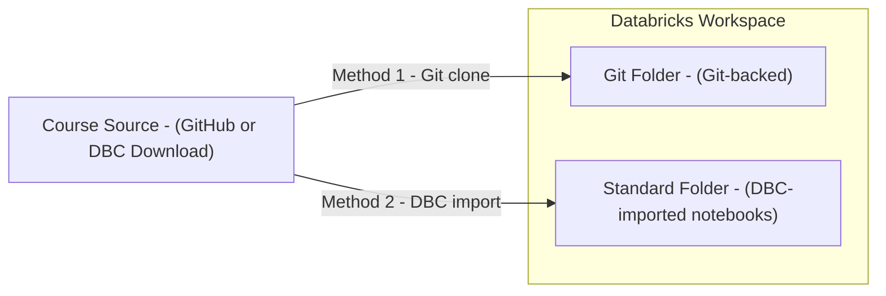
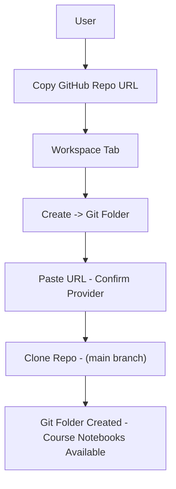
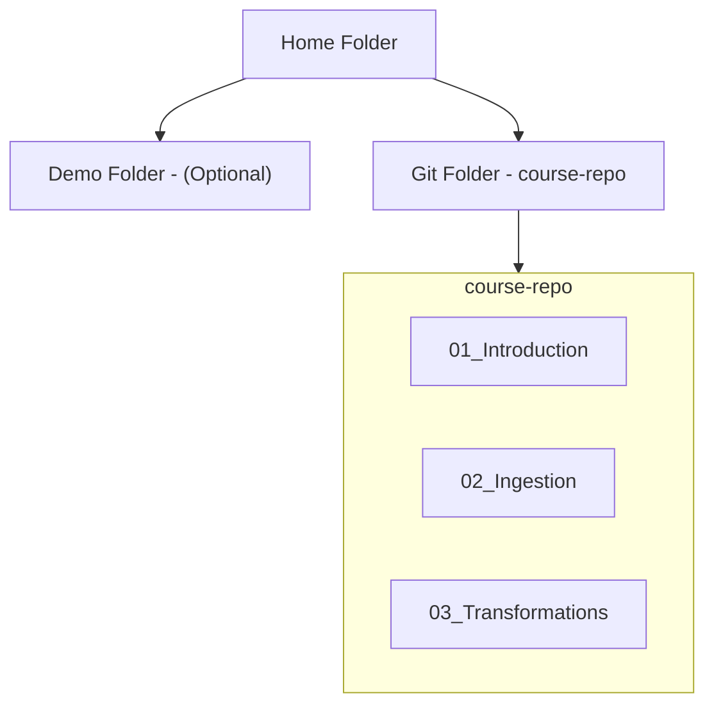
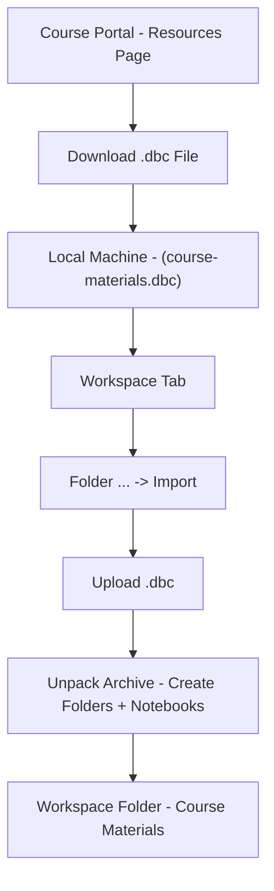
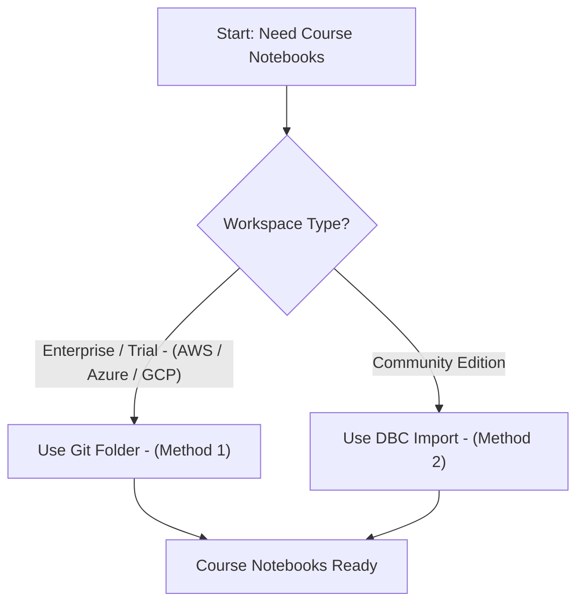

# Importing Materials into Databricks

This guide describes two supported approaches for importing course notebooks into your Databricks workspace:

* **Git Folder Cloning**: For full featured Databricks workspaces (trial or enterprise on AWS, Azure, or GCP).
* **DBC Archive Import**: For Databricks Community Edition and as a fallback option for any workspace.

Both methods give you a local copy of course notebooks inside your workspace so you can run, modify, and experiment freely.

---

## 1. High Level Import Overview

Conceptually, both methods do the same thing: move notebooks from a course source into your Databricks workspace. They differ in how they treat version control and updates.



* **Method 1 (Git Folder)**: Uses Git as the source of truth and keeps a live connection to the remote repo.
* **Method 2 (DBC)**: Imports a snapshot; no built in Git awareness.

---

## 2. Method 1: Git Folder Import (Full Databricks Environments)

Git folders integrate Databricks with external Git systems (GitHub, GitLab, Azure DevOps). This method is recommended for:

* Enterprise trial or production workspaces on AWS/Azure/GCP.
* Team learning settings where you want to keep course material in sync with upstream changes.
* Users who want to commit their own solutions and extensions back to Git.

### 2.1 Prerequisites

Before cloning:

* Your workspace must support **Git folders**.
* Your user must have **Git integration** configured:

  * Linked GitHub, Azure DevOps, or GitLab account.
  * Appropriate access to the target repository (read access minimum).

### 2.2 Step-by-Step: Clone a GitHub Repository

#### 1. Copy Repository URL

* Navigate to the course GitHub repository in your browser.
* Copy the full HTTPS URL, for example:

```text
https://github.com/your-org/course-repo.git
```

#### 2. Open Workspace Tab

* In Databricks, open the **Workspace** tab in the left sidebar.

#### 3. Create Git Folder

* Click **Create** (or **+ New**) in the top right.
* Select **Git Folder** from the menu.

#### 4. Paste Repository URL

* In the dialog:

  * Paste the Git repository URL.
  * Databricks auto detects the provider (GitHub / ADO / GitLab).
  * A default Git folder name (usually the repo name) is suggested; you can adjust it.

#### 5. Confirm Cloning

* Click **Create Git Folder**.
* Databricks runs an internal `git clone` and checks out the default branch (commonly `main`).

Once complete:

* The Git folder appears in your Workspace tree.
* All repository notebooks and folders are visible and ready to use.

### 2.3 Git Folder Import Flow 



### 2.4 Git Folder Benefits

* **Full Git version control**:

  * Commit, push, pull directly from Databricks.
* **Branch awareness**:

  * Work on feature branches for exercises or solutions.
* **Continuous sync**:

  * Pull upstream changes when the course repository is updated.
* **CI/CD integration**:

  * Use the same repository for automated tests, jobs, and deployments.

For any environment beyond Community Edition, this should be your default approach.

---

## 3. Verifying Imported Notebooks

After cloning with a Git folder, verify that everything is wired correctly.

1. Open the **Workspace** tab.
2. Expand your **Home** directory or the parent folder you chose.
3. You should see:

   * Any existing folders (for example a `Demo` folder you created earlier).
   * A **Git folder** named after the course repository (for example `course-repo`).

Inside the Git folder:

* You should see course notebooks, subfolders, and support files as they appear in GitHub.
* You can open and run notebooks immediately (after attaching a cluster).

### 3.1 Verification Layout 



---

## 4. Method 2: Import DBC Archive (Community Edition Compatible)

Databricks Community Edition does not support Git folders. Instead, you import a pre packaged archive of notebooks in **DBC** format.

A `.dbc` file is a Databricks specific bundle that may contain:

* One or more notebooks.
* A folder hierarchy mirroring the course structure.

### 4.1 Use Cases

* Databricks Community Edition users.
* One time imports where Git connectivity is not available or allowed.
* Offline or snapshot style course distribution.

### 4.2 Step-by-Step: Import DBC File

#### 1. Download Archive File

* Go to the course platform or GitHub release page.
* Locate the provided `.dbc` file in the **Resources** or **Downloads** section.
* Download it to your local machine (for example `course-materials.dbc`).

#### 2. Open Workspace Tab

* In Databricks (Community Edition or full), open the **Workspace** tab.

#### 3. Use Import Option

* In the Workspace tree, find the target folder (for example your `Home`).
* Click the three dot menu (`...` or `⋮`) next to that folder.
* Select **Import**.

#### 4. Upload Archive

* In the **Import** dialog:

  * Click **Browse** or **Choose file**.
  * Select the `.dbc` file you downloaded.

#### 5. Complete Import

* Click **Import**.
* Databricks unpacks the DBC and creates the folder structure and notebooks under the target folder.

You should now see a new folder (often named after the course or archive) containing all the course notebooks.

### 4.3 DBC Import Flow 



### 4.4 Characteristics of DBC Import

* Single shot import:

  * No automatic link back to the Git repository.
* Changes are local:

  * Editing notebooks does not affect any upstream source.
* Re import behavior:

  * Importing again will create additional folders unless you explicitly delete/replace the previous ones.

---

## 5. Summary of Import Methods

| Feature                | Full Databricks (AWS/Azure/GCP)  | Community Edition            |
| ---------------------- | -------------------------------- | ---------------------------- |
| Git folder integration | Supported (recommended)          | Not available                |
| DBC file import        | Supported                        | Supported                    |
| Git version control    | Full Git features via Git folder | None (notebook history only) |
| Best simplicity option | Either (Git or DBC)              | DBC import                   |
| Live repo updates      | Yes (pull latest changes)        | No (snapshot only)           |

### 5.1 Decision Flow 



---

## 6. Next Steps After Import

Once the materials are available in your workspace (either as a Git folder or imported DBC):

* Attach a suitable cluster (for example `13.3 LTS` cluster) to the notebooks.
* Open notebooks in sequence and execute cells to follow the course.
* Experiment with code changes, add your own notes, and create additional notebooks for exercises.
* In full Databricks environments:

  * Optionally push your modifications to your own fork or a feature branch.

This establishes a clean, reproducible foundation for all hands on work in the course, whether you are using a lightweight Community Edition environment or a full enterprise workspace.
