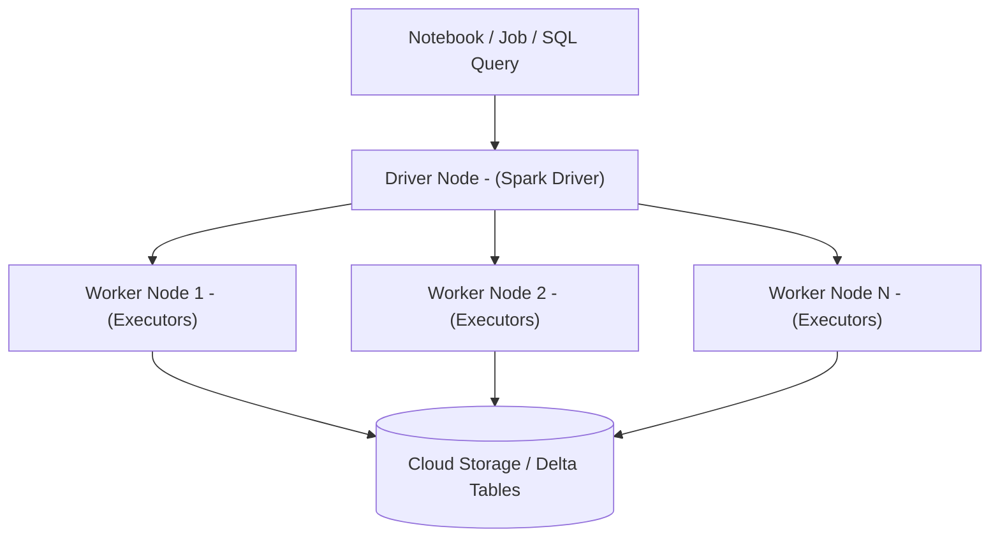
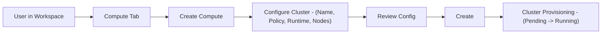
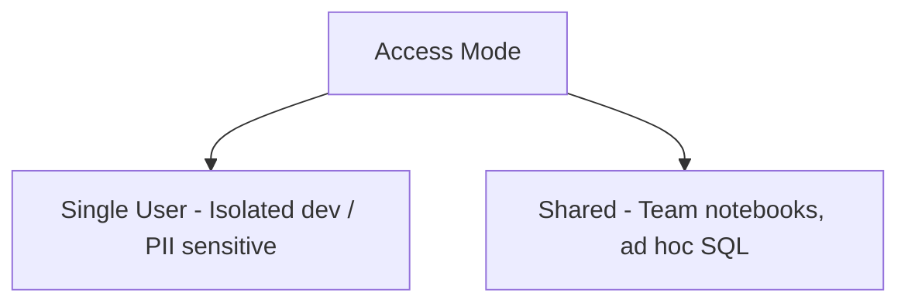
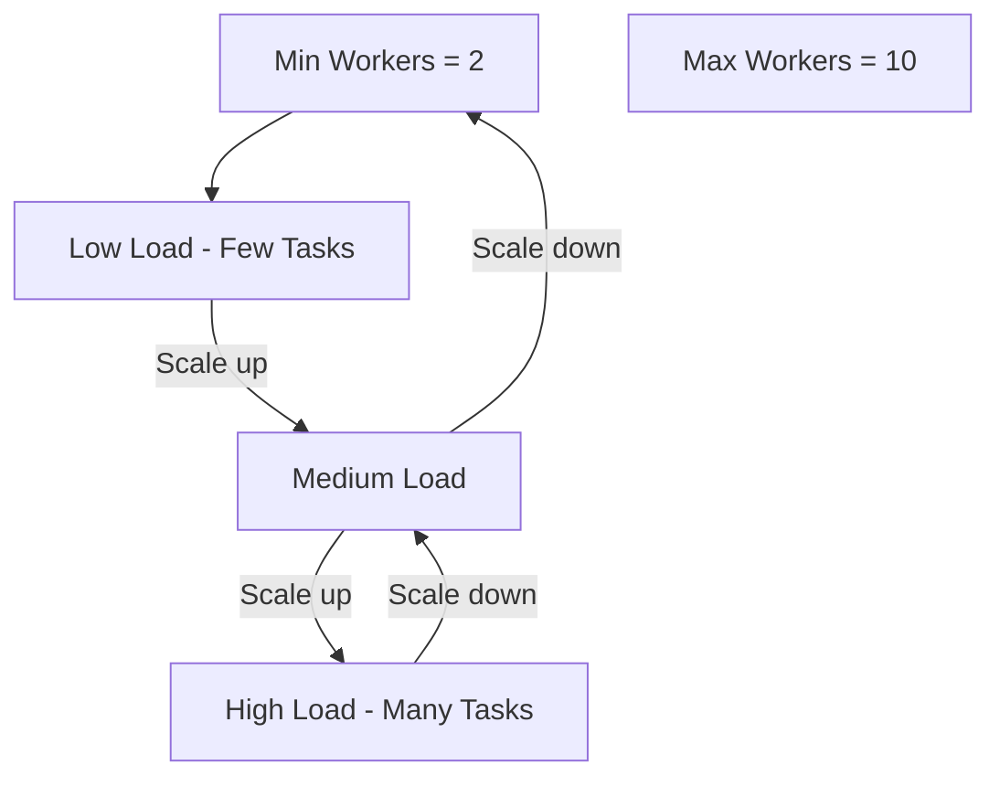
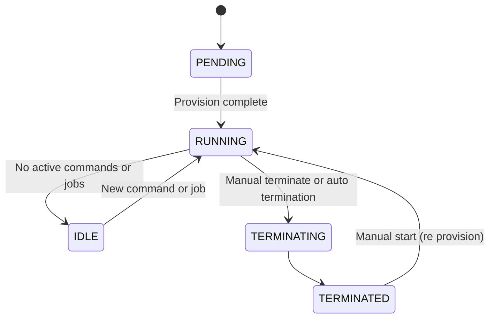
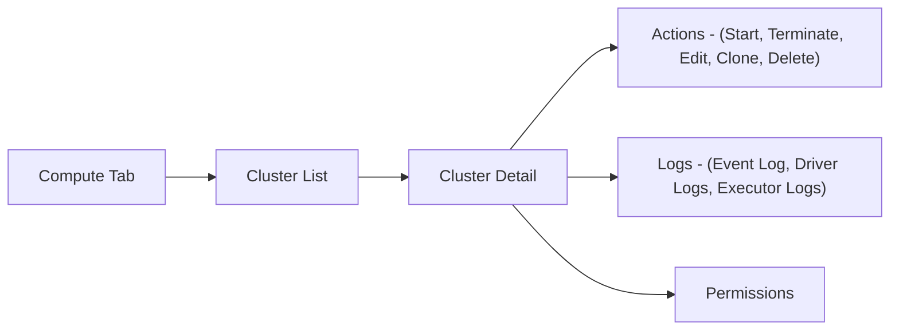
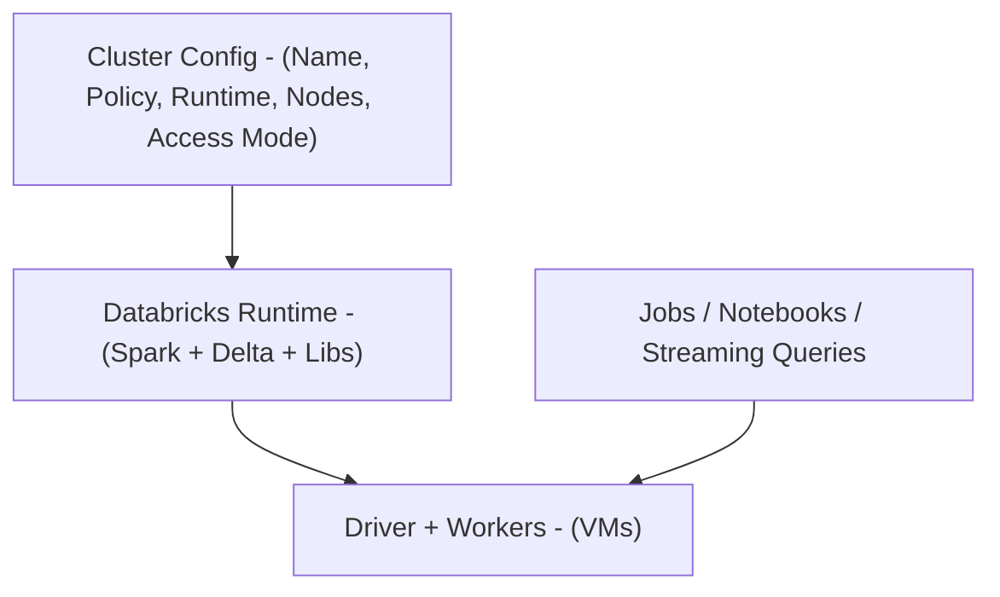

# Creating a Cluster in Databricks

This guide explains in detail how to create and manage a Databricks cluster, the foundational compute engine for executing Apache Spark jobs within the platform.
Correct cluster design affects:

* Performance and scalability
* Cost and resource efficiency
* Security and governance
* Skills tested in the Databricks Data Engineer Associate certification

---

## 1. What Is a Databricks Cluster?

A Databricks **cluster** is a set of virtual machines (VMs) with Databricks Runtime installed, coordinated to run Spark workloads in parallel.

Core roles:

* **Driver node**

  * Hosts the Spark driver and SparkContext.
  * Parses jobs, builds logical and physical plans, and coordinates task execution.
  * Collects results for display in notebooks or for downstream tasks.

* **Worker nodes**

  * Run Spark executors.
  * Execute tasks, cache DataFrames, and perform actual distributed computation.

Clusters power:

* Notebooks (interactive development)
* Jobs and workflows (batch ETL, pipelines, ML training)
* Streaming applications (Structured Streaming)
* SQL queries (via SQL warehouses or all purpose clusters, depending on configuration)

### 1.1 Cluster Architecture 



---

## 2. Accessing Cluster Management

To create or manage clusters:

1. Open the Databricks workspace UI.
2. In the left sidebar, select **Compute**.

You will see:

* Tabs for different compute types (clusters, SQL warehouses, etc.).
* Lists of existing clusters, their states, owners, and policies.
* Buttons to **Create Compute** (or similar wording) for new clusters.

---

## 3. Creating a Cluster: Step by Step

### 3.1 Start Cluster Creation

1. In the **Compute** tab, under **All purpose compute**, click **Create Compute**.
2. Provide a descriptive cluster name, for example:

   * `de-associate-lab-cluster`
   * `etl-prod-cluster`

Good practice: encode environment and purpose in the name (for example `dev`, `stg`, `prod`).

### 3.2 Cluster Policy

* **Cluster Policy** defines allowed and default configurations.
* Options commonly include:

  * `Unrestricted`

    * Full customization of runtime, instance types, autoscaling, etc.
    * Often disabled in hardened enterprise environments.
  * Restricted policies (for example `standard-etl-policy`, `analyst-sql-policy`)

    * Enforce:

      * Allowed instance families
      * Max cluster size
      * Allowed runtimes
      * Security settings (for example access mode)

For training or certification labs, `Unrestricted` is usually allowed. In production, expect to work under policies defined by administrators.

### 3.3 Creation Flow 



---

## 4. Cluster Configuration Options

### 4.1 Cluster Mode

Cluster mode determines how many nodes and what topology are used.

* **Single node**

  * Only a driver node, no separate workers.
  * Driver hosts executors and performs all computation.
  * Suitable for:

    * Development, demos, small scale experiments.
    * Workloads that do not benefit from parallelism (tiny datasets).

* **Multi node**

  * One driver node and multiple worker nodes.
  * Enables horizontal scaling and parallel execution.
  * Recommended for:

    * Production ETL
    * Large data volumes
    * Heavy aggregations and joins
    * ML training on large datasets

### 4.2 Access Mode

Access mode defines how users connect to data via the cluster and how identity is passed through.

Typical modes:

* **Single user**

  * Bound to a single user identity.
  * Good for:

    * Personal development clusters.
    * Strong data isolation (only one principal).
  * Typically supports all languages (SQL, Python, Scala, R, etc.).

* **Shared**

  * Multiple users can attach to the same cluster.
  * Efficient when many users need to run workloads on the same cluster.
  * Often limited to SQL and Python in many configurations.
  * Identity and permissions are enforced via Unity Catalog and cluster access mode rules.

* **No isolation / legacy modes** may exist in older configurations but are generally not recommended.

### 4.3 Access Mode and Use Case 



---

## 5. Runtime Environment

### 5.1 Databricks Runtime

The Databricks Runtime bundles:

* Apache Spark
* Scala, Python, Java, R interfaces
* Delta Lake
* System libraries and connectors

Variants include:

* **Standard runtimes** (general purpose)
* **ML runtimes** (include ML frameworks like TensorFlow, PyTorch, XGBoost, etc.)
* **GPU runtimes** (GPU drivers and libraries)

For the Data Engineer Associate certification and most core data engineering labs, a long term support (LTS) runtime such as:

```text
Databricks Runtime 13.3 LTS
```

is sufficient and recommended.

Runtime version affects:

* Available features (for example Delta Lake features, Photon behavior).
* Spark version and API features.
* Stability and support window.

---

## 6. Photon Engine

**Photon** is a vectorized query engine implemented in C++ that accelerates SQL and some DataFrame operations.

Characteristics:

* Optimized for:

  * SQL-heavy workloads.
  * BI queries with aggregations and joins.
* Often provides significant cost and latency improvements on compatible workloads.

Configuration:

* Toggle **Photon Acceleration** ON in the cluster configuration if:

  * Supported by the runtime version.
  * Supported by the instance types.
  * Workload is primarily SQL or DataFrame transformations.

---

## 7. Node Configuration

### 7.1 VM Type Selection

Each node (driver and workers) uses a VM type (instance type) on the underlying cloud provider.

Consider:

* **Memory (RAM)**

  * Large joins, window functions, and caching need more memory.
* **Cores (CPU)**

  * More cores enable more concurrent tasks.
* **Storage**

  * Local disk for shuffle and caching.
* **Cloud provider**

  * Different instance families and naming for AWS, Azure, and GCP.

For hands on learning:

* Use default instance types recommended by Databricks UI.
  For production:

* Align with workload profiles and your organization’s cost and performance requirements.

### 7.2 Worker Configuration

You can configure:

* **Fixed size cluster**

  * Set an exact number of workers, for example 3.
  * Simpler behavior, but no elasticity.

* **Autoscaling cluster**

  * Set minimum and maximum workers, for example 2 to 10.
  * Databricks autoscaler adds or removes workers based on:

    * Pending tasks.
    * Utilization and workload backlog.

Autoscaling is recommended for variable load ETL and multi tenant notebooks.

### 7.3 Driver Configuration

* Driver instance can match worker type or be a different instance type.
* For heavy query planning, large shuffles, or many concurrent users, a stronger driver may be required.

### 7.4 Autoscaling Concept 



---

## 8. Cluster Lifecycle Settings

### 8.1 Auto Termination

* Automatically terminates the cluster after a period of inactivity.
* Prevents accidental cost accumulation from forgotten clusters.
* Common setting for labs and shared dev clusters: **30 minutes** of inactivity.

Behavior:

* If no active commands or jobs run on the cluster for the configured duration, Databricks terminates it.
* Restarting later will cause re provisioning, including re attaching libraries and warming caches.

### 8.2 DBU Consumption

* A **Databricks Unit (DBU)** is a normalized unit of processing power per hour.
* Cost is a function of:

  * DBUs per hour for a given runtime and instance type.
  * Number of nodes (driver + workers).
  * Duration that the cluster is running.

Design implications:

* Use autoscaling to limit idle capacity.
* Use auto termination to shut down idle clusters.
* Select runtime and instance types appropriate for workload, not over sized.

---

## 9. Launching the Cluster

When configuration is complete:

1. Review the cluster summary panel on the right.
2. Click **Create**.

The system then:

* Allocates underlying VMs.
* Installs Databricks Runtime and dependencies.
* Configures Spark, networking, and security.
* Marks the cluster as `Pending`, then `Running` when ready.

### 9.1 Cluster Lifecycle 



---

## 10. Managing a Cluster

After creation, cluster management is done in the **Compute** tab.

### 10.1 Status Monitoring

Cluster states commonly include:

* `Pending`
* `Running`
* `Terminating`
* `Terminated`
* `Error` (if provisioning fails)

### 10.2 Actions

From the cluster details page or list view:

* **Start / Restart**
* **Terminate**
* **Edit** configuration (changes typically require restart).
* **Clone** cluster to create a similar configuration with a new name.
* **Delete** cluster configuration (removes definition; does not delete data).
* **Permissions**:

  * Control who can attach notebooks, manage, restart, or attach to cluster.

### 10.3 Monitoring Features

* **Event log**:

  * Records creation, start, stop, resize, policy enforcement, and error events.
* **Driver logs and worker logs**:

  * stdout / stderr for Spark applications and Databricks services.
  * Critical for troubleshooting failed jobs.

### 10.4 Management View 



---

## 11. Community Edition Limitations

Databricks Community Edition provides a simplified environment for learning, with strict resource limits.

| Feature           | Availability                    |
| ----------------- | ------------------------------- |
| Cluster type      | Single node only                |
| CPU / RAM         | Typically 2 cores, 15 GB RAM    |
| VM configuration  | Not configurable                |
| Photon support    | Not available                   |
| Autoscaling       | Not available                   |
| Runtime selection | Limited set of runtime versions |
| Policies          | Not configurable by user        |

Implications:

* Good for learning core concepts and small examples.
* Not representative of real multi node or autoscaling behavior.
* No control over VM families or advanced options.

---

## 12. Terminating a Cluster

To stop an active cluster and avoid further charges:

1. Go to the **Compute** tab.
2. Click the target cluster.
3. Select **Terminate**.

Termination:

* Releases compute resources.
* Stops DBU accumulation.
* Preserves definitions, cluster logs (for some time), and any data stored in managed object storage (Delta tables, DBFS paths, etc.).

---

## 13. Summary

### 13.1 Feature Comparison

| Feature                      | Full Databricks       | Community Edition |
| ---------------------------- | --------------------- | ----------------- |
| Multi node support           | Yes                   | No                |
| Custom VM selection          | Yes                   | No                |
| Autoscaling                  | Yes                   | No                |
| Access modes (Single/Shared) | Yes                   | No                |
| Photon engine                | Yes (where supported) | No                |
| Runtime selection            | Yes (broad range)     | Yes (limited)     |
| Event and driver logs        | Yes                   | Partial           |
| Cluster policies             | Yes                   | No                |

### 13.2 Conceptual Cluster View 



Understanding cluster configuration, lifecycle, and cost implications is essential both for real world Databricks deployments and for the Databricks Data Engineer Associate certification objectives.
