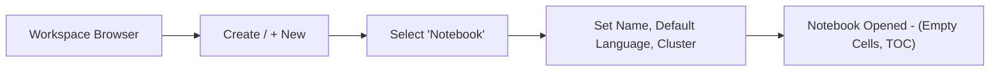
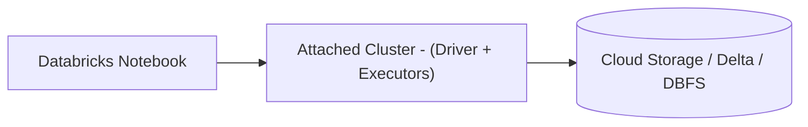
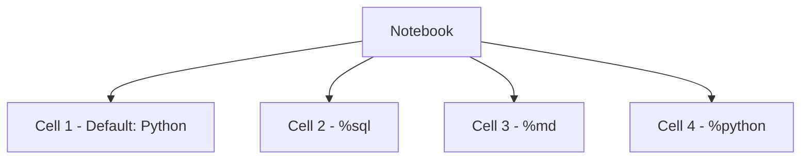
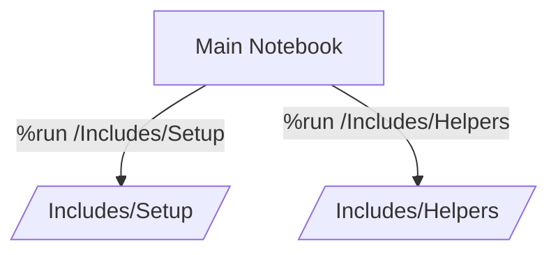
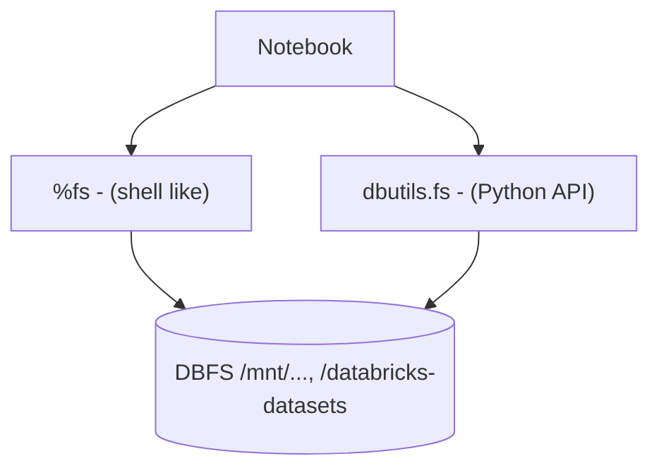
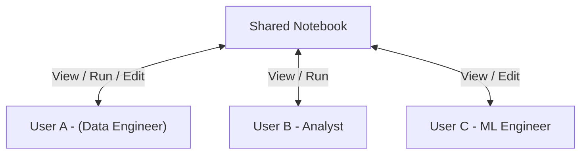

# Working with Databricks Notebooks

Databricks notebooks provide a collaborative, interactive interface for developing, testing, and executing data workflows.
They support multi language development, modular code execution, rich text documentation, and filesystem integration.
Mastery of notebooks is essential both for certification and for day to day usage in Databricks environments.

---

## 1. Creating a New Notebook

To create a notebook from the UI:

1. Navigate to the **Workspace** tab in the left sidebar.
2. Click **Create** (or **+ New**) in the top right.
3. Select **Notebook**.
4. Choose:

   * Notebook name
   * Default language (Python, SQL, Scala, R)
   * Cluster (you can attach later as well)

A new notebook is created with a default title such as `Untitled Notebook` if you do not specify a name.

### 1.1 Renaming the Notebook

* Click the notebook title in the top bar.
* Enter a new, descriptive name (for example `01_notebook_basics_python`).
* Confirm by pressing Enter.

Good practice: encode purpose and ordering (for example `01_ingest_customers`, `02_transform_orders`).

### 1.2 Creation Flow 



---

## 2. Language Support

Databricks notebooks support:

* Python (default)
* SQL
* Scala
* R

You configure:

* **Default notebook language** at notebook creation.
* **Per cell language** using magic commands.

Execution semantics:

* The driver process maintains a separate REPL state per language.
* State in one language is not automatically shared with another (you pass data via tables, files, or widgets, not in memory).

---

## 3. Cluster Attachment

Notebooks require an active compute environment.

* Use the **cluster dropdown** at the top of the notebook.
* Select a cluster (for example `Demo Cluster`).
* If the cluster is stopped, click **Start**.
* Status indicator:

  * Green: cluster is running and attached.
  * Yellow: starting or pending.
  * Red or error icon: failure state.

You can:

* Detach the notebook from a cluster.
* Re attach to a different cluster, as long as the target cluster has access to the same data and libraries.

### 3.1 Notebook Execution Context 



---

## 4. Running Code Cells

A notebook is composed of cells that can contain code or markdown.

To execute a code cell:

* Click the **Play** icon on the left side of the cell, or
* Press `Shift + Enter` to run the current cell and move to the next.

Other useful actions:

* `Ctrl + Enter` or `Cmd + Enter`: run cell, stay in the cell.
* Run all cells above or below from the cell menu.
* Run all cells in the notebook from the **Run all** menu.

Execution behavior:

* Cells share a single interpreter state per language and cluster.
* Variables defined in one cell remain available to subsequent cells, **as long as the cluster remains attached and the interpreter is not restarted**.
* If the cluster is restarted or detached, state is lost and cells must be rerun.

### 4.1 Simple Example

```python
print("Hello, World")
```

---

## 5. Language Magic Commands

Magic commands (`%` or `%%` style) let you control language and environment at cell scope.

Common language magics:

```sql
%sql
SELECT * FROM sales_data
LIMIT 10;
```

```python
%python
x = 42
print(x)
```

```scala
%scala
val nums = Seq(1, 2, 3)
println(nums.sum)
```

```r
%r
df <- data.frame(a = c(1,2), b = c(3,4))
print(df)
```

Markdown cells:

```markdown
%md
## Section Header
This is a documentation paragraph with **bold** and *italic* text.
```

Additional useful magics:

* `%run` -- execute another notebook in line.
* `%fs` -- filesystem operations on DBFS.
* `%sh` -- run shell commands on the driver node.
* `%pip` -- install Python libraries at notebook scope (on supported runtimes).

### 5.1 Multi Language Notebook 



---

## 6. Table of Contents (TOC)

The notebook automatically generates a table of contents based on Markdown headers in `%md` cells.

Usage:

* Open TOC using the **document icon** on the left toolbar.
* All headers from `#` to `######` appear as nested sections.
* Click an entry to jump to the corresponding cell.

Best practices:

* Use hierarchical headers:

  * `# Title`
  * `## Section`
  * `### Subsection`
* Keep header names descriptive for easier navigation in long notebooks.

---

## 7. Modular Notebook Execution: `%run`

The `%run` command lets you reuse code across notebooks.

### 7.1 Setup Notebook Example

Notebook: `/Includes/Setup`

```python
# Setup values
full_name = "John Doe"
pi_value = 3.14159
```

### 7.2 Main Notebook

```python
%run /Includes/Setup

print(full_name)
print(pi_value)
```

Behavior:

* `%run` executes the target notebook top to bottom in the **same interpreter** and attached cluster.
* All variables, functions, and imports from the included notebook become available in the current notebook.
* Execution happens at the moment `%run` is evaluated.

Recommendations:

* Store shared configuration, utility functions, and reusable logic in `/Includes` or `/Shared` notebooks.
* Use `%run` at the top of notebooks to standardize environment setup.

### 7.3 Modular Execution Flow 



---

## 8. File System Operations

You often need to inspect data, list directories, or move files on DBFS.

### 8.1 `%fs` Magic

```bash
%fs ls /databricks-datasets
```

Common operations:

* `ls` -- list directories and files.
* `cp` -- copy files.
* `rm` -- remove paths.
* `head` -- preview small files.

### 8.2 `dbutils.fs` Programmatic Access

```python
files = dbutils.fs.ls("/databricks-datasets")
display(files)
```

Notes:

* `display()` renders a nice interactive table (sortable, filterable).
* `dbutils.fs` methods return objects that your Python code can iterate over.

### 8.3 Help and Introspection

```python
dbutils.help()
dbutils.fs.help()
```

This lists available utilities, including:

* `fs` -- filesystem
* `widgets` -- parameterization
* `secrets` -- secret scopes
* `notebook` -- workflow chaining and exit values

### 8.4 Filesystem View 



---

## 9. Exporting and Importing Notebooks

### 9.1 Exporting Notebooks

From the notebook:

* Open the **File** menu.
* Select **Export**.
* Choose a format:

  * `.ipynb` -- Jupyter compatible format.
  * `.html` -- static HTML render.

From the workspace browser:

* Use the folder three dot menu `...`.
* Select **Export DBC Archive** to export a folder (and its notebooks) as a `.dbc` bundle.

### 9.2 Importing Notebooks

To import:

* Navigate to the **Workspace** pane.
* Right click or use the three dot menu on a target folder.
* Choose **Import**.
* Upload:

  * `.ipynb` to import a single notebook.
  * `.dbc` to import an archive of multiple notebooks and folders.

Notes:

* DBC is Databricks specific; it is efficient for backup and migration between workspaces.
* For ongoing development, use Git integration instead of manual export and import.

---

## 10. Revision History

Databricks automatically versions notebooks:

* Every significant save or edit creates a new revision.
* You can browse the history and restore previous versions.

### 10.1 Accessing Revisions

* Click the **Last edit** or **Revision history** link in the top bar.
* A panel opens showing timestamps, authors, and comments (if any).
* Select a revision to preview its content.
* Click **Restore this revision** to revert the notebook.

Use cases:

* Undo accidental deletions or refactors.
* Compare current implementation with older approaches.
* Inspect who changed what in collaborative notebooks.

---

## 11. Collaboration and Permissions

Notebooks are workspace objects subject to permissions.

Common roles:

* **Can View** -- read only.
* **Can Run** -- can execute but not edit code.
* **Can Edit** -- can modify code and markdown.
* **Can Manage** -- can change permissions and ownership.

Collaboration features:

* Multiple users can open and edit a notebook concurrently.
* Comments and discussion can be added on cells (in modern workspace UIs).
* Git integration via Repos or Git folders is recommended for larger teams and code review workflows.

### 11.1 Collaboration Diagram 



---

## 12. Best Practices for Databricks Notebooks

Key guidelines:

* **Keep notebooks focused**

  * One main concern per notebook, for example: ingest, transform, validate, or visualize.
* **Parameterize using widgets**

  * Use `dbutils.widgets` to control table names, dates, or environments.
* **Use `%run` for shared logic**

  * Place shared code in `/Includes` or `/Shared`.
* **Avoid heavy logic in a single cell**

  * Use small cells for easier debugging and re execution.
* **Persist important outputs**

  * Write results to Delta tables, not just in memory.
* **Pair notebooks with Jobs**

  * Use Jobs to schedule, retry, and monitor notebook driven pipelines.

---

## Summary of Features

| Feature                | Description                                               |
| ---------------------- | --------------------------------------------------------- |
| Multi language support | Python, SQL, Scala, R per notebook and per cell           |
| Language switching     | `%sql`, `%md`, `%python`, `%r`, `%scala`, `%run`, `%fs`   |
| Cluster integration    | Notebooks execute on an attached cluster                  |
| File system access     | `%fs` and `dbutils.fs` for DBFS and mounted storage       |
| Table of contents      | Auto generated from Markdown headers in `%md` cells       |
| Markdown support       | Documentation, headings, lists, images, formatting        |
| Modular code sharing   | `%run` to import and execute other notebooks              |
| Export formats         | `.ipynb`, `.dbc` (archives), `.html`                      |
| Import capability      | Upload `.ipynb` or `.dbc` into workspace folders          |
| Revision tracking      | Built in history with restore functionality               |
| Collaboration          | Shared editing, permissions, Git via Repos or Git folders |

Databricks notebooks sit at the center of interactive development, orchestration, and documentation in the Databricks platform, combining execution, versioning, and collaboration into a single, cluster backed interface.
