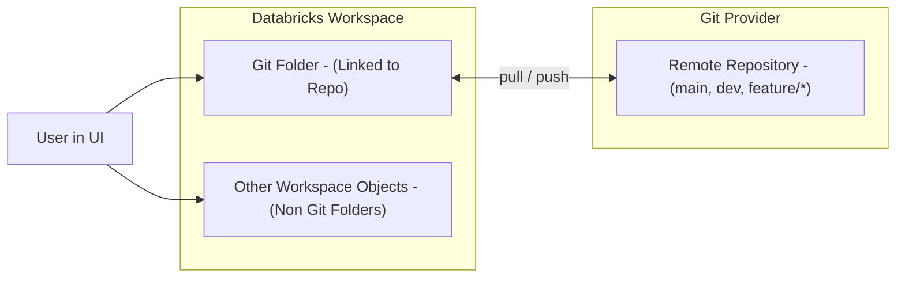
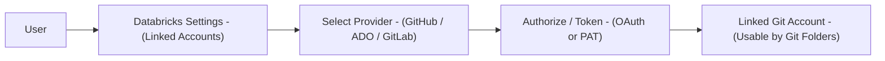
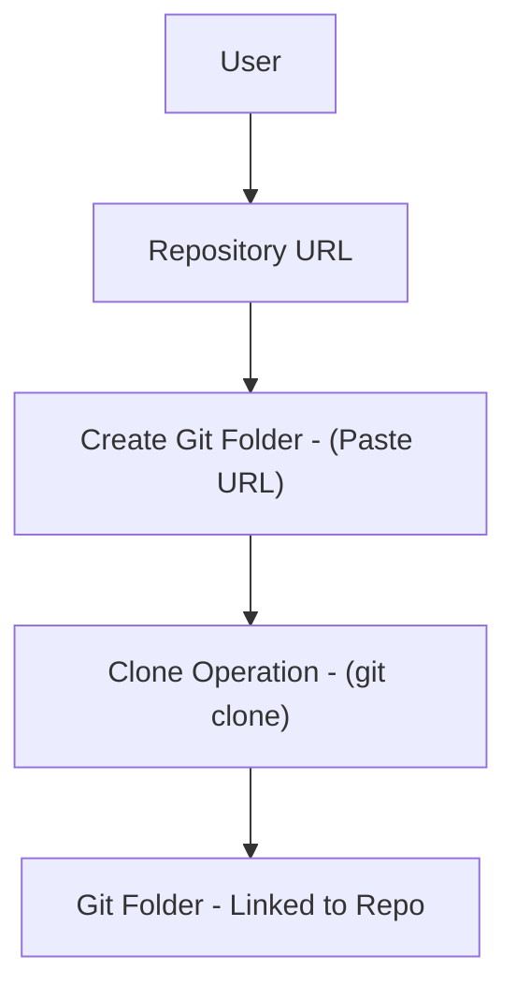
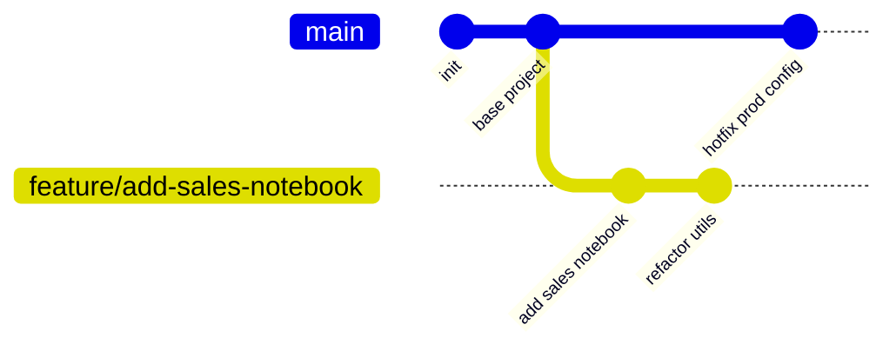
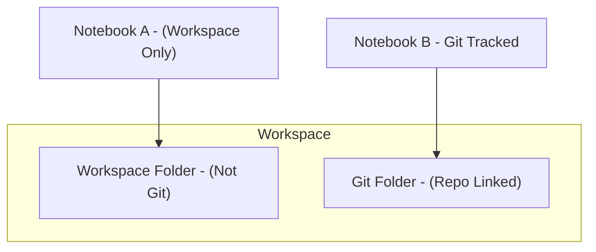
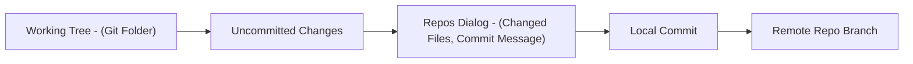
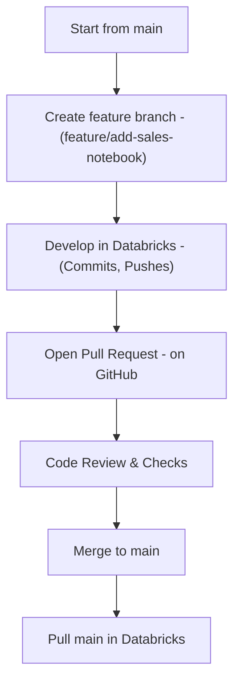

# Git Folders in Databricks

Git folders (formerly Databricks Repos) are specialized workspace directories that integrate directly with external Git repositories. They provide first class Git based version control for notebooks, scripts, and supporting assets inside Databricks.

Supported Git providers include:

* GitHub (public, private, enterprise)
* Azure DevOps
* GitLab (via personal access token)

Git folders sit at the intersection of:

* Databricks workspace objects (notebooks, folders, apps)
* External Git repositories (branches, commits, pull requests)
* CI/CD pipelines and automation

---

## 1. Conceptual Model of Git Folders

A Git folder:

* Is a top level folder in the workspace that is bound 1:1 to a Git repository.
* Mirrors the repository tree structure (directories, notebooks, scripts).
* Tracks a single branch at a time (you switch branches through the UI).
* Maintains a local working copy and syncs with the remote repository via pull, commit, and push.

### 1.1 High Level Architecture 

Git folders are distinct from normal workspace folders:

* Git folder: versioned by Git, syncs with remote.
* Workspace folder: only backed by workspace internal storage and notebook revision history.

---

## 2. Key Capabilities

Git folders enable:

* Clone remote repositories directly into Databricks.
* Create and switch branches.
* View changed files in a Git aware UI.
* Commit and push changes to the remote branch.
* Pull remote updates into the Git folder.
* Organize and version control:

  * Notebooks
  * Python / Scala / SQL scripts
  * Configuration files (YAML, JSON)
  * Project documentation (Markdown)

They complement notebook revision history by providing:

* Persistent change tracking across workspaces and environments.
* Branch based workflows for experiments and features.
* Clean integration with Git based CI/CD pipelines.

---

## 3. Setting Up Git Integration

### 3.1 Open Git Account Settings

1. Click the user profile icon (top right in Databricks).
2. Select `Settings`.
3. In the left navigation, select `Linked accounts` or `Git integration` (exact label depends on workspace UI version).

### 3.2 Select Git Provider

Configure a provider:

* GitHub
* Azure DevOps
* GitLab (typically via personal access token)

You can usually configure more than one provider, but each Git folder still maps to a single remote repo.

### 3.3 Link GitHub Account

Recommended approach is a provider app integration.

**Option 1: GitHub App (OAuth)**

* Click `Link GitHub using GitHub App`.
* Follow GitHub OAuth flow.
* Approve Databricks to access your GitHub account or organization.
* Select which repositories Databricks can access (all or specific).

**Option 2: Personal Access Token**

* Create a GitHub personal access token with required scopes (for example `repo`).
* Paste the token into Databricks Git settings.
* Less ideal from a security and lifecycle standpoint, but works where GitHub App is not available.

### 3.4 Integration Flow 

---

## 4. Cloning a Git Repository into Databricks

### 4.1 Create or Identify a Repository

In the Git provider (for example GitHub):

* Click `+` -> `New repository`.
* Choose a name (for example `demo-dbx-project`).
* Set visibility to `Private` or `Public`.
* Optionally initialize with:

  * README
  * `.gitignore`
  * License

### 4.2 Clone into Databricks as a Git Folder

In Databricks:

1. Copy the HTTPS repo URL, for example:
   `https://github.com/user/demo-dbx-project.git`
2. Go to the **Workspace** tab.
3. Click **Create** -> **Git folder** (or similar menu entry).
4. Paste the repository URL.
5. Optionally specify:

   * Target path in workspace.
   * Default branch to check out (if different from `main`).
6. Click `Create Git folder`.

Databricks will:

* Resolve the provider from the URL.
* Create a Git folder.
* Clone the repository.
* Checkout the default branch (commonly `main`).

### 4.3 Clone Flow 

---

## 5. Branch Management

Git folders expose branch operations via a branch dropdown and Repos dialog.

### 5.1 Creating a New Branch

From Databricks:

1. Click the current branch name (for example `main`).
2. In the Repos dialog, click `Create branch`.
3. Enter a branch name (for example `feature/add-sales-notebook`).
4. Confirm creation.

Databricks:

* Creates the new branch from the current branch tip.
* Checks out the new branch in the Git folder.

### 5.2 Switching Branches

* Use the branch dropdown at the top of the Git folder view or from the Repos dialog.
* Select a branch; Databricks checks it out and updates the working tree.

### 5.3 Branch Topology 

---

## 6. Adding and Managing Content

### 6.1 Adding Notebooks or Files

Inside a Git folder:

* Create:

  * New notebooks (Python, SQL, Scala, R).
  * Subfolders for logical organization.
  * Supporting scripts (for example `.py`, `.scala`).
* Use the folder three dot menu (`...`) to:

  * Import files (for example `.py`, `.sql`, `.ipynb`).
  * Upload configuration files (for example `config.yaml`, `pipeline.yml`).

### 6.2 Cloning Existing Workspace Notebooks into Git Folder

To migrate an existing notebook:

1. In the Workspace browser, locate the notebook.
2. Click `...` -> `Clone`.
3. Choose a destination path inside the Git folder.

Now the notebook is Git tracked. The original remains in the standard workspace context.

### 6.3 Workspace vs Git Folder Context 

---

## 7. Committing and Pushing Changes

Changes in a Git folder move through a local staging area, then to the remote repo.

### 7.1 Commit and Push Workflow

1. Modify or add files inside the Git folder (notebooks, scripts, etc.).
2. Click the branch name to open the **Repos dialog**.
3. Review **Changed files**:

   * New, modified, deleted.
4. Optionally deselect files you do not want in this commit.
5. Enter a **commit message** (for example `Add sales E2E pipeline and tests`).
6. Click **Commit & push**.

Databricks executes:

* `git add` for the chosen files.
* `git commit` with the provided message.
* `git push` to the current remote branch.

### 7.2 Commit Flow 

Good practice:

* Commit frequently with clear, descriptive messages.
* Keep commits logically grouped (one feature or fix per commit where possible).

---

## 8. Pulling Remote Changes

To synchronize with the latest remote state:

1. Confirm the correct branch is selected in Databricks.
2. Open the **Repos dialog**.
3. Click **Pull**.

Databricks:

* Performs `git fetch` and `git pull`.
* Merges or fast forwards local branch to match remote.
* Updates the Git folder contents.

If there are conflicts:

* You may have to resolve conflicts outside Databricks or with available conflict resolution tooling.
* In practice, complex merges are often handled via local clones and IDEs.

---

## 9. Merging Branches via GitHub (or Other Provider)

Git folder UIs do not replace provider level merge workflows. Standard pattern:

1. Develop in a feature branch (`feature/add-sales-notebook`).

2. Commit and push changes from Databricks.

3. In GitHub:

   * Switch to the feature branch.
   * Click `Contribute` -> `Open pull request`.
   * Review diff, run automated checks, request reviews.
   * Click `Merge pull request` once approved.

4. Back in Databricks:

   * Switch to `main` in the Git folder.
   * Click **Pull** to synchronize `main` with the merged changes.

### 9.1 Feature Branch Lifecycle 

---

## 10. Summary: Git Folder Features

| Feature             | Description                                    |
| ------------------- | ---------------------------------------------- |
| Git integration     | Link to GitHub, Azure DevOps, GitLab           |
| Commit & push       | Commit changes and push from Databricks UI     |
| Branch management   | Create, switch, and track branches per folder  |
| GitHub App support  | OAuth based secure linking to GitHub           |
| File import/export  | Import notebooks, scripts, and assets          |
| Pull remote updates | Sync with upstream changes                     |
| Workspace sync      | One Git folder mapped to one remote repository |
| Collaboration       | Multiple users can work on the same Git repo   |

---

## 11. Best Practices

Recommended patterns when using Git folders:

* Use **feature branches**:

  * For each feature, bug fix, or experiment.
* Commit frequently:

  * Use descriptive commit messages aligned with your team conventions.
* Protect `main`:

  * Avoid direct development on `main`.
  * Enforce pull request based merges in the Git provider.
* Keep workspace clean:

  * Separate non versioned scratch work into standard workspace folders.
  * Use Git folders only for code intended to be version controlled.
* Align with CI/CD:

  * Allow CI pipelines to run on pushed branches and pull requests.
  * Promote Databricks jobs, pipelines, or asset bundles from Git definitions rather than manual workspace only assets.

Git folders provide the foundation for professional grade development workflows in Databricks, bridging notebooks and scripts with standard Git practices, enabling reproducibility, collaboration, and automation across data and analytics projects.
