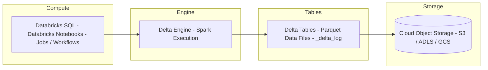
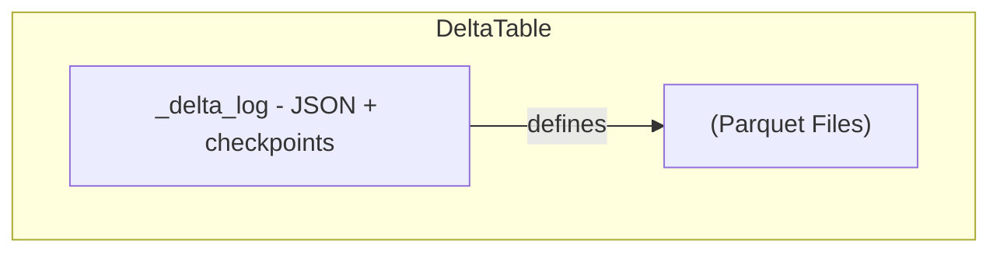
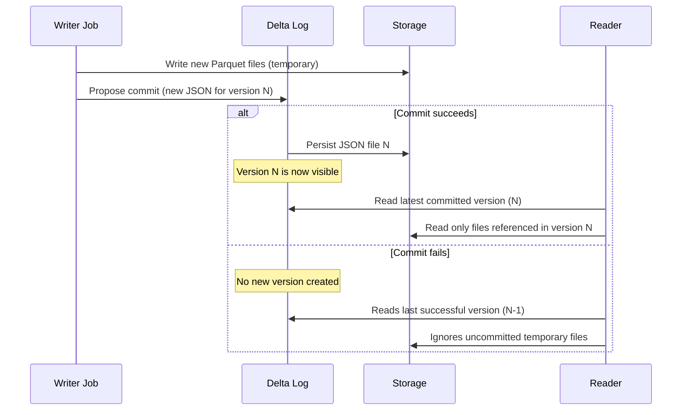
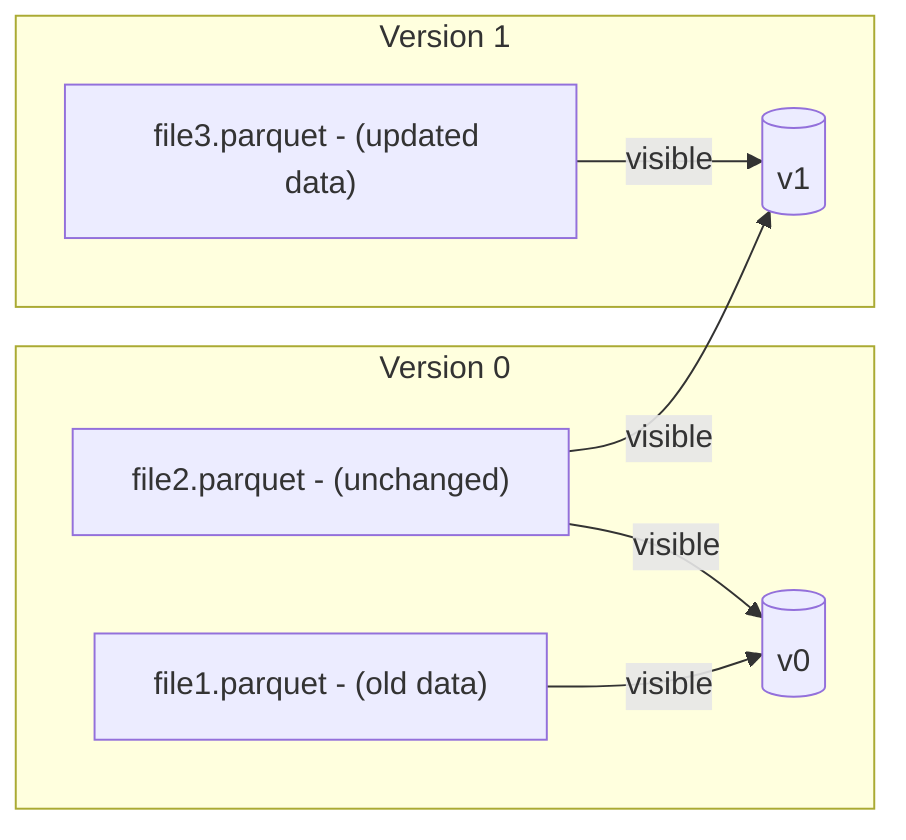
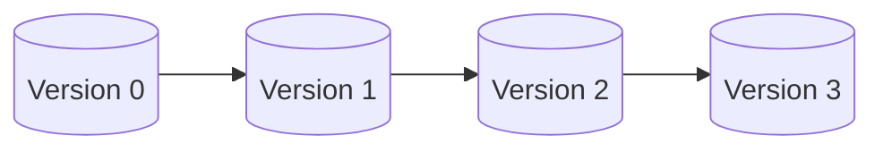
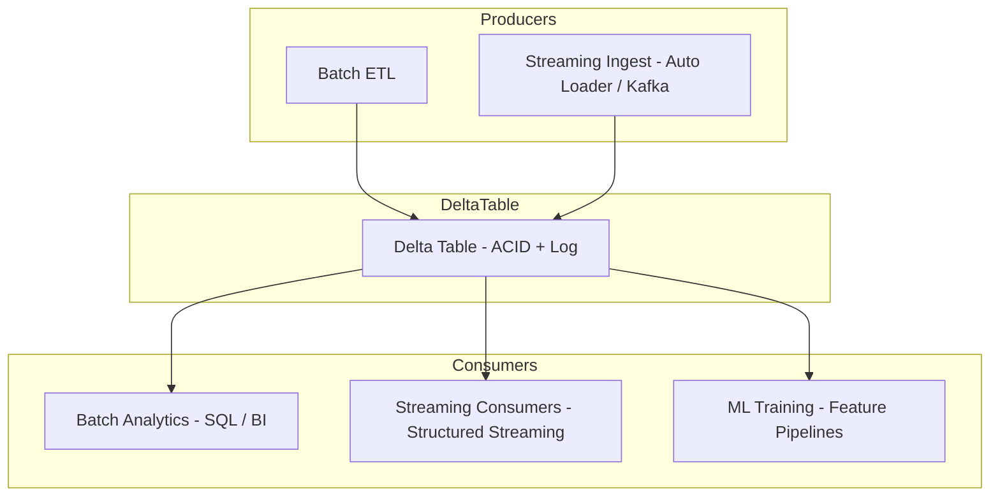
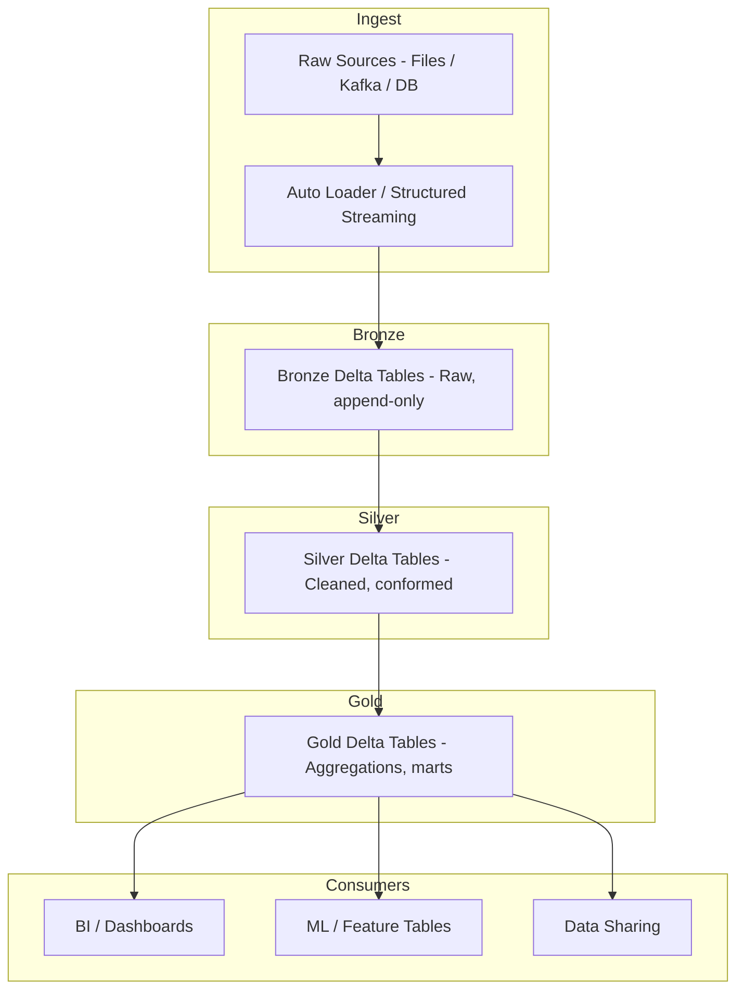

# Delta Lake on Databricks

Delta Lake is an open source storage framework that brings **ACID transactions**, **scalable metadata handling**, and **unified batch and streaming data processing** to data lakes.

It acts as a **storage layer** on top of cloud object storage, not as a separate storage system, file format, or data warehouse. On Databricks, Delta Lake is the foundational storage layer of the Lakehouse architecture and is deeply integrated with:

- Databricks Runtime and Spark APIs (SQL, PySpark, Scala)
- Unity Catalog (governance, permissions, lineage)
- Streaming and batch compute engines
- Optimized I/O (Delta Engine, caching, data skipping)

---

## High Level Architecture

Delta Lake sits between compute (Spark / Databricks Runtime) and cloud object storage.



Delta Lake enhances a traditional data lake with:

* ACID transactions over Parquet files
* Transaction log based metadata instead of directory listing
* Schema enforcement and evolution
* Time travel and auditability
* Unified batch and streaming semantics

---

## Delta Lake vs Traditional Data Lakes

| Feature                        | Traditional Data Lakes     | Delta Lake                           |
|--------------------------------|----------------------------|--------------------------------------|
| ACID Transactions              | No                         | Yes                                  |
| Schema Enforcement             | Weak / Manual              | Strong (write-time enforcement)      |
| Schema Evolution               | Manual                     | Controlled, declarative              |
| Metadata Scalability           | Limited (file listing)     | High (transaction log + checkpoints) |
| Time Travel                    | No                         | Yes (version or timestamp)           |
| Streaming + Batch Unification  | No                         | Yes                                  |
| Governance (Databricks)        | External / ad hoc          | Unity Catalog integration            |
| Performance Optimizations      | Manual partitioning only   | OPTIMIZE, ZORDER, caching, skipping  |

---

## Core Concepts

### Delta Table Layout

A Delta table is a directory (or managed location) in cloud storage that contains:

* Data files: Parquet files
* Transaction log: `_delta_log` folder with JSON and checkpoint files

```text
/path/to/table/
  _delta_log/
    00000000000000000000.json
    00000000000000000001.json
    ...
    00000000000000001000.checkpoint.parquet
  part-0000-....snappy.parquet
  part-0001-....snappy.parquet
  ...
```

### Data Files

* Stored as **Parquet**, columnar and compressed
* Partitioning is done via directory structure (e.g. `date=2025-11-20/`)
* Delta operations never mutate Parquet files in place
* Updates and deletes are implemented as write new files + mark old files as removed

### Transaction Log (`_delta_log`)

* Ordered sequence of JSON and checkpoint files
* Each JSON file represents a commit version (0, 1, 2, ...)
* Checkpoints are periodic Parquet summaries of the log for fast loading
* The log is the **single source of truth** for table state



Readers reconstruct the table by reading the latest checkpoint plus subsequent JSON log files, then applying:

* `add` actions (files to include)
* `remove` actions (files to exclude)
* `metaData`, `protocol`, and other configuration actions

---

## Delta Log Mechanics

### Overview Commit Flow



---

### Scenario 1: Initial Write

1. Writer writes two Parquet files: `file1.parquet`, `file2.parquet`.
2. Writer creates `00000000000000000000.json` in `_delta_log` with:

   * `add` actions for `file1.parquet` and `file2.parquet`
   * Table metadata and protocol version
3. Readers load version `0` from `_delta_log` and read `file1` and `file2` only.

### Scenario 2: Update Operation (Copy-on-write)

1. Writer needs to update records in `file1.parquet`.
2. Delta Lake:

   * Reads relevant data from `file1.parquet`
   * Writes `file3.parquet` with updated content
   * Marks `file1.parquet` as removed (logical delete)
3. `00000000000000000001.json` contains:

   * `remove` action for `file1.parquet`
   * `add` action for `file3.parquet`
4. Readers of version `1` see:

   * `file2.parquet` and `file3.parquet`
   * `file1.parquet` is excluded



### Scenario 3: Concurrent Read / Write

* Writer starts commit `N+1` (e.g. version 2).
* Until commit `N+1` JSON is fully written and atomically visible:

  * Readers continue to read version `N`.
  * There is no partial visibility of uncommitted files.
* This yields **snapshot isolation** and **serializable semantics** for operations.

### Scenario 4: Failed Write

* Writer attempts to write `file5.parquet` but fails before committing.
* No new log JSON file is created for that version.
* Readers:

  * Always use the last valid version number.
  * Never see `file5.parquet`, even if it exists physically, because it is not referenced in the log.

---

## Time Travel And History

Delta Lake supports querying historical versions using either a **version number** or **timestamp**.



Typical operations (Databricks SQL):

```sql
-- Inspect table history (audit log)
DESCRIBE HISTORY my_delta_table;

-- Query by version
SELECT * FROM my_delta_table VERSION AS OF 3;

-- Query by timestamp
SELECT * FROM my_delta_table TIMESTAMP AS OF '2025-11-20T10:00:00Z';
```

Use cases:

* Debugging incorrect pipelines by reproducing past state
* Regulatory and compliance audits
* Point-in-time reporting

---

## Unified Batch And Streaming

Delta Lake provides a single table abstraction consumed by both batch jobs and streaming queries.



Examples:

```sql
-- Batch write
CREATE TABLE events_delta
USING DELTA
LOCATION 's3://bucket/events_delta'
AS
SELECT * FROM raw_events;

-- Streaming read (SQL)
CREATE OR REPLACE TEMP VIEW events_streaming AS
SELECT * FROM STREAM events_delta;
```

PySpark:

```python
# Streaming write to Delta
query = (
    df_stream
    .writeStream
    .format("delta")
    .option("checkpointLocation", "s3://bucket/chk/events_delta")
    .start("s3://bucket/events_delta")
)
```

Because both batch and streaming use the same Delta table, data correctness, schema enforcement, and time travel semantics are consistent.

---

## Schema Enforcement And Evolution

### Schema Enforcement (Write-time Checks)

Delta Lake validates incoming data against table schema:

* Extra columns, missing required columns, or type mismatches cause write errors by default.
* This prevents corrupt or unexpected data from landing in the table.

```sql
-- Example write that will fail if schema is incompatible
INSERT INTO users_delta
SELECT * FROM new_users;
```

### Schema Evolution (Controlled Changes)

Schema evolution can be enabled for compatible changes, such as:

* Adding new nullable columns
* Relaxing certain constraints

Example (SQL):

```sql
-- Enable automatic schema merge for specific operation
CREATE OR REPLACE TABLE users_delta
AS SELECT * FROM source_users;

ALTER TABLE users_delta SET TBLPROPERTIES (
  delta.schema.autoMerge.enabled = true
);

MERGE INTO users_delta AS t
USING source_incremental AS s
ON t.id = s.id
WHEN MATCHED THEN UPDATE SET *
WHEN NOT MATCHED THEN INSERT *;
```

Example (PySpark):

```python
df.write.format("delta") \
  .option("mergeSchema", "true") \
  .mode("append") \
  .save("/mnt/delta/users")
```

---

## Constraints And Data Quality

Delta Lake supports:

* `NOT NULL` constraints
* `CHECK` constraints

```sql
ALTER TABLE orders_delta
ADD CONSTRAINT valid_amount CHECK (amount >= 0);

ALTER TABLE users_delta
ALTER COLUMN user_id SET NOT NULL;
```

Violations are blocked at write time, improving data quality and reliability.

---

## Performance Features On Databricks

### Checkpointing

* Checkpoints are Parquet snapshots of the log every N commits.
* They allow readers to start from the latest checkpoint instead of replaying an entire JSON log history.
* This dramatically improves table initialization time for large tables.

### OPTIMIZE

Rewrites small files into larger ones and optionally applies Z-ordering.

```sql
OPTIMIZE events_delta;

OPTIMIZE events_delta
WHERE event_date >= '2025-11-01'
ZORDER BY (user_id, event_type);
```

Effects:

* Fewer, larger files -> better scan performance
* Z-order clustering improves data skipping for common filter predicates

### VACUUM

Removes old, unreferenced files for storage cleanup.

```sql
-- Default retention
VACUUM events_delta;

-- Explicit retention in hours (use carefully)
VACUUM events_delta RETAIN 168 HOURS;  -- 7 days
```

Warning:
Lower retention intervals can break time travel beyond that interval and must be configured in line with governance requirements.

---

## ACID Guarantees

Delta Lake provides:

* **Atomicity**: Each commit is all or nothing. Either the new log version is visible or it is not.
* **Consistency**: Valid table state is always exposed to readers. Schema and constraints are enforced at write time.
* **Isolation**: Readers see a consistent snapshot version. Concurrent writers are coordinated by optimistic concurrency control.
* **Durability**: Once committed, data and log entries are persisted in cloud object storage.

These properties hold for both batch and streaming workloads, which is critical for complex lakehouse pipelines.

---

## Interaction In Databricks

### Creating And Managing Tables

```sql
-- Create managed Delta table
CREATE TABLE sales (
  id BIGINT,
  ts TIMESTAMP,
  amount DOUBLE
)
USING DELTA;

-- Create external table on existing location
CREATE TABLE sales_ext
USING DELTA
LOCATION 's3://bucket/delta/sales';

-- Inspect metadata
DESCRIBE DETAIL sales;
DESCRIBE HISTORY sales;
```

### Reading And Writing (PySpark)

```python
# Read Delta table
df = spark.read.format("delta").table("sales")

# Write to Delta table
df.write.format("delta").mode("append").saveAsTable("sales")

# Time travel read
df_v3 = spark.read.format("delta") \
    .option("versionAsOf", 3) \
    .table("sales")
```

---

## Typical End To End Flow



Delta Lake is the storage foundation backing bronze, silver, and gold layers. Databricks Jobs, Workflows, and SQL Warehouses orchestrate the movement and transformation of data through these layers while ACID semantics and the transaction log guarantee correctness.

---

## Summary

* Delta Lake is the ACID storage layer powering the Databricks Lakehouse.
* It uses Parquet data files plus a transaction log in `_delta_log`.
* It provides schema enforcement, controlled schema evolution, time travel, and unified batch and streaming semantics.
* Databricks adds optimized execution, governance (Unity Catalog), and performance features such as OPTIMIZE, ZORDER, and VACUUM on top of Delta Lake.

