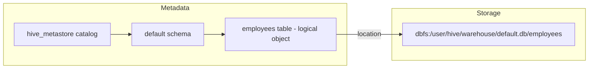
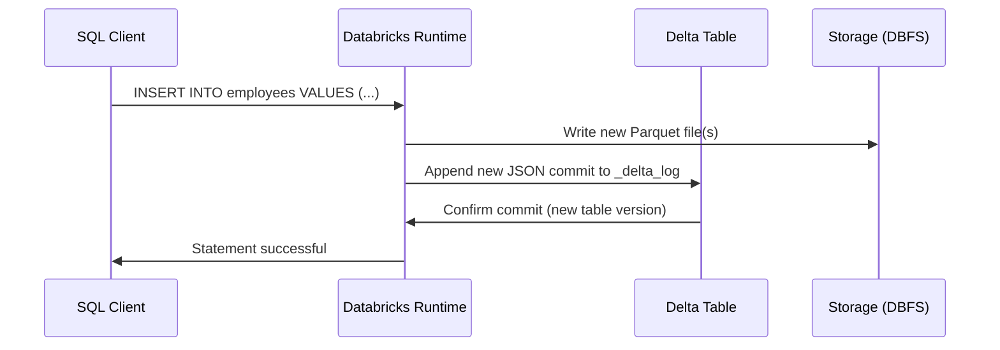
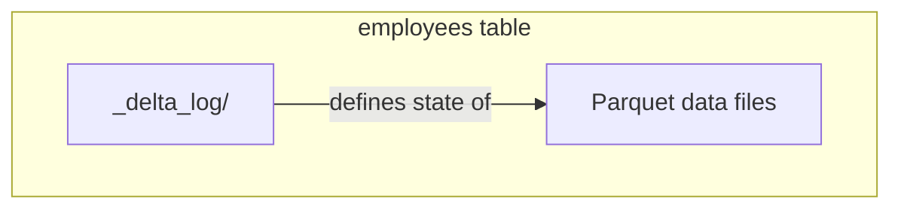
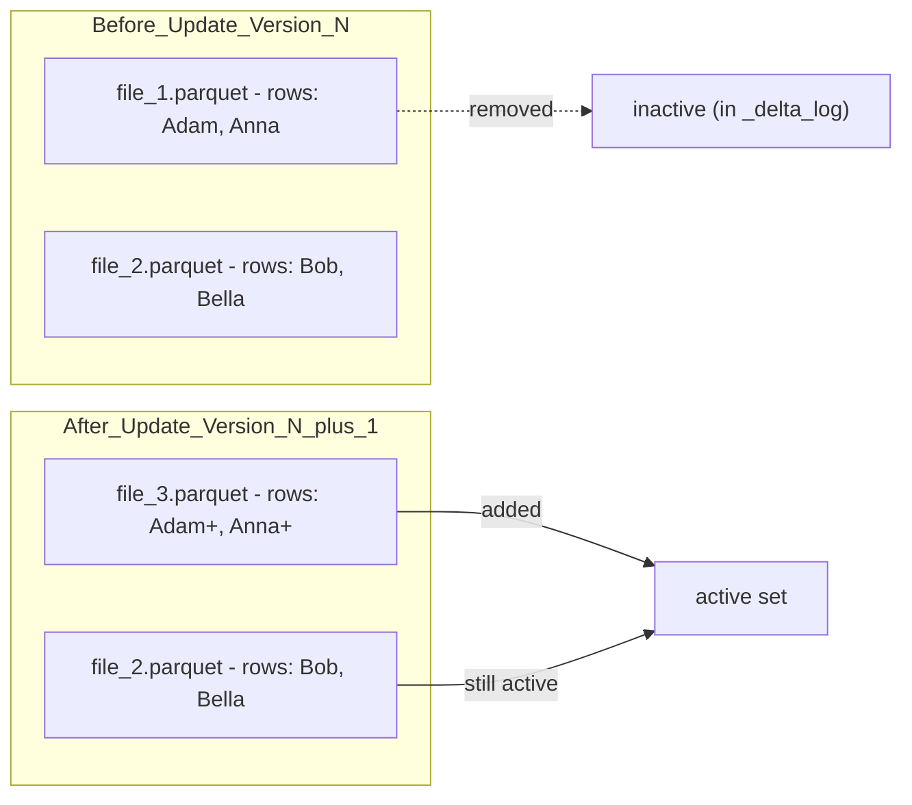
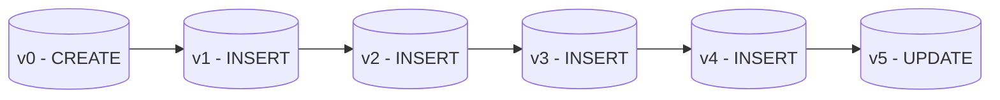
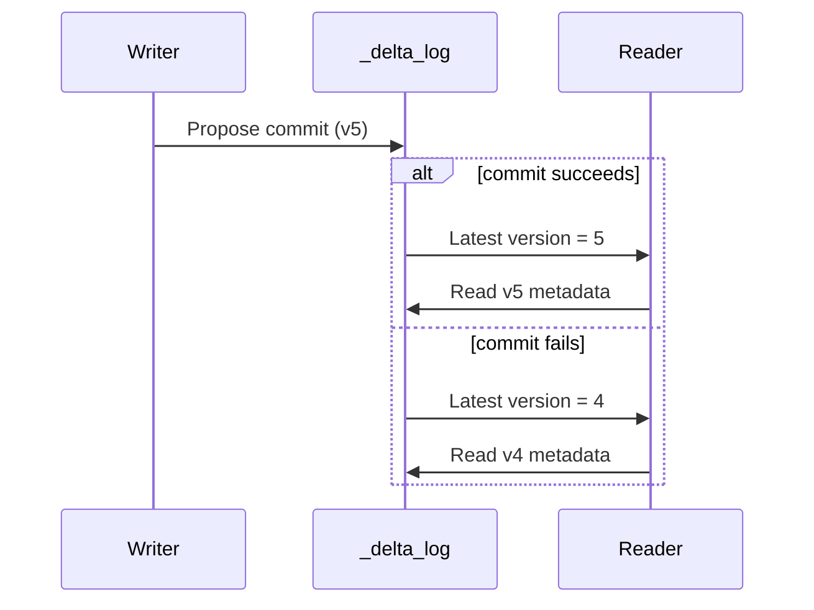
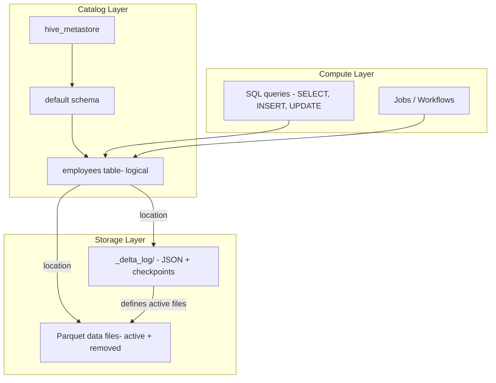

# Understanding Delta Tables in Databricks

This notebook introduces the fundamentals of working with **Delta Lake tables** in Databricks using the **Hive Metastore** as catalog. It covers:

- Catalog and metadata resolution
- Delta table creation
- Inserts and updates and how they translate into files
- Physical file structure in DBFS
- Transaction logging in `_delta_log`
- ACID transactions and how Delta implements them

---

## 1. Catalog And Metadata Configuration

Delta tables in Databricks are organized in a **three level namespace**:

- `catalog.schema.table`

In this notebook you explicitly use the **Hive Metastore** instead of Unity Catalog:

```sql
USE CATALOG hive_metastore;
USE SCHEMA default;
````

From now on:

* Fully qualified name is: `hive_metastore.default.employees`
* Unqualified name `employees` resolves to that table in the active catalog and schema.

### Hive Metastore vs Unity Catalog (short comparison)

* **Hive Metastore**

  * Legacy metadata store
  * Permissions often managed at cluster or workspace level
  * Paths typically under `dbfs:/user/hive/warehouse/...`

* **Unity Catalog**

  * Central governance, fine grained permissions, lineage
  * Strong isolation between catalogs and schemas
  * Recommended for production

In this notebook, Hive Metastore keeps the examples simple and transparent, especially when inspecting storage paths.

### Logical vs Physical View



* **Logical object:** The table entry in the metastore.
* **Physical location:** The folder in DBFS containing Parquet data files and `_delta_log`.

---

## 2. Creating Delta Tables

On Databricks, **Delta is the default table format** for managed tables (unless overridden).

```sql
CREATE TABLE employees (
  id INT,
  name STRING,
  salary DOUBLE
);
```

Key points:

* This creates a **managed Delta table** in `hive_metastore.default`.

* Storage location is automatically assigned, for example:

  * `dbfs:/user/hive/warehouse/default.db/employees`

* Table format is **Delta** (transactional Parquet).

You can verify the table via Catalog Explorer or with:

```sql
DESCRIBE EXTENDED employees;
```

Typical fields you will see:

* `Provider: delta`
* `Location: dbfs:/user/hive/warehouse/default.db/employees`
* `Type: MANAGED`

### Creating External Delta Tables

You can also create an external table pointing to an existing path:

```sql
CREATE TABLE employees_external
USING DELTA
LOCATION 'dbfs:/mnt/data/employees';
```

Managed vs external is important for lifecycle:

* Managed tables: Databricks manages the storage location and may drop data upon `DROP TABLE`.
* External tables: The table metadata can be dropped independently of the underlying files.

---

## 3. Inserting Data

You insert records with standard SQL:

```sql
INSERT INTO employees VALUES (1, 'Adam', 1000);
INSERT INTO employees VALUES (2, 'Anna', 1200);
INSERT INTO employees VALUES (3, 'Bob', 1100);
INSERT INTO employees VALUES (4, 'Bella', 1150);
```

Each `INSERT`:

* Is its own **Delta transaction**
* Writes one or more Parquet files
* Appends a new JSON entry to the `_delta_log` directory

On small examples, this often results in roughly one data file per statement, but the actual file layout is an implementation detail and may vary based on optimization and clustering settings.

### Logical Insert Flow



The important concept: a successful `INSERT` means:

* A new **Delta version** is created.
* Readers see a consistent snapshot including the new rows.

---

## 4. Querying Data

Simple query:

```sql
SELECT * FROM employees;
```

Notes:

* In notebooks, only the **last SQL statement** in a cell renders a result grid.
* Use multiple cells or temporary views if you want to inspect intermediate results.

Typical exercises at this stage:

* Verify that all 4 rows were inserted.
* Try filters and projections:

  ```sql
  SELECT name, salary FROM employees WHERE salary > 1100;
  ```

---

## 5. Inspecting Table Metadata

Use `DESCRIBE DETAIL` for a compact metadata summary:

```sql
DESCRIBE DETAIL employees;
```

Important fields:

* `location`
  Physical path of the table, for example
  `dbfs:/user/hive/warehouse/default.db/employees`
* `numFiles`
  Count of **active** data files that current version uses.
* `format`
  Should be `delta`.
* `tableType`
  `MANAGED` or `EXTERNAL`.
* `lastModified`
  Last modification timestamp.

You can inspect the physical files using the Databricks File System magic:

```python
%fs ls dbfs:/user/hive/warehouse/default.db/employees
```

Typical layout:

* One `_delta_log/` directory
* Multiple `.parquet` data files

### Logical vs Physical Structure



* `_delta_log` drives which Parquet files are currently valid for a given table version.

---

## 6. Update Operations And File Behavior

Consider an update:

```sql
UPDATE employees
SET salary = salary + 100
WHERE name LIKE 'A%';
```

This will logically affect:

* `Adam` and `Anna`.

**Delta semantics:**

* Existing Parquet files are **not updated in place**.
* Delta performs a **copy on write**:

  * Reads affected data.
  * Writes **new** Parquet files with the updated rows.
  * Marks old Parquet files as removed in `_delta_log`.

### Update Flow



* At version `N`:

  * `F1` and `F2` are active.
* At version `N+1`:

  * `F1` is marked as removed.
  * `F3` is added with updated salaries.
  * `F2` remains active.

### Re inspecting Metadata

```sql
DESCRIBE DETAIL employees;
```

You may observe:

* `numFiles` reflects the number of **active** data files, not the total physical files ever written.
* The physical directory may contain more files than `numFiles` because of logically removed files.

---

## 7. Transaction Log And Table History

The Delta transaction log lives in the `_delta_log` directory under the table location:

```python
%fs ls dbfs:/user/hive/warehouse/default.db/employees/_delta_log
```

You will see:

* JSON commit files:
  `000000.json`, `000001.json`, ..., `000005.json`, ...
* Possibly Parquet checkpoints for larger tables:
  `000010.checkpoint.parquet`, etc.

Each JSON file corresponds to a **table version** and includes actions such as:

* `metaData` (table definition)
* `protocol` (reader and writer versions)
* `add` (new files)
* `remove` (files removed from the active set)

### Example History

```sql
DESCRIBE HISTORY employees;
```

Typical history:

| Version | Operation | Description    |
| ------- | --------- | -------------- |
| 0       | CREATE    | Table creation |
| 1       | WRITE     | First insert   |
| 2       | WRITE     | Second insert  |
| 3       | WRITE     | Third insert   |
| 4       | WRITE     | Fourth insert  |
| 5       | UPDATE    | Salary update  |

### Versioned Timeline Diagram



Each version:

* Represents a consistent snapshot of the `employees` table.
* Is reconstructible from the transaction log (checkpoint + JSON).

### Viewing Specific Versions (Time Travel)

You can query historical versions:

```sql
SELECT * FROM employees VERSION AS OF 3;

SELECT * FROM employees TIMESTAMP AS OF '2025-11-20T10:00:00Z';
```

Time travel is directly powered by the `_delta_log` history.

---

## 8. ACID Transactions In Delta Tables

ACID stands for **Atomicity**, **Consistency**, **Isolation**, and **Durability**. Delta Lake implements these properties on top of object storage using the transaction log and a commit protocol.

### 8.1 Atomicity

Definition:

* A transaction is all or nothing.
* Either every change in a commit becomes visible, or none does.

In Delta tables, atomicity is implemented via:

* A new log file (for example `000005.json`) is written and then atomically committed as the latest version.
* Readers either see version `4` or version `5`, but never a mix.



If something fails before the log file is fully committed, readers continue to see the previous version.

### 8.2 Consistency

Definition:

* A transaction transforms the table from one valid state to another.
* Constraints, schema, and rules must not be violated.

In Delta:

* **Schema enforcement** ensures that inserts and updates follow the declared schema.
* Constraints such as `NOT NULL` and `CHECK` definitions are validated at write time.

Example:

```sql
ALTER TABLE employees
ALTER COLUMN id SET NOT NULL;

ALTER TABLE employees
ADD CONSTRAINT positive_salary CHECK (salary >= 0);
```

Any transaction violating these is rejected; the table remains in a consistent state.

### 8.3 Isolation

Definition:

* Concurrent transactions appear as if they were executed serially.
* One transaction does not see partial results of another.

Delta uses **snapshot isolation** and **optimistic concurrency control**:

* Readers work against a fixed version (for example `v4`).
* Writers attempt to create a new version (for example `v5`).
* If two writers conflict (modify the same data range), the second commit may fail and must be retried.

From a reader perspective:

* They never see half applied updates.
* They always see a stable snapshot.

### 8.4 Durability

Definition:

* Once a transaction is committed, its effects are permanent.
* Survive cluster restarts or failures.

In Delta:

* Data files and log files are persisted to **cloud object storage** or DBFS, which is itself backed by resilient storage.
* After a commit, the new version is durable and can be reconstructed from `_delta_log` even if the cluster is restarted.

---

## 9. ACID Summary Table For Delta Tables

| Property    | Delta Implementation Detail                             |
| ----------- | ------------------------------------------------------- |
| Atomicity   | Single versioned commit in `_delta_log` per transaction |
| Consistency | Schema and constraints enforced at write time           |
| Isolation   | Snapshot isolation, optimistic concurrency control      |
| Durability  | Data and logs stored durably in object storage / DBFS   |

---

## 10. End To End Conceptual View



* **Catalog Layer:** Resolves table names and stores metadata.
* **Storage Layer:** Contains Delta transaction log and Parquet data files.
* **Compute Layer:** Executes SQL, batch jobs, and streaming on top of Delta tables.

---

## 11. Practical Checks To Perform In The Notebook

1. Run:

   ```sql
   USE CATALOG hive_metastore;
   USE SCHEMA default;
   ```

2. Create the `employees` table and insert the rows.

3. Inspect:

   ```sql
   DESCRIBE DETAIL employees;
   DESCRIBE HISTORY employees;
   ```

4. List files:

   ```python
   %fs ls dbfs:/user/hive/warehouse/default.db/employees
   %fs ls dbfs:/user/hive/warehouse/default.db/employees/_delta_log
   ```

5. Perform the `UPDATE` and re run `DESCRIBE DETAIL` and `%fs ls` to see:

   * Additional Parquet files in storage
   * Updated history version
   * Difference between physical file count and `numFiles` (active files)

Through these steps you see concretely how logical SQL operations on Delta tables translate into physical files and log entries while preserving ACID guarantees.
