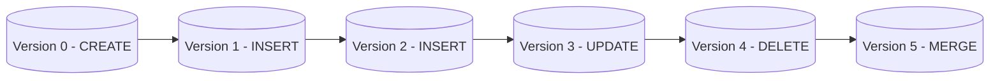
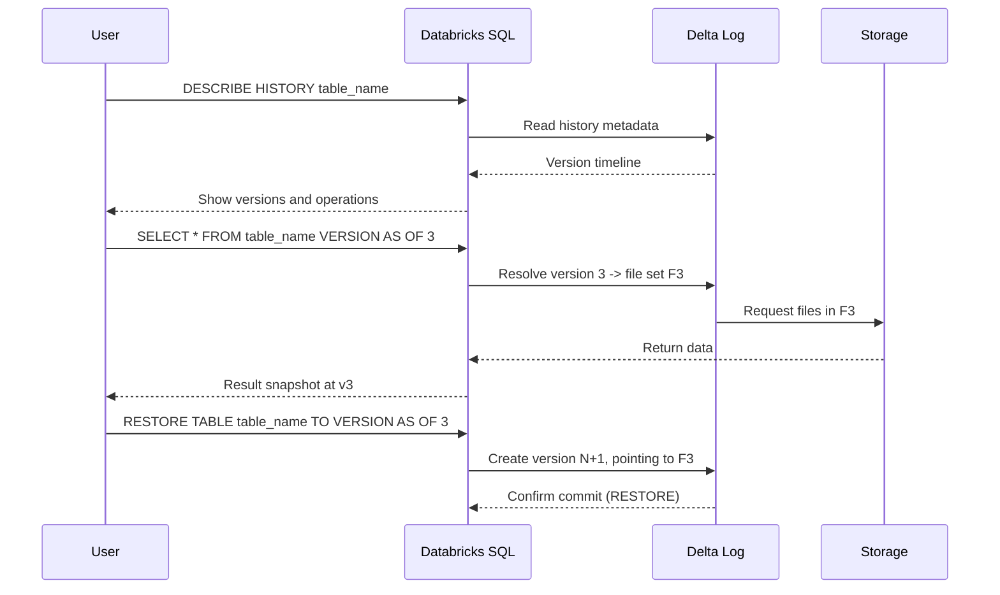
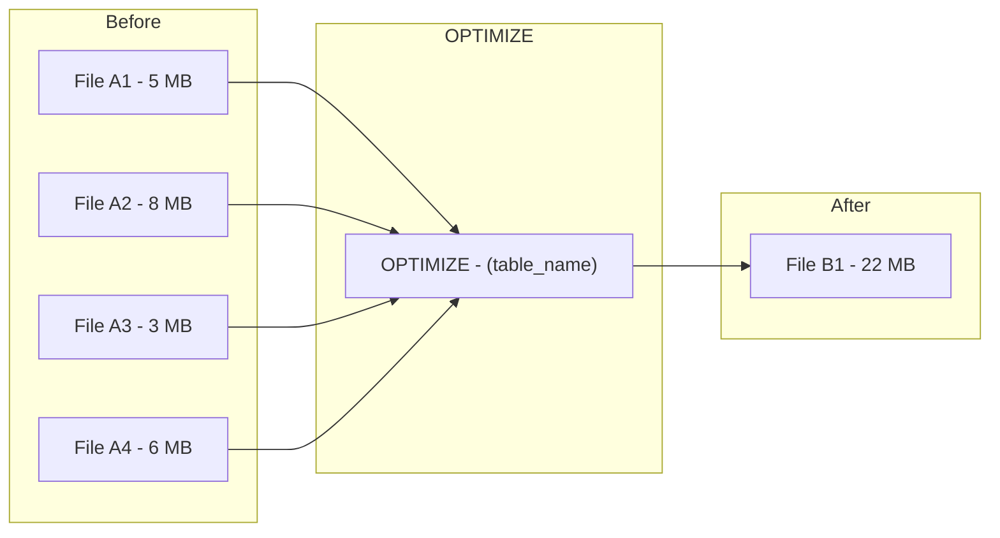
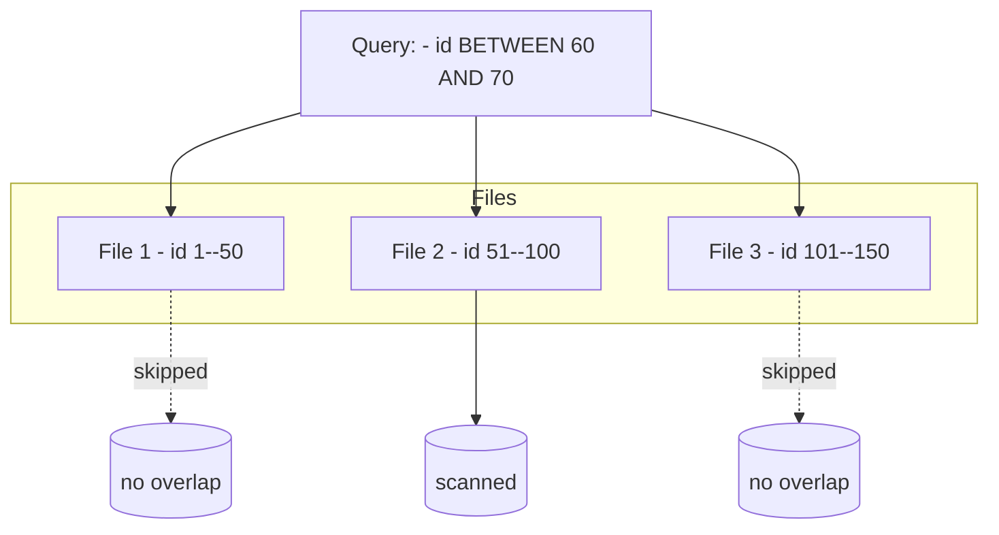
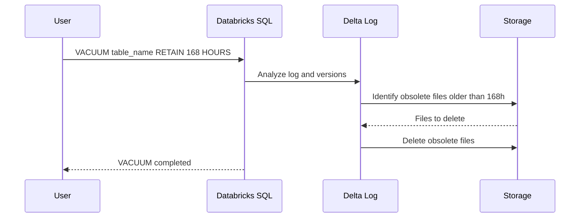
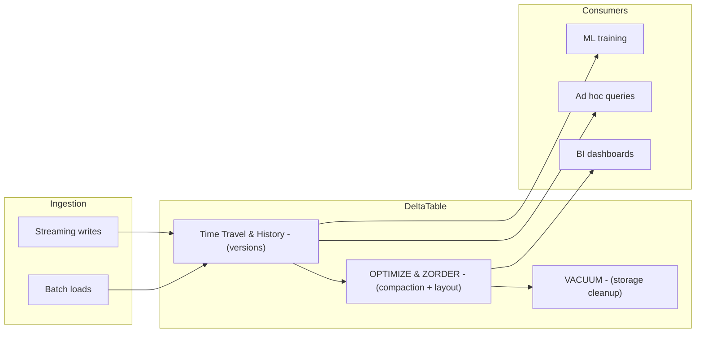

# Advanced Delta Lake Features in Databricks

This guide deepens the overview of advanced **Delta Lake** capabilities in **Databricks**, focusing on:

- Time travel and table restoration
- File compaction with `OPTIMIZE`
- Z-Ordering for data skipping
- Garbage collection with `VACUUM`
- How these features work together in a production Lakehouse

---

## 1. Time Travel

Delta Lake versions every committed change, enabling:

- Point in time analytics
- Auditing and debugging
- Safe rollback after accidental writes or schema changes

Conceptually, each write or update creates a **new table version**.



Each version is backed by:

* A commit entry in `_delta_log`
* A set of active Parquet files for that version

### 1.1 View Table History

History is the entry point for understanding a table’s lifecycle:

```sql
DESCRIBE HISTORY table_name;
```

You get:

* `version`
* `timestamp`
* `operation` (WRITE, MERGE, UPDATE, DELETE, OPTIMIZE, VACUUM, RESTORE, etc.)
* `operationParameters` (predicate, mode, options)
* `userName`, `jobId` (if available)

Typical use cases:

* Find when a column was added
* Track who performed a destructive operation
* Identify the version before a bad load

---

### 1.2 Query By Timestamp

```sql
SELECT * FROM table_name
TIMESTAMP AS OF '2025-07-01T15:00:00Z';
```

Notes:

* Use ISO 8601 format with time zone for clarity.
* Internally, Delta resolves the closest version at or before the timestamp.

### 1.3 Query By Version Number

```sql
SELECT * FROM table_name VERSION AS OF 3;

-- SQL shorthand in Databricks
SELECT * FROM table_name@v3;
```

This is deterministic and independent of time zone.

---

### 1.4 Restoring A Table

`RESTORE` creates a **new version** that copies the state of an old version.

```sql
RESTORE TABLE table_name
TO TIMESTAMP AS OF '2025-07-01T15:00:00Z';

RESTORE TABLE table_name
TO VERSION AS OF 3;
```

Important:

* No physical in place revert; a new commit is created (version N+1).
* All downstream consumers see the restored snapshot as the latest version.
* Previous versions still exist (subject to VACUUM retention).

### 1.5 Time Travel Lifecycle



---

## 2. Compaction And OPTIMIZE

Frequent incremental writes (streaming, micro batches, small jobs) produce many **small files**:

* More files -> higher metadata overhead
* Lower scan efficiency
* Longer query planning and execution times

`OPTIMIZE` rewrites these small files into fewer, larger ones.

### 2.1 Basic Compaction

```sql
OPTIMIZE table_name;
```

Behavior:

* Delta reads many small files.
* Rewrites them into larger, optimally sized files (e.g. 256 MB / 1 GB range).
* Updates `_delta_log`:

  * `remove` actions for old small files
  * `add` actions for new compacted files

Conceptual flow:



Effects:

* Query scans fewer files.
* Data skipping statistics improve due to more consistent per file ranges.

### 2.2 Predicate Based Compaction

You can focus compaction on hot partitions:

```sql
OPTIMIZE table_name
WHERE event_date >= '2025-07-01';
```

Typical pattern:

* Compact recent partitions (frequently queried).
* Leave cold partitions as is to avoid unnecessary rewrites.

---

## 3. Z Order Indexing (ZORDER BY)

Z Ordering physically groups rows with similar values of specific columns into the same or nearby files. This enhances **data skipping** and I/O efficiency for queries that filter on those columns.

### 3.1 Applying ZORDER

```sql
OPTIMIZE table_name
ZORDER BY (column1, column2);
```

Guidelines:

* Use ZORDER on columns that appear frequently in `WHERE` clauses.
* Works best when:

  * Cardinality is moderate/high.
  * Values are not completely random noise.
* Common examples:

  * `user_id`, `device_id`
  * `country`, `region`
  * `event_date` combined with `user_id`

### 3.2 ZORDER Conceptual Data Layout

Without ZORDER:

* Values for a column are scattered randomly across files.

With ZORDER on `id`:

* Files are more range aligned.

Example narrative:

* File 1: `id` 1–50
* File 2: `id` 51–100
* File 3: `id` 101–150

This allows the engine to skip whole files when filtering, for example:

```sql
SELECT * FROM table_name WHERE id BETWEEN 10 AND 20;
```

Only File 1 is scanned.

### 3.3 ZORDER And Data Skipping



* Min/max statistics per file are exploited for skipping.
* ZORDER improves clustering which in turn improves these min/max ranges for chosen columns.

---

## 4. Garbage Collection With VACUUM

Delta keeps **obsolete files** to support:

* Time travel
* Rollbacks
* Concurrent reads during updates

Over time, these obsolete files accumulate and cost storage. `VACUUM` permanently removes them.

### 4.1 Running VACUUM

```sql
-- Explicit retention (in hours)
VACUUM table_name RETAIN 168 HOURS;

-- Use the configured default (typically 7 days)
VACUUM table_name;
```

Behavior:

* Delta identifies files that:

  * Are not referenced by any active version within the retention window.
  * Are older than the retention threshold.
* These files are deleted from storage.

### 4.2 Safety And Retention

Important points:

* Default retention is 168 hours (7 days).
* Time travel is only guaranteed **within** the retention window.
* Time travel queries to versions older than the retention window may fail because underlying files have been deleted.
* Delta typically prevents unsafe configurations where retention is too low, unless safety checks are explicitly disabled (which is strongly discouraged for production).

### 4.3 VACUUM Lifecycle



After `VACUUM`:

* History metadata (versions) may still show old versions.
* But queries against versions whose files were vacuumed will fail because physical files are gone.

---

## 5. How These Features Fit Together

### 5.1 End To End Operational View



Typical lifecycle:

1. **Writes** (streaming / batch):

   * Create new versions and small files.
2. **Time travel**:

   * Supports debugging, audits, and rollback.
3. **OPTIMIZE + ZORDER**:

   * Periodically improve performance by compacting and clustering data.
4. **VACUUM**:

   * Periodically clean up old files beyond the retention policy.

---

## 6. Operational Best Practices (High Level)

* Use **time travel** for:

  * Debugging wrong data loads.
  * Recomputing reports as of a specific business date.
  * Compliance audits.

* Schedule **OPTIMIZE**:

  * On large, heavily used tables.
  * Target recent partitions with `WHERE` to control cost.
  * Add `ZORDER BY` for frequently filtered columns.

* Configure **VACUUM**:

  * Respect compliance and audit requirements when choosing retention.
  * Avoid overly aggressive retention periods in production.
  * Run on a schedule for large, high churn tables to control storage.

---

## 7. Summary Table

| Feature          | Command Syntax                                   | Purpose                                        |
| ---------------- | ------------------------------------------------ | ---------------------------------------------- |
| Time Travel      | `SELECT * FROM t TIMESTAMP AS OF ...`            | Query historical snapshot by timestamp         |
|                  | `SELECT * FROM t VERSION AS OF ...`              | Query by exact version                         |
| History          | `DESCRIBE HISTORY t`                             | Inspect operations and version metadata        |
| Restore Table    | `RESTORE TABLE t TO VERSION/TIMESTAMP AS OF ...` | Revert table state and create a new version    |
| Compact Files    | `OPTIMIZE t`                                     | Reduce number of small files                   |
| Z Order Indexing | `OPTIMIZE t ZORDER BY (col1, col2)`              | Improve skipping on filter columns             |
| Garbage Collect  | `VACUUM t RETAIN n HOURS`                        | Permanently delete obsolete files from storage |

Delta Lake’s advanced features allow you to operate your Lakehouse as a **transactional**, **auditable**, and **high performance** system, even when built on top of simple object storage.

