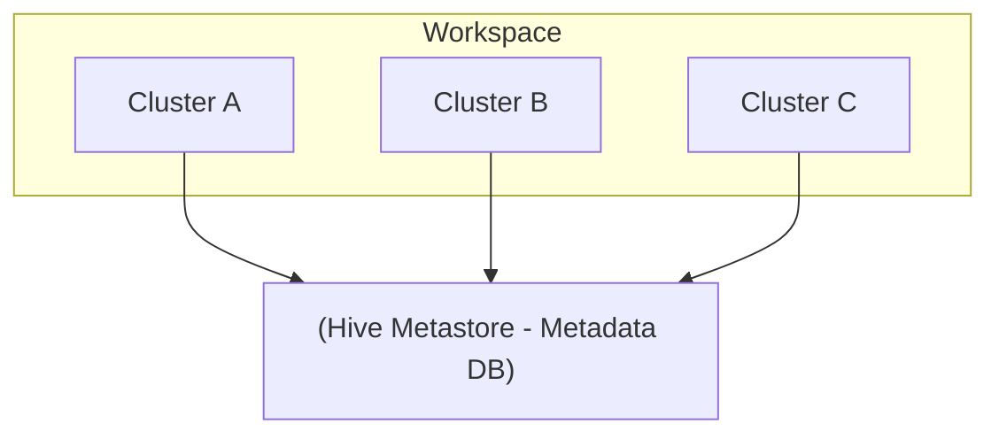
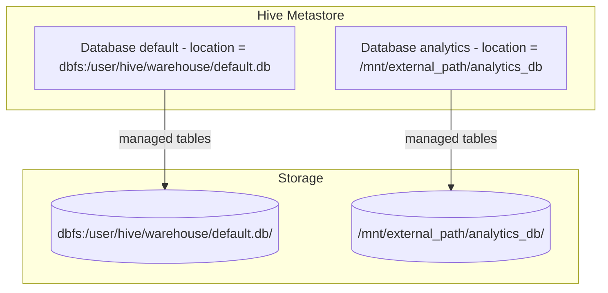
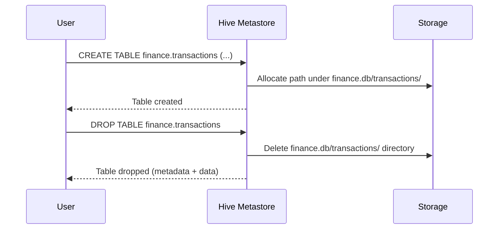
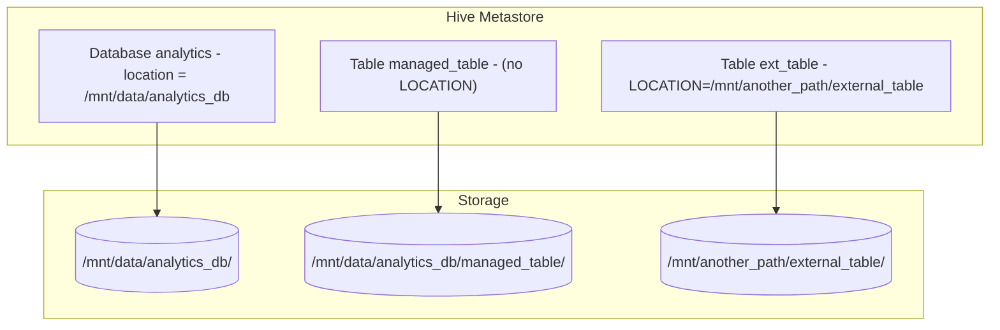
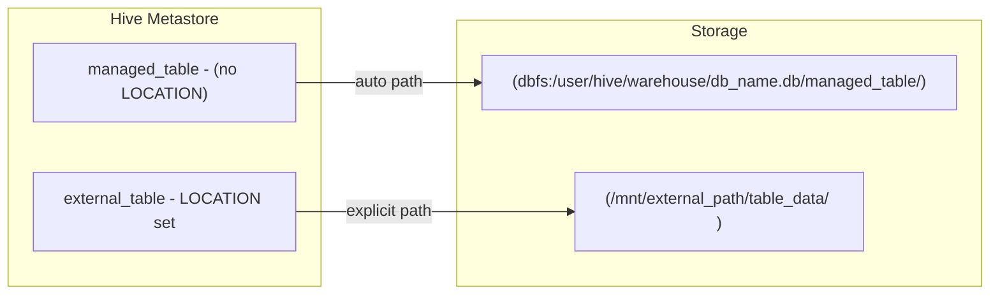
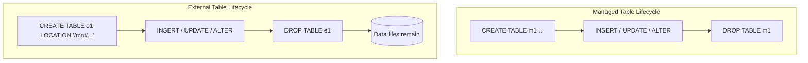

# Relational Entities In Databricks (Hive Metastore Focus)

This document explains the architecture and behavior of **relational entities** in **Databricks** with a focus on the **Hive metastore**:

- Databases (schemas)
- Tables (managed vs external)
- Storage resolution and the effect of `LOCATION`
- Lifecycle and deletion behavior

The goal is to make explicit how **logical objects** (databases, tables) map to **physical storage** on DBFS or mounted paths.

---

## 1. Hive Metastore In Databricks

### 1.1 Purpose

The **Hive metastore** is the central metadata repository. It stores:

- Databases (schemas)
- Tables and views
- Columns, data types, partitioning
- Table properties (format, provider, options)
- Physical locations (paths)
- For partitioned tables: partition values and partition locations

It does **not** contain the actual data. It only points to the data via paths.

### 1.2 Workspace Scope

- Each **Databricks workspace** has an associated **Hive metastore**.
- All clusters in that workspace:

  - Share the same metastore.
  - See the same set of databases and tables (unless using Unity Catalog instead).

High level view:



* Clusters do not talk directly to the data location when resolving names.
  They ask the metastore for metadata, which includes the physical path, then access storage.

---

## 2. Databases (Schemas) In Databricks

### 2.1 Terminology

* In Databricks with Hive metastore:

  * **Database** and **schema** are synonyms.
  * The following are equivalent:

    ```sql
    CREATE DATABASE finance;
    CREATE SCHEMA finance;
    ```

### 2.2 Default Database

* There is a built in database called `default`.
* Without explicit database qualification, tables go into `default`.

Default storage pattern:

* Base warehouse directory:

  ```text
  dbfs:/user/hive/warehouse/
  ```

* A database named `default` maps to:

  ```text
  dbfs:/user/hive/warehouse/default.db/
  ```

* A table `sales` in `default` maps (by default) to:

  ```text
  dbfs:/user/hive/warehouse/default.db/sales/
  ```

### 2.3 Custom Databases (Default Location)

```sql
CREATE DATABASE finance;
```

This creates:

* Metadata entry for database `finance` in the metastore.
* A directory (default pattern):

  ```text
  dbfs:/user/hive/warehouse/finance.db/
  ```

Any **managed table** created in `finance` without its own `LOCATION` will live under that directory.

### 2.4 Custom Databases With Custom LOCATION

You can override the default database location:

```sql
CREATE SCHEMA analytics
LOCATION '/mnt/external_path/analytics_db';
```

Effects:

* Metadata for `analytics` lives in the Hive metastore.

* The **default base path for managed tables** in this database becomes:

  ```text
  /mnt/external_path/analytics_db/
  ```

* A managed table `orders` in `analytics` (without its own `LOCATION`) will live at:

  ```text
  /mnt/external_path/analytics_db/orders/
  ```

### 2.5 Database Level Storage Resolution



Key point:

* Database `LOCATION` defines the **default root** for managed tables in that database.

---

## 3. Tables In Databricks (Hive Metastore)

### 3.1 Table Name Resolution

Fully qualified name structure (Hive metastore):

```text
database_name.table_name
```

Examples:

* `default.employees`
* `finance.transactions`
* `analytics.external_table`

If you do not specify `database_name`, the active database from `USE DATABASE` (or `USE SCHEMA`) is used.

```sql
USE DATABASE finance;
CREATE TABLE monthly_summary (...);
-- Fully qualified: finance.monthly_summary
```

### 3.2 Core Table Types (Storage Aware)

For physical storage, the key distinction is:

1. **Managed tables** (also called internal tables)
2. **External tables**

(There are also views, temporary views, etc., but they do not own data on storage.)

#### 3.2.1 Managed Tables

Definition:

* Table is **owned** by the metastore.
* Data location is derived from:

  * The database `LOCATION`, or
  * Default warehouse directory if database has no explicit LOCATION.
* Dropping the table:

  * Removes metadata from metastore.
  * Deletes the underlying data directory and its files.

#### 3.2.2 External Tables

Definition:

* Table is created with an explicit `LOCATION` that points to an existing or desired path.
* The metastore only owns the **metadata**, not the storage path.
* Dropping the table:

  * Removes only the metadata entry.
  * Leaves the data files untouched.

---

## 4. Creating Tables (With And Without LOCATION)

### 4.1 Managed Table (Default Behavior)

```sql
USE DATABASE finance;

CREATE TABLE transactions (
  id INT,
  amount DOUBLE
);
```

Assuming `finance` has no custom `LOCATION`, the path is:

```text
dbfs:/user/hive/warehouse/finance.db/transactions/
```

Lifecycle:



### 4.2 External Table In Default Database

```sql
USE DATABASE default;

CREATE TABLE ext_data (
  id INT,
  name STRING
)
LOCATION '/mnt/external_data/table_data/';
```

Resolution:

* Metastore entry:

  * Database: `default`
  * Table: `ext_data`
  * Location: `/mnt/external_data/table_data/`

* The data path is **not** under `default.db`.

Drop behavior:

* `DROP TABLE default.ext_data`:

  * Deletes only metadata row.
  * `/mnt/external_data/table_data/` remains.

### 4.3 External Table In Custom Database

```sql
USE DATABASE analytics;

CREATE TABLE ext_table (
  id INT,
  value STRING
)
LOCATION '/mnt/another_path/external_table/';
```

Resolution:

* `analytics` may use a custom or default location.
* `ext_table` **overrides** the database location with its own `LOCATION`.

Storage mapping:



---

## 5. Summary Of Storage Logic

### 5.1 Entity Summary Table

| Entity Type        | Metadata Location | Data Storage Location                     | Deletion Behavior                       |
| ------------------ | ----------------- | ----------------------------------------- | --------------------------------------- |
| Managed Table      | Hive Metastore    | Under database folder (default or custom) | Deletes metadata and underlying data    |
| External Table     | Hive Metastore    | External path provided by `LOCATION`      | Deletes metadata only, keeps data       |
| Database (Default) | Hive Metastore    | `dbfs:/user/hive/warehouse/db_name.db/`   | Hive semantics; managed data removed    |
| Database (Custom)  | Hive Metastore    | As specified by database `LOCATION`       | Files may need manual cleanup depending |

Notes:

* Dropping a **database** with `CASCADE` will drop all tables:

  * For managed tables: data directories removed.
  * For external tables: metadata dropped, data left in place.

### 5.2 Managed vs External Visualization



---

## 6. Example Workflow In SQL

```sql
-- 1. Create a database in default location
CREATE DATABASE finance;

-- 2. Create a database in custom location
CREATE SCHEMA analytics
LOCATION '/mnt/data/analytics_db';

-- 3. Use the custom database
USE analytics;

-- 4. Create a managed table (lives under /mnt/data/analytics_db)
CREATE TABLE managed_table (
  id INT,
  value STRING
);

-- 5. Create an external table (lives under explicit LOCATION)
CREATE TABLE external_table (
  id INT,
  value STRING
)
LOCATION '/mnt/data/external_table';

-- 6. Inspect metadata
DESCRIBE EXTENDED managed_table;
DESCRIBE EXTENDED external_table;
```

`DESCRIBE EXTENDED` will show:

* `Location` for each table.
* Provider / format (for example `delta`).
* Table type (MANAGED / EXTERNAL or similar).

---

## 7. Important Considerations And Edge Cases

### 7.1 Use Of LOCATION

* Use `LOCATION` at **database level** when:

  * You want all managed tables in that database to live under a common custom root.
  * You want to keep data separate from the default warehouse path.

* Use `LOCATION` at **table level** when:

  * You want to point a table to an existing data directory.
  * You need finer control over where this specific table stores data.
  * You are defining an **external table** that must not be deleted when you drop the table.

### 7.2 Managed vs External Lifecycle



For external tables, the lifecycle is decoupled:

* Dropping and recreating the table can reuse the same data path.
* Multiple environments (for example dev and prod) can reference the same data.

### 7.3 Existing Data To Table Binding

You can register existing data as an external table:

```sql
CREATE TABLE logs_ext
USING DELTA
LOCATION '/mnt/raw/logs/';
```

Important:

* The folder `/mnt/raw/logs/` must have a compatible layout for the chosen provider (for example a Delta table).
* The table object in the metastore is just a pointer; the underlying data may also be used by other engines or workspaces.

### 7.4 Partition Directories (Physical Layout)

For partitioned tables, the table directory contains subdirectories for partitions.

Example:

```sql
CREATE TABLE events (
  id BIGINT,
  event_date DATE,
  payload STRING
)
PARTITIONED BY (event_date);
```

Physical layout (managed table):

```text
dbfs:/user/hive/warehouse/db_name.db/events/
  event_date=2025-01-01/
    part-0000-...
  event_date=2025-01-02/
    part-0001-...
```

The metastore tracks:

* Partition values.
* Paths for each partition directory.

---

## 8. Summary

Relational entities in Databricks (using the Hive metastore) follow a clear separation of concerns:

* The **Hive metastore** stores metadata for databases, tables, and partitions.
* **Databases** define logical namespaces and default storage roots (via `LOCATION`).
* **Managed tables** are fully lifecycle managed: dropping them removes both metadata and data.
* **External tables** separate metadata from data: dropping them removes only metadata.

Understanding how `LOCATION` interacts at database and table level is essential for:

* Data governance and lifecycle control.
* Safe sharing of data between systems.
* Predictable behavior when dropping databases and tables.

