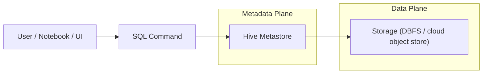
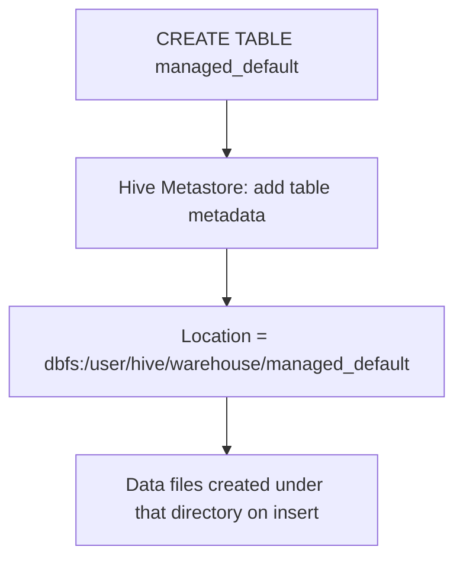
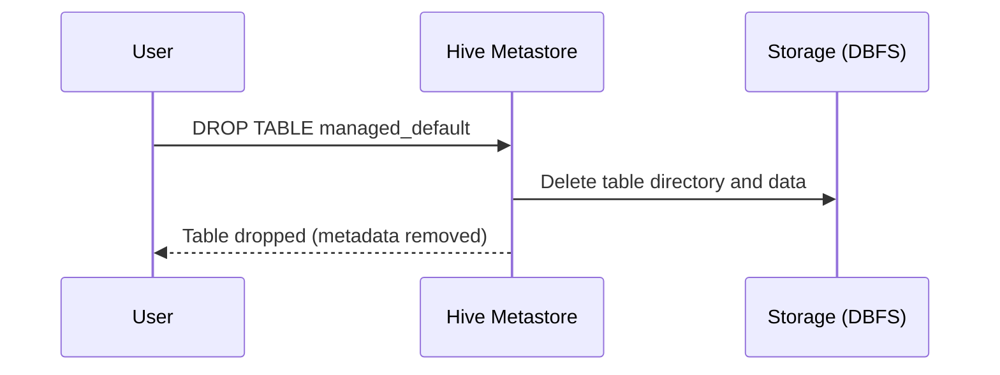
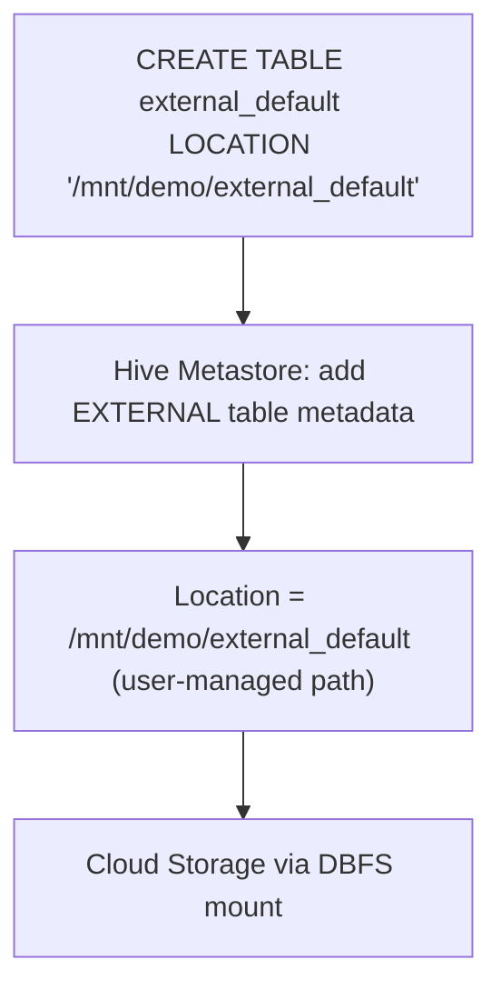
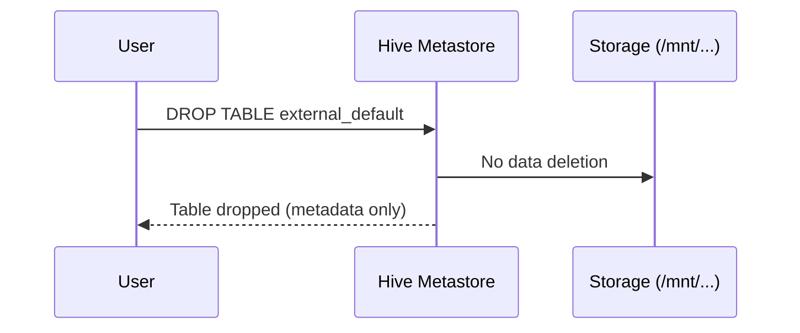
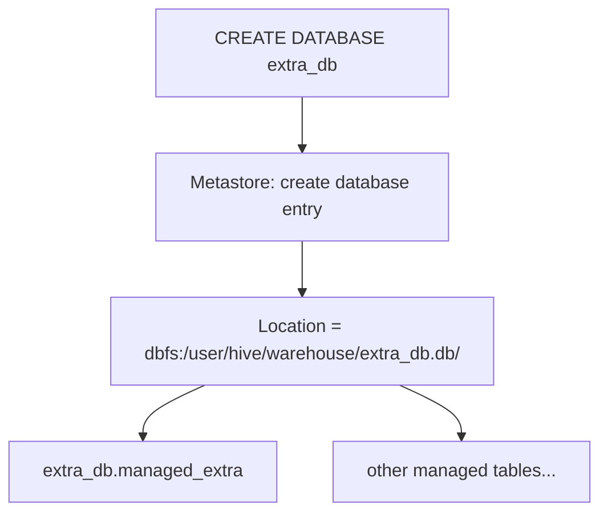
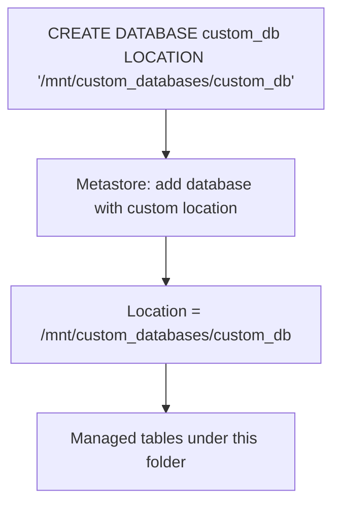
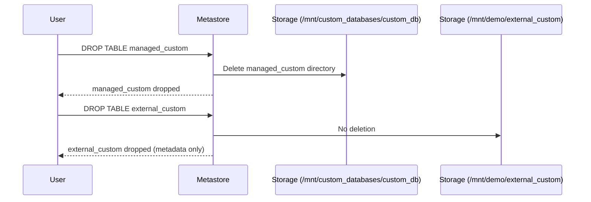
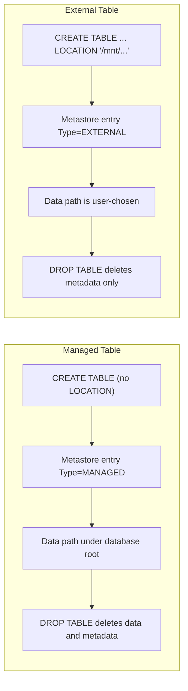

# Working with Databases and Tables in Databricks

This documentation explains how **databases** and **tables** work with the **Hive metastore** in Databricks, with a focus on:

* Managed vs. external tables
* Default vs. custom locations
* Database-level locations
* What actually happens on storage when you create or drop objects

All examples assume:

* You are using the built-in **hive_metastore** (classic Hive metastore behavior).
* Storage paths like `dbfs:/user/hive/warehouse` and mounted paths such as `/mnt/...` are available.

Mermaid diagrams are included to visualize flows and relationships.

---

## 1. Hive Metastore Overview

In Databricks (without Unity Catalog, or in the `hive_metastore` catalog), the Hive metastore is responsible for storing **metadata only**:

* Databases (schemas)
* Tables (columns, data types, locations, properties, etc.)
* Views

### 1.1. Conceptual Architecture



* Metadata is stored in the metastore.
* Table data (Parquet, Delta, etc.) is stored in DBFS or mounted cloud storage.
* Databricks uses the metadata to resolve where the data actually sits.

### 1.2. Access via Data Explorer

* In the **Data** or **Data Explorer** UI, the Hive metastore usually appears as catalog `hive_metastore`.
* The **default database** is `default`. When no database is specified, Databricks resolves tables as `default.table_name`.

---

## 2. Creating and Inspecting Tables in the Default Database

### 2.1. Creating a Managed Table

```sql
CREATE TABLE managed_default (
  id INT,
  value STRING
);
```

Characteristics:

* No `LOCATION` clause is used.
* The table is a **managed table**.
* Databricks chooses the location under the database root:

  ```text
  dbfs:/user/hive/warehouse/managed_default/
  ```

If you use Delta:

```sql
CREATE TABLE managed_default_delta (
  id INT,
  value STRING
)
USING DELTA;
```

The table is still **managed**; only the storage format changes.

### 2.2. Metadata Inspection

```sql
DESCRIBE EXTENDED managed_default;
```

Key fields to look at:

* `Type: MANAGED`
* `Location: dbfs:/user/hive/warehouse/managed_default`
* Additional fields such as `Provider` (e.g. `PARQUET` or `DELTA`) and table properties.



### 2.3. Dropping a Managed Table

```sql
DROP TABLE managed_default;
```

Behavior:

* Hive metastore entry for `managed_default` is removed.
* The directory `dbfs:/user/hive/warehouse/managed_default/` and its files are deleted.



Important:

* For managed tables, **DROP TABLE is destructive for the data**.

---

## 3. Creating and Managing External Tables

### 3.1. External Table Creation

```sql
CREATE TABLE external_default (
  id INT,
  value STRING
)
LOCATION '/mnt/demo/external_default';
```

Characteristics:

* The explicit `LOCATION` makes the table **external**.
* Data is stored **outside** the default warehouse directory.
* The path `/mnt/demo/external_default` typically points to mounted cloud storage (e.g. S3, ADLS, GCS).

For Delta:

```sql
CREATE TABLE external_default_delta (
  id INT,
  value STRING
)
USING DELTA
LOCATION '/mnt/demo/external_default_delta';
```

### 3.2. Metadata Inspection

```sql
DESCRIBE EXTENDED external_default;
```

Key fields:

* `Type: EXTERNAL`
* `Location: /mnt/demo/external_default`



### 3.3. Dropping an External Table

```sql
DROP TABLE external_default;
```

Behavior:

* Metadata is removed from the Hive metastore.
* **Data is not deleted** at `/mnt/demo/external_default`.



Operational consequence:

* Dropping an external table leaves behind a **data orphan** if nothing else references that path.
* You must manually clean up the storage path if it is no longer needed (e.g. via `dbutils.fs.rm`).

---

## 4. Creating Additional Databases

### 4.1. Database Creation Syntax

```sql
CREATE DATABASE extra_db;
-- or equivalently
CREATE SCHEMA extra_db;
```

In Hive metastore, `DATABASE` and `SCHEMA` are synonyms.

### 4.2. Default Database Location and Metadata

```sql
DESCRIBE DATABASE EXTENDED extra_db;
```

You will typically see:

* `Location: dbfs:/user/hive/warehouse/extra_db.db/`

Notes:

* Hive appends the `.db` suffix for database directories.
* Tables created in this database without explicit `LOCATION` will be placed under this directory.



---

## 5. Working with Tables in a Custom Database

### 5.1. Set Database Context

```sql
USE extra_db;
```

From this point, unqualified table names refer to `extra_db`.

### 5.2. Create Managed and External Tables

```sql
-- Managed Table (location under extra_db.db)
CREATE TABLE managed_extra (
  id INT,
  value STRING
);

-- External Table (explicit location)
CREATE TABLE external_extra (
  id INT,
  value STRING
)
LOCATION '/mnt/demo/external_extra';
```

Behavior:

* `managed_extra` is stored at something like:

  ```text
  dbfs:/user/hive/warehouse/extra_db.db/managed_extra/
  ```

* `external_extra` is stored at:

  ```text
  /mnt/demo/external_extra
  ```

### 5.3. Deletion Behavior

```sql
DROP TABLE managed_extra;
DROP TABLE external_extra;
```

* `managed_extra`:

  * Metadata removed.
  * Path under `extra_db.db` deleted.
* `external_extra`:

  * Metadata removed.
  * Data under `/mnt/demo/external_extra` remains.

---

## 6. Creating a Database in a Custom Location

You can place the **database root** in a custom directory, often a dedicated storage container or folder.

### 6.1. Custom Location Syntax

```sql
CREATE DATABASE custom_db
LOCATION '/mnt/custom_databases/custom_db';
```

* The directory `/mnt/custom_databases/custom_db` becomes the base path for **managed tables** within `custom_db`.

### 6.2. Metadata Inspection

```sql
DESCRIBE DATABASE EXTENDED custom_db;
```

Check:

* `Location: /mnt/custom_databases/custom_db`

Metadata is still in the Hive metastore. Only the data location is changed.



---

## 7. Tables in a Custom Location Database

### 7.1. Table Creation in `custom_db`

```sql
USE custom_db;

-- Managed Table (under custom_db location)
CREATE TABLE managed_custom (
  id INT,
  value STRING
);

-- External Table (explicit external location)
CREATE TABLE external_custom (
  id INT,
  value STRING
)
LOCATION '/mnt/demo/external_custom';
```

Resulting locations:

* `managed_custom`:

  ```text
  /mnt/custom_databases/custom_db/managed_custom/
  ```

* `external_custom`:

  ```text
  /mnt/demo/external_custom
  ```

### 7.2. Deletion Behavior

```sql
DROP TABLE managed_custom;
DROP TABLE external_custom;
```

* Managed table:

  * Metastore metadata removed.
  * Data directory under `/mnt/custom_databases/custom_db` removed.
* External table:

  * Metastore metadata removed.
  * Data at `/mnt/demo/external_custom` remains untouched.



---

## 8. Lifecycle Comparison

### 8.1. High-Level Managed vs External Lifecycle



---

## 9. Summary Table

| Scope                    | Entity             | Type     | Location (example)                                | Drop Behavior             |
| ------------------------ | ------------------ | -------- | ------------------------------------------------- | ------------------------- |
| Default Database         | `managed_default`  | Managed  | `/user/hive/warehouse/managed_default/`           | Deletes data and metadata |
| Default Database         | `external_default` | External | `/mnt/demo/external_default/`                     | Deletes metadata only     |
| Extra Database           | `managed_extra`    | Managed  | `/user/hive/warehouse/extra_db.db/managed_extra/` | Deletes data and metadata |
| Extra Database           | `external_extra`   | External | `/mnt/demo/external_extra/`                       | Deletes metadata only     |
| Custom Location Database | `managed_custom`   | Managed  | `/mnt/custom_databases/custom_db/managed_custom/` | Deletes data and metadata |
| Custom Location Database | `external_custom`  | External | `/mnt/demo/external_custom/`                      | Deletes metadata only     |

Paths may differ slightly depending on workspace configuration, but the behaviors are consistent.

---

## 10. Operational Notes and Best Practices

1. **Use `DESCRIBE EXTENDED` and `DESCRIBE DATABASE EXTENDED`**

   * Inspect:

     * `Type` (MANAGED vs EXTERNAL)
     * `Location`
     * `Provider` (e.g. DELTA, PARQUET)
     * Table properties (e.g. `delta.*` keys for Delta tables)

2. **Managed Tables**

   * Convenient when Databricks can own the entire lifecycle of the data.
   * Suitable for ephemeral or workspace-local datasets.
   * Be aware that `DROP TABLE` deletes data. This is safe only if the table is the sole owner of that data.

3. **External Tables**

   * Use when:

     * Data is shared across workspaces, tools, or systems.
     * You need a stable path independent of a specific database or metastore.
   * Always track:

     * Who owns cleanup responsibilities.
     * Which jobs or workspaces rely on the same path.

4. **Database Locations**

   * Use custom database locations to:

     * Separate environments (e.g. `/mnt/prod/custom_db`, `/mnt/dev/custom_db`).
     * Control storage layout per team or project.
   * All **managed** tables in the database inherit the database root location unless overridden.

5. **Context with `USE`**

   * `USE database_name;` sets the current database context.
   * Qualify objects explicitly when required:

     ```sql
     SELECT * FROM extra_db.managed_extra;
     ```
   * This avoids ambiguity when multiple databases have tables with the same name.

6. **Cleanup Strategy**

   * Managed tables: `DROP TABLE` is usually enough.
   * External tables:

     * `DROP TABLE` removes only metadata.
     * Use filesystem tools (e.g. `dbutils.fs.rm("/mnt/demo/external_default", recurse=true)`) for actual data deletion once no longer needed.

This extended view should give you both the conceptual model and the practical commands required to manage Databricks databases and tables safely and predictably.
