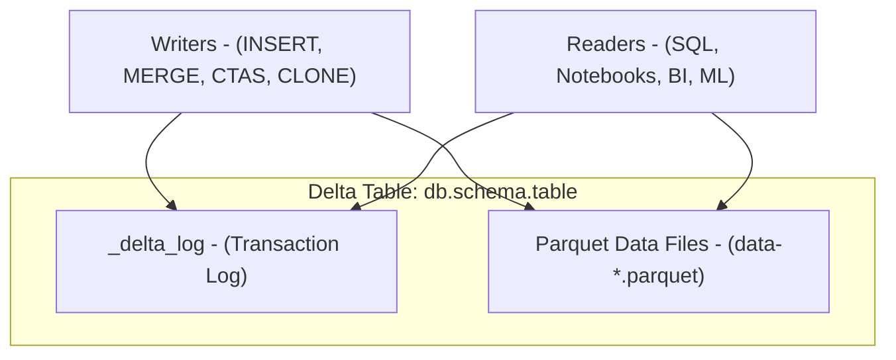
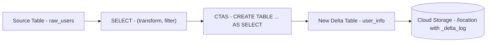
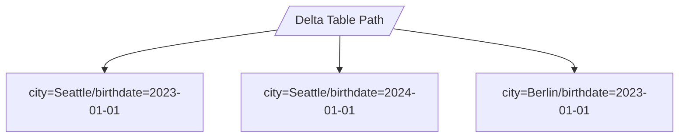
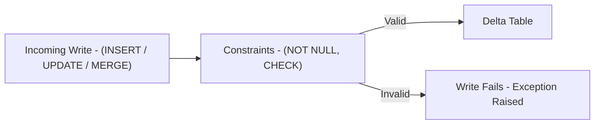
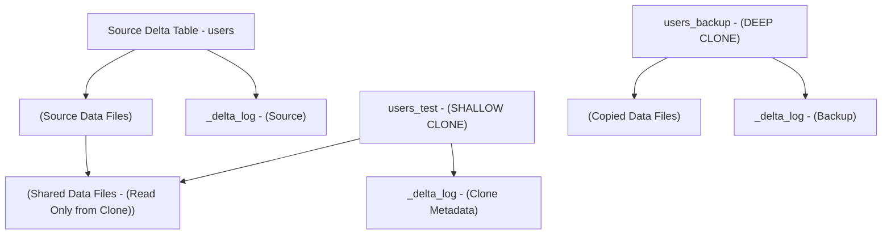

# Setting Up Delta Tables

This document expands on creating and managing **Delta Lake tables** in Databricks, focusing on:

* Creating Delta tables using **CTAS (Create Table As Select)**
* Comparing CTAS with regular `CREATE TABLE`
* Applying **constraints** for data quality
* Using **deep** and **shallow clones** to copy tables
* Partitioning considerations and best practices

---

## 1. Delta Table Fundamentals

A Delta table is backed by:

* A set of **Parquet data files**
* A **_delta_log** directory that stores transaction logs and table metadata

Conceptually:



Every `INSERT`, `UPDATE`, `DELETE`, `MERGE`, `CLONE` is recorded in `_delta_log`. Readers always see a consistent snapshot defined by the log.

---

## 2. Creating Delta Tables with CTAS

### 2.1 What Is CTAS

`CREATE TABLE AS SELECT` (CTAS) is used to:

* Define a new Delta table
* Populate it immediately from a `SELECT` query

It is essentially a combined **schema+create+insert** operation.

### 2.2 Key Characteristics

* **Schema inference**

  * Column names and types are inferred from the `SELECT` output schema
  * You cannot override data types inline in the CTAS statement
* **Data load on creation**

  * Data is written during the create operation
* **Transformation friendly**

  * You can:

    * Rename columns
    * Drop columns
    * Derive new columns
    * Apply filters and joins

### 2.3 Example CTAS With Partitioning and External Location

```sql
CREATE TABLE user_info
COMMENT 'Contains PII (name, email)'
PARTITIONED BY (city, birthdate)
LOCATION '/mnt/external_data/user_info'
AS
SELECT 
  id,
  name AS full_name,
  email,
  city,
  birthdate
FROM raw_users
WHERE active = TRUE;
```

Notes:

* `COMMENT` documents table intent and sensitivity (PII).
* `PARTITIONED BY` physically organizes files by partition keys.
* `LOCATION` makes this an **external** Delta table stored at a custom path.
* The `WHERE` clause ensures only active users are loaded.

### 2.4 CTAS Flow 



---

## 3. CTAS vs Regular CREATE TABLE

Regular `CREATE TABLE` and CTAS complement each other.

### 3.1 Comparison Table

| Feature               | CTAS                        | Regular CREATE TABLE                |
| --------------------- | --------------------------- | ----------------------------------- |
| Schema declaration    | Inferred from SELECT output | Explicit column list and data types |
| Data insertion        | During creation             | Requires `INSERT INTO` or `MERGE`   |
| Transformations       | Via SELECT expressions      | Not at creation; done in later DML  |
| Partition support     | Yes, via `PARTITIONED BY`   | Yes                                 |
| External LOCATION     | Yes                         | Yes                                 |
| Constraints at create | Limited in practice         | Easier to declare constraints       |
| Evolution control     | Less explicit               | Very explicit design upfront        |

### 3.2 When To Use Which

* Use **CTAS** when:

  * You are creating a table based on an existing data set
  * You want to transform and load in one step
  * It is acceptable to let Databricks infer schema

* Use **regular CREATE TABLE** when:

  * You need strict types and ordering
  * You must declare constraints or column comments per column at creation
  * You want to create an empty table and load data incrementally

---

## 4. Partitioning Best Practices

Partitioning is a physical layout strategy for large Delta tables.

### 4.1 When To Partition

Partition large tables when:

* Queries frequently filter by a column like:

  * `date` / `event_date`
  * `region` / `tenant_id`
* Data written per partition is sufficiently large to avoid too many tiny files

Avoid or minimize partitioning when:

* The table is small or medium-sized
* The partition key has high cardinality and creates many small directories
* You rarely filter on the partition columns

### 4.2 Common Patterns

Examples:

```sql
PARTITIONED BY (event_date)
```

```sql
PARTITIONED BY (region, registration_date)
```

Use **few** partition columns with sensible cardinality. For extremely common filter columns that are not good partitions, consider using `ZORDER` instead of over partitioning.

### 4.3 Partitioning Concept 



Each partition folder contains Parquet files for that partition combination.

---

## 5. Adding Table Constraints

Delta tables can enforce **data integrity** using:

* `NOT NULL` constraints
* `CHECK` constraints

These are enforced on writes and help keep your dataset clean.

### 5.1 Constraint Types

1. **NOT NULL**

```sql
ALTER TABLE customers
ALTER COLUMN customer_id SET NOT NULL;
```

2. **CHECK constraint**

```sql
ALTER TABLE customers
ADD CONSTRAINT chk_valid_date
CHECK (registration_date >= '2023-01-01');
```

### 5.2 Requirements And Behavior

* Existing data must satisfy the constraint before it can be added.
* If any row violates the constraint, Databricks will not apply it.
* After the constraint is applied:

  * Any `INSERT`, `UPDATE`, or `MERGE` that violates the condition will fail.

This pushes business rules down to the storage layer and prevents corrupt data from entering the table.

### 5.3 Constraint Enforcement Flow 



---

## 6. Copying Delta Tables With Clones

Delta Lake supports **DEEP CLONE** and **SHALLOW CLONE** to copy tables (including across catalogs and schemas, subject to permissions).

### 6.1 Deep Clone

#### 6.1.1 Behavior

`DEEP CLONE`:

* Copies:

  * Metadata
  * Data files
* The clone becomes a fully independent copy of the table’s data at a given point in time.
* Useful for:

  * Backups
  * Environment replication (for example from `dev` to `staging`)
  * Creating isolated historical snapshots

#### 6.1.2 Example

```sql
CREATE TABLE users_backup
DEEP CLONE source_catalog.source_schema.users;
```

* Produces a new table `users_backup` with its own data files.
* Can be re-run to sync changes (incremental copy of differences).

### 6.2 Shallow Clone

#### 6.2.1 Behavior

`SHALLOW CLONE`:

* Copies only:

  * Table metadata
  * Transaction log
* Reuses the **underlying data files** from the source
* Data is not copied at clone time
* Very fast and low cost

Suitable for:

* Development and testing environments
* Ad hoc experiments
* Schema validation and query tuning without copying data

#### 6.2.2 Example

```sql
CREATE TABLE users_test
SHALLOW CLONE source_catalog.source_schema.users;
```

### 6.3 Post Clone Isolation

* Both deep and shallow clones become independent in terms of **future writes**:

  * Changes to the clone do not affect the source
  * Changes to the source do not affect the clone’s view of historical data
* For shallow clones:

  * New data written to the clone uses clone owned files
  * Original shared files remain read only in the context of the clone

### 6.4 Clone Semantics 



---

## 7. Putting It Together: CTAS, Constraints, Clones

### 7.1 Example: Production Table Lifecycle

1. **Create staging table with CTAS**:

```sql
CREATE TABLE staging_users
USING DELTA
PARTITIONED BY (ingest_date)
AS
SELECT
  user_id,
  email,
  city,
  current_date() AS ingest_date
FROM raw_users;
```

2. **Create target table explicitly and add constraints**:

```sql
CREATE TABLE dim_users (
  user_id   BIGINT NOT NULL,
  email     STRING,
  city      STRING,
  ingest_date DATE
)
USING DELTA
PARTITIONED BY (ingest_date);

ALTER TABLE dim_users
ADD CONSTRAINT chk_email_not_empty
CHECK (email IS NOT NULL AND email != '');
```

3. **Load data from staging into constrained table**:

```sql
INSERT INTO dim_users
SELECT * FROM staging_users;
```

4. **Create a shallow clone for development**:

```sql
CREATE TABLE dim_users_dev
SHALLOW CLONE dim_users;
```

5. **Create a deep clone as a backup**:

```sql
CREATE TABLE dim_users_backup
DEEP CLONE dim_users;
```

---

## 8. Summary Matrix

| Feature          | CTAS                        | Regular CREATE          | Deep Clone                        | Shallow Clone                       |
| ---------------- | --------------------------- | ----------------------- | --------------------------------- | ----------------------------------- |
| Data insert      | At creation (SELECT output) | After create (INSERT)   | Copies full data + metadata       | No data copy at creation            |
| Schema           | Inferred from SELECT        | Explicit column list    | Cloned from source                | Cloned from source                  |
| Transformations  | In SELECT clause            | Done later in DML       | Not for transform, for copying    | Not for transform, for copying      |
| Partitioning     | Supported                   | Supported               | Preserved from source             | Preserved from source               |
| External storage | Via `LOCATION`              | Via `LOCATION`          | Optional (new target path)        | Optional (new target path)          |
| Use case         | Transform + load in 1 step  | Schema first, then load | Backup / environment replication  | Fast dev / test copy, low cost      |
| Data movement    | Yes                         | Depends on inserts      | Yes (initially, then incremental) | No (initially; shared source files) |

---

## 9. Recommendations

* Use **CTAS** when:

  * Rapidly creating derived tables from existing data
  * Performing transformations during initial population

* Use **regular CREATE TABLE** when:

  * You need explicit schema control and constraints at creation time
  * You are designing core dimensional or fact tables

* Apply **partitioning**:

  * Only for large tables
  * On low to medium cardinality columns that match frequent filter predicates

* Add **constraints**:

  * To enforce business rules at write time
  * Especially for critical dimensions and reference data

* Use **deep clones**:

  * For full backups
  * For replicating data across environments with independent storage

* Use **shallow clones**:

  * For fast, low cost dev and test environments
  * When you do not need an independent physical copy of existing data

This combination of CTAS, constraints, partitioning, and cloning patterns provides a solid foundation for building resilient, performant Delta architectures in Databricks.
