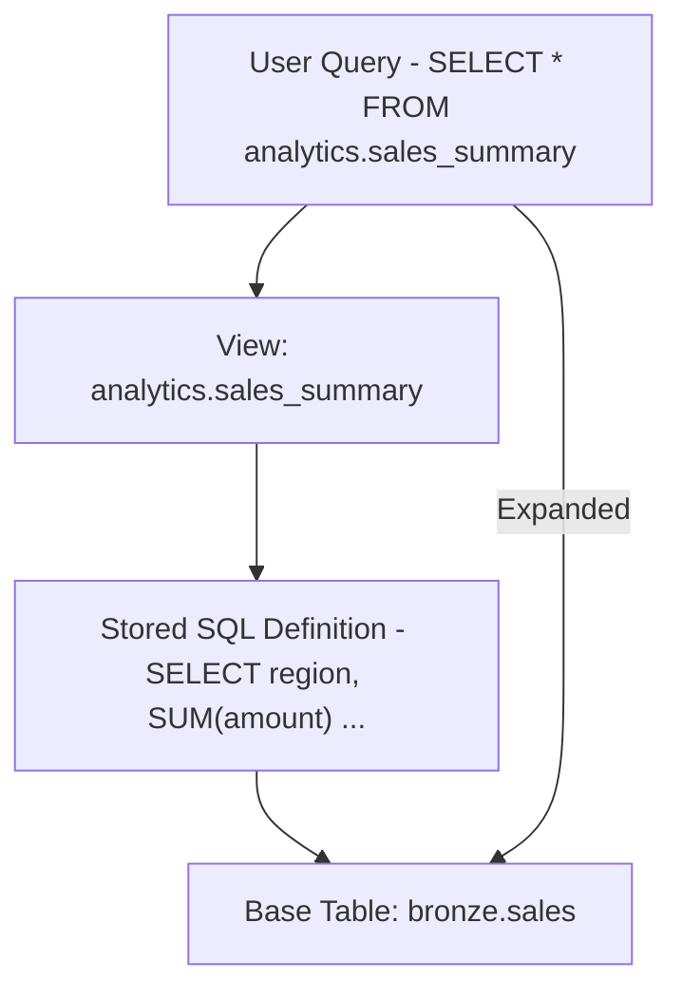
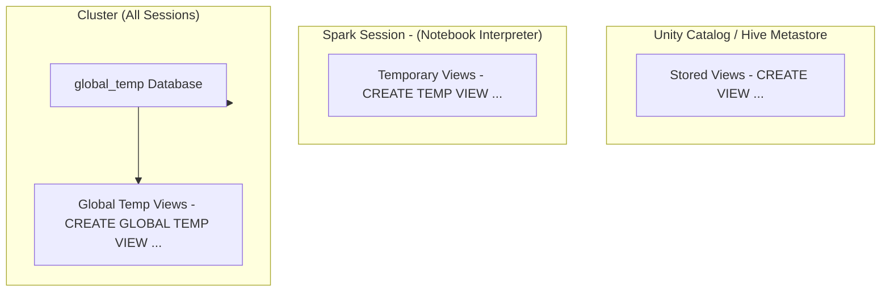
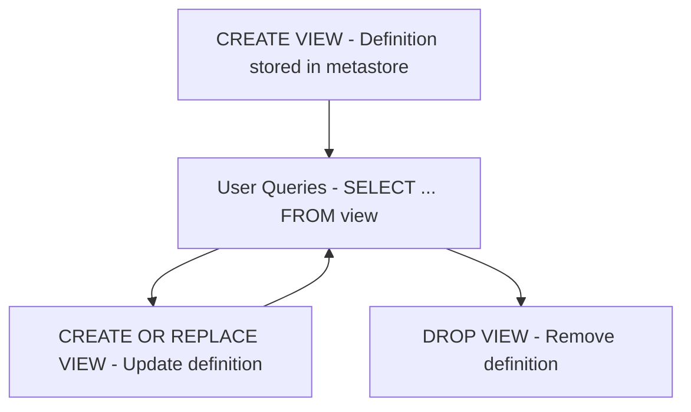
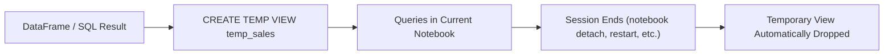
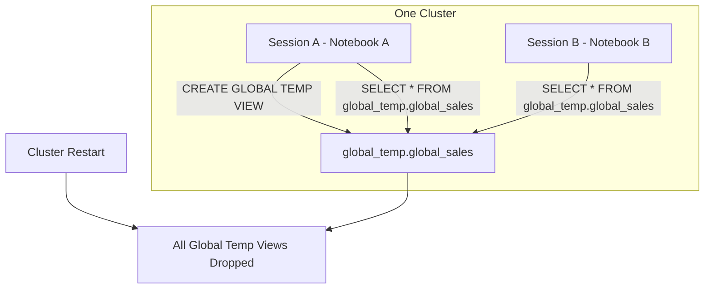
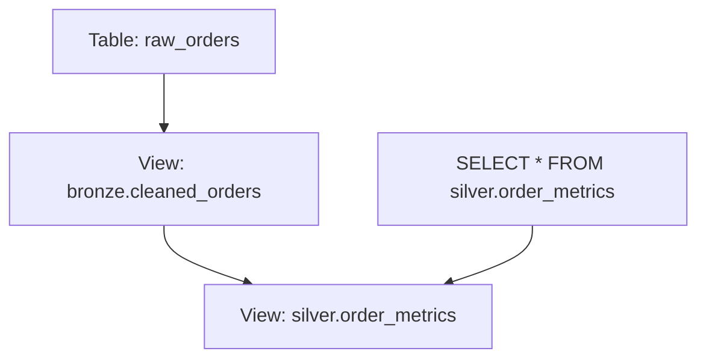

# Views

This documentation expands on **views** in Databricks, focusing on:

* What a view is and how it differs from a table
* View types and their lifecycle behavior
* How views relate to Unity Catalog, permissions, and dependency graphs
* Creation and usage patterns in SQL and Python
* Best practices for production and development scenarios

Views are central for abstracting complex SQL, enforcing consistent business logic, and avoiding data duplication.

---

## 1. What Is a View?

A **view** is a **virtual table** defined by a SQL query.

Key properties:

* A view **does not store physical data** (no Parquet files, no Delta log).
* It stores:

  * A SQL definition (the text of the query).
  * Metadata such as schema, owner, and privileges.
* Each time you query the view, Databricks:

  * Expands the view definition,
  * Substitutes it into your query,
  * Executes the resulting SQL against the underlying tables.

Conceptually:



Views are a logical abstraction layer: they expose a stable interface even as underlying tables evolve.

---

## 2. Types of Views in Databricks

Databricks supports three main view types:

| View Type        | Scope                   | Persistence                | Dropped When           | Typical Use Case                          |
| ---------------- | ----------------------- | -------------------------- | ---------------------- | ----------------------------------------- |
| Stored view      | Across sessions & users | Metastore / Unity Catalog  | Manually via DROP VIEW | Production business logic and data access |
| Temporary view   | Current Spark session   | In memory                  | On session end         | Intermediate transforms in a notebook     |
| Global temp view | All sessions on cluster | In memory (global_temp db) | On cluster restart     | Shared dev views across notebooks         |

### 2.1 View Type Overview (Mermaid)



---

## 3. Stored Views (Persistent Views)

### 3.1 Description

Stored views:

* Are registered in the metastore (Hive or Unity Catalog).
* Persist across:

  * Notebook restarts,
  * Cluster restarts,
  * User sessions.
* Are referenced by their fully qualified name, for example:

```text
catalog_name.schema_name.view_name
```

They behave like tables in SQL, but without owning data.

### 3.2 SQL Syntax

Basic stored view:

```sql
CREATE VIEW analytics.sales_summary AS
SELECT
  region,
  SUM(total_sales) AS revenue,
  COUNT(*) AS order_count
FROM sales_data
GROUP BY region;
```

Create or replace:

```sql
CREATE OR REPLACE VIEW analytics.sales_summary AS
SELECT
  region,
  SUM(total_sales) AS revenue
FROM sales_data
WHERE is_test = FALSE
GROUP BY region;
```

Drop:

```sql
DROP VIEW analytics.sales_summary;
```

In Unity Catalog, always think in 3-part names: `catalog.schema.view`.

### 3.3 Stored View Lifecycle (Mermaid)



Data always lives in underlying Delta tables; dropping the view does not drop the data.

---

## 4. Temporary Views

### 4.1 Description

Temporary views:

* Exist only in the **current Spark session**.
* Are not persisted in the metastore.
* Are useful for:

  * Intermediate or exploratory transformations.
  * Chaining multiple steps without writing to disk.

Typical pattern:

* Build a DataFrame or SQL result.
* Register it as a temporary view.
* Use SQL on top of that view.

### 4.2 Lifecycle Triggers

A Spark session (and its temporary views) is reset when:

* You open a brand new notebook.
* You detach and reattach a notebook from a cluster.
* You restart the Python or Scala interpreter (for example by `%pip install` on some runtimes).
* You restart the cluster.

After that, all temporary views must be recreated.

### 4.3 SQL Syntax

```sql
CREATE TEMP VIEW temp_sales AS
SELECT *
FROM sales_data
WHERE region = 'EMEA';
```

Or:

```sql
CREATE TEMPORARY VIEW temp_sales AS
SELECT *
FROM sales_data
WHERE region = 'EMEA';
```

### 4.4 Python DataFrame Based Temporary View

```python
df = spark.read.table("analytics.sales_data").where("region = 'EMEA'")
df.createOrReplaceTempView("temp_sales")
```

You can now query:

```sql
SELECT * FROM temp_sales;
```

### 4.5 Temporary View Lifecycle (Mermaid)



---

## 5. Global Temporary Views

### 5.1 Description

Global temporary views:

* Live in the `global_temp` database.
* Are visible to all notebooks and sessions attached to the same cluster.
* Exist until the cluster is restarted.

Scope:

* Wider than temporary views (multiple notebooks),
* Narrower than stored views (limited to one cluster).

Useful when:

* Collaborating across multiple notebooks on the same cluster.
* Sharing intermediate results across sessions in dev or test environments.

### 5.2 SQL Syntax

Create:

```sql
CREATE GLOBAL TEMP VIEW global_sales AS
SELECT *
FROM sales_data
WHERE total_sales > 1000;
```

Query:

```sql
SELECT * FROM global_temp.global_sales;
```

Note: `global_temp` is a special, reserved database name.

### 5.3 Global Temp Lifecycle (Mermaid)



---

## 6. Summary Table

| Feature                | Stored View                | Temporary View        | Global Temporary View                    |
| ---------------------- | -------------------------- | --------------------- | ---------------------------------------- |
| Stores data            | No                         | No                    | No                                       |
| Metadata location      | Metastore / Unity Catalog  | Session memory        | `global_temp` database in cluster memory |
| Lifetime               | Until manually dropped     | Until session ends    | Until cluster restart                    |
| Visibility scope       | All sessions, all clusters | Single session only   | All sessions attached to same cluster    |
| Query qualifier needed | None                       | None                  | `global_temp.` prefix required           |
| Creation SQL           | `CREATE VIEW`              | `CREATE TEMP VIEW`    | `CREATE GLOBAL TEMP VIEW`                |
| Typical use case       | Production reusable logic  | Ad hoc / intermediate | Shared dev logic in a cluster session    |

---

## 7. View Resolution and Dependencies

Views form dependency graphs on top of base tables.

Example:

```sql
CREATE VIEW bronze.cleaned_orders AS
SELECT * FROM raw_orders WHERE is_valid = TRUE;

CREATE VIEW silver.order_metrics AS
SELECT
  customer_id,
  COUNT(*) AS order_count,
  SUM(amount) AS total_spent
FROM bronze.cleaned_orders
GROUP BY customer_id;
```

When you query `silver.order_metrics`, Databricks expands both views back to the base tables.

### 7.1 Dependency Graph (Mermaid)



Use Unity Catalog lineage tools to visualize deeper dependency graphs across many views and tables.

---

## 8. Views, Permissions, and Unity Catalog

Permissions model:

* Access to a view is controlled by **permissions on the view**, not directly on the base table.
* However, the **runtime still enforces access**:

  * If the view owner does not have permission to access underlying tables, the view will fail for them.
* This enables:

  * Row or column level abstraction with views.
  * Hiding sensitive columns in base tables by exposing only safe subsets.

Pattern:

* Base table: contains all raw data (including sensitive fields).
* View: exposes only non sensitive columns.

```sql
CREATE VIEW analytics.customer_public AS
SELECT
  customer_id,
  country,
  signup_date
FROM raw.customer_full;
```

Grant view to analysts:

```sql
GRANT SELECT ON VIEW analytics.customer_public TO `analyst_group`;
```

Analysts can use the view without direct access to `raw.customer_full`.

---

## 9. Best Practices

1. **Favor stored views for reusable business logic**

   * Use for curated metrics, standardized aggregations, or canonical joins.

2. **Use temporary views for within notebook pipelines**

   * For multi step transformations in a single pipeline run.
   * Avoid cluttering the metastore with one off objects.

3. **Use global temp views for collaborative dev on a shared cluster**

   * When multiple notebooks need to share intermediate results.
   * Do not use for production; they are tied to cluster lifespan.

4. **Name views clearly and consistently**

   * Prefix by layer (for example `vw_`, `v_`, or medallion tier: `bronze.`, `silver.`, `gold.`).

5. **Avoid deeply nested view chains**

   * Too many layers of views can make debugging and performance tuning harder.
   * Periodically materialize key transformations into physical Delta tables.

6. **Monitor performance**

   * Remember: views do not cache or materialize by default.
   * Expensive logic in views is executed on every query.
   * For very heavy logic, consider replacing a view with:

     * A scheduled ETL job that writes to a Delta table, or
     * A materialized view / streaming table where appropriate.

7. **Document view semantics**

   * Use comments:

```sql
COMMENT ON VIEW analytics.sales_summary IS
'Region level sales metrics used in executive dashboards';
```

This makes the catalog easier to explore and reduces ambiguity for consumers.

---

Views provide a powerful abstraction layer in Databricks, allowing you to separate physical data layout from logical access patterns. Correct use of stored, temporary, and global temporary views gives you flexibility for production modeling, exploratory analysis, and collaborative development without duplicating data.
