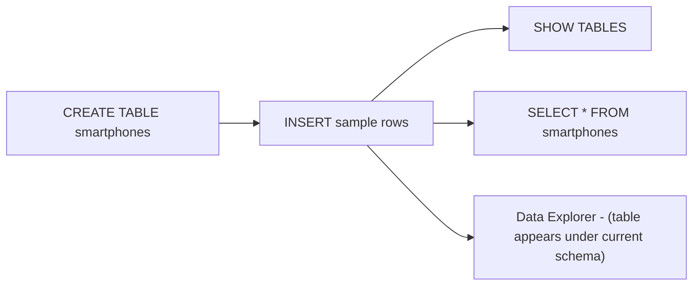
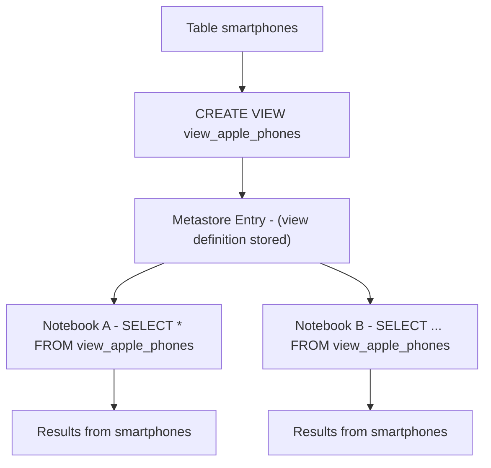
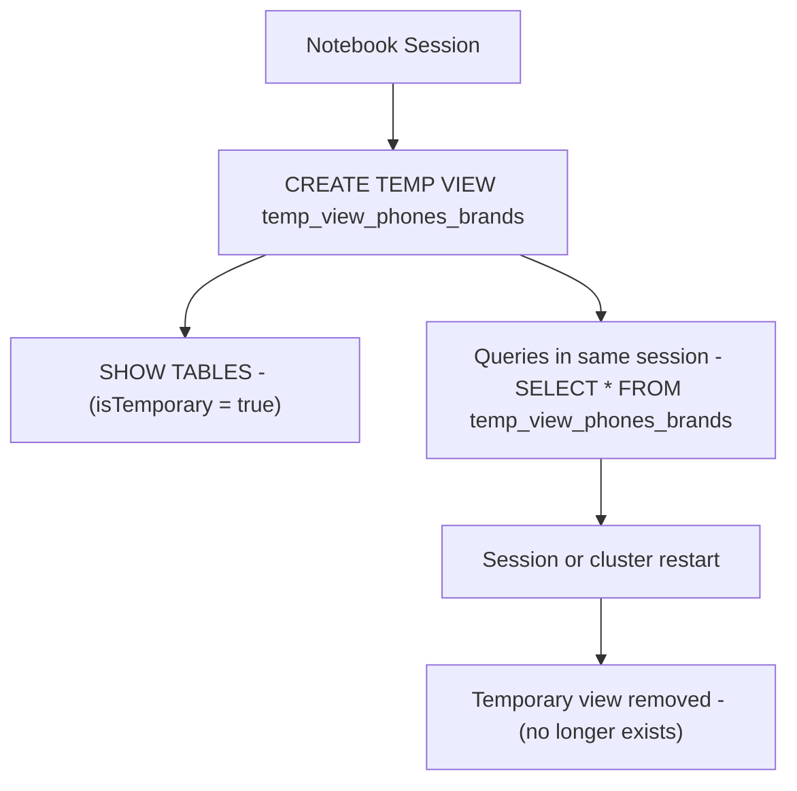
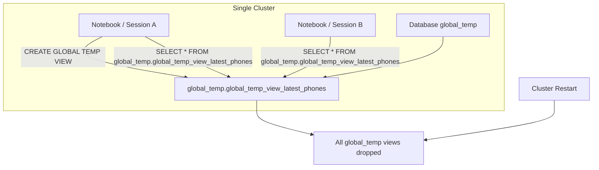
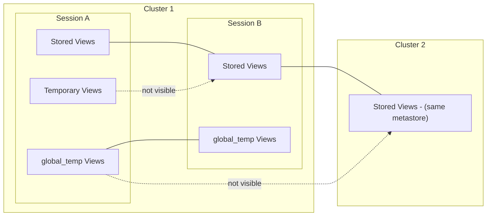

# Working with Views

This documentation shows how to **create**, **query**, and **observe the lifecycle** of Databricks **stored views**, **temporary views**, and **global temporary views**, using a concrete `smartphones` example and explicit session/cluster behavior.

---

## 1. Setup: Base Table for Demonstration

All examples here use a shared base table named `smartphones`.

### 1.1 Table Creation and Population

```sql
CREATE TABLE smartphones (
  id INT,
  name STRING,
  brand STRING,
  release_year INT
);

INSERT INTO smartphones VALUES
(1,  'iPhone X',   'Apple',   2017),
(2,  'Galaxy S10', 'Samsung', 2019),
(3,  'Pixel 5',    'Google',  2020),
(4,  'OnePlus 9',  'OnePlus', 2021),
(5,  'Galaxy S22', 'Samsung', 2022),
(6,  'iPhone 13',  'Apple',   2021),
(7,  'Pixel 7',    'Google',  2022),
(8,  'Galaxy S23', 'Samsung', 2023),
(9,  'Nothing Phone 2', 'Nothing', 2023),
(10, 'iPhone 14',  'Apple',   2023);
```

Verification options:

* Run `SELECT * FROM smartphones;`
* Use `SHOW TABLES;` in SQL
* Check the table in Data Explorer

### 1.2 Base Table Flow (Mermaid)



This base table will be referenced by all view examples.

---

## 2. Creating Views

Databricks supports three view types, all defined via `CREATE VIEW` with different modifiers:

* Stored view: `CREATE VIEW`
* Temporary view: `CREATE TEMP VIEW`
* Global temporary view: `CREATE GLOBAL TEMP VIEW`

Each type has distinct scope and lifecycle.

---

## 3. Stored View

### 3.1 Description

* Persisted in the metastore (Hive or Unity Catalog).
* Visible in Data Explorer and in `SHOW TABLES` for the schema.
* Survives notebook, session, and cluster restarts.
* Shared across all users who have permissions.

### 3.2 Example: Apple Phones View

```sql
CREATE VIEW view_apple_phones AS
SELECT *
FROM smartphones
WHERE brand = 'Apple';
```

Usage examples:

```sql
SELECT * FROM view_apple_phones;

SELECT name, release_year
FROM view_apple_phones
ORDER BY release_year DESC;
```

### 3.3 Behavior and Visibility

* `SHOW TABLES;` will list `view_apple_phones` with `isTemporary = false`.

* In Unity Catalog, fully qualified name might be:

  ```text
  main.default.view_apple_phones
  ```

* Available to any notebook in any session that uses the same catalog and schema and has privileges.

### 3.4 Stored View Lifecycle (Mermaid)



Deletion:

```sql
DROP VIEW view_apple_phones;
```

Drop removes the definition from the metastore but leaves `smartphones` unchanged.

---

## 4. Temporary View

### 4.1 Description

* Lives only in the current **Spark session**.
* Exists only in memory, not in the metastore.
* Ideal for intermediate transformations, joins, or quick exploration.
* Not visible in Data Explorer.

### 4.2 Example: Distinct Brands

```sql
CREATE TEMP VIEW temp_view_phones_brands AS
SELECT DISTINCT brand
FROM smartphones;
```

Query:

```sql
SELECT * FROM temp_view_phones_brands;
```

### 4.3 Behavior and Visibility

* `SHOW TABLES;` in that session will show `temp_view_phones_brands` with `isTemporary = true`.
* Not visible in other notebooks or new sessions.
* Disappears when the session is reset, for example:

  * Opening a new notebook (new session).
  * Detach and reattach notebook to cluster.
  * Interpreter restart (for example after `%pip install` on some runtimes).
  * Cluster restart.

### 4.4 Python Pattern for Temporary View

```python
df_brands = spark.table("smartphones").selectExpr("distinct brand")
df_brands.createOrReplaceTempView("temp_view_phones_brands")
```

Now you can run:

```sql
SELECT * FROM temp_view_phones_brands;
```

### 4.5 Temporary View Lifecycle (Mermaid)



There is no explicit drop required; you can still drop it manually:

```sql
DROP VIEW temp_view_phones_brands;
```

---

## 5. Global Temporary View

### 5.1 Description

* Lives across multiple **sessions**, but only within the same **cluster**.
* Stored in a reserved database named `global_temp`.
* Accessible from any notebook attached to that cluster using the `global_temp.` prefix.
* Removed when the cluster is restarted.

### 5.2 Example: Latest Phones View

```sql
CREATE GLOBAL TEMP VIEW global_temp_view_latest_phones AS
SELECT *
FROM smartphones
WHERE release_year > 2020
ORDER BY release_year DESC;
```

### 5.3 Query Syntax

Because it lives in the `global_temp` database, querying requires a database prefix:

```sql
SELECT * 
FROM global_temp.global_temp_view_latest_phones;
```

List all global temporary views:

```sql
SHOW TABLES IN global_temp;
```

### 5.4 Global Temp Lifecycle (Mermaid)



Global temp views are shared for collaborative work on the same cluster, but they are not durable across cluster lifecycles.

Deletion:

```sql
DROP VIEW global_temp.global_temp_view_latest_phones;
```

---

## 6. View Visibility Across Sessions and Clusters

The three view types differ mainly in:

* **Where their metadata lives**
* **How long they exist**
* **Which sessions and clusters can see them**

### 6.1 Visibility Matrix

| View Type             | Visible in Data Explorer | Visible in `SHOW TABLES` default schema | Visible in `SHOW TABLES IN global_temp` | Available across sessions | Survives cluster restart |
| --------------------- | ------------------------ | --------------------------------------- | --------------------------------------- | ------------------------- | ------------------------ |
| Stored view           | Yes                      | Yes                                     | No                                      | Yes                       | Yes                      |
| Temporary view        | No                       | Yes (isTemporary = true, same session)  | No                                      | No                        | No                       |
| Global temporary view | No                       | No                                      | Yes                                     | Yes (same cluster only)   | No                       |

### 6.2 Session and Cluster Scope (Mermaid)



Interpretation:

* Stored views: visible across sessions and clusters that share the same metastore / catalog.
* Temporary views: bound to one session.
* Global temp views: shared across sessions, limited to one cluster.

---

## 7. Cleanup Example

To remove all created objects from this example:

```sql
-- Drop all views
DROP VIEW IF EXISTS view_apple_phones;
DROP VIEW IF EXISTS temp_view_phones_brands;
DROP VIEW IF EXISTS global_temp.global_temp_view_latest_phones;

-- Drop base table
DROP TABLE IF EXISTS smartphones;
```

This returns the environment to a clean state, which is recommended at the end of labs and demos.

---

## 8. Lifecycle Summary Table

| Aspect          | Stored View                     | Temporary View                          | Global Temporary View                            |
| --------------- | ------------------------------- | --------------------------------------- | ------------------------------------------------ |
| Scope           | All sessions, all clusters      | Current Spark session only              | All sessions on the same cluster                 |
| Persistence     | Metastore / Unity Catalog       | In session memory only                  | Cluster memory in `global_temp` database         |
| Creation syntax | `CREATE VIEW`                   | `CREATE TEMP VIEW`                      | `CREATE GLOBAL TEMP VIEW`                        |
| Query syntax    | `SELECT ... FROM view_name`     | `SELECT ... FROM temp_view_name`        | `SELECT ... FROM global_temp.view_name`          |
| Visibility      | `SHOW TABLES`, Data Explorer    | `SHOW TABLES` (same session, temporary) | `SHOW TABLES IN global_temp`                     |
| Deletion        | Manual `DROP VIEW`              | Automatic on session end or manual drop | Automatic on cluster restart or manual drop      |
| Typical use     | Production reusable definitions | Intermediate notebook pipelines         | Shared dev views within a single cluster session |

---

## 9. Practical Usage Guidelines

* Use **stored views** for:

  * Stable, reusable business logic that multiple teams depend on.
  * Canonical aggregations and curated datasets in silver or gold layers.

* Use **temporary views** for:

  * Multi step transformations inside a single job or notebook.
  * Isolated experimentation without polluting the catalog.

* Use **global temporary views** for:

  * Shared development across several notebooks on the same cluster.
  * Short lived collaboration where durability across clusters is not required.

Understanding these view types and their lifecycles allows you to design clear, maintainable, and predictable query layers in Databricks.
