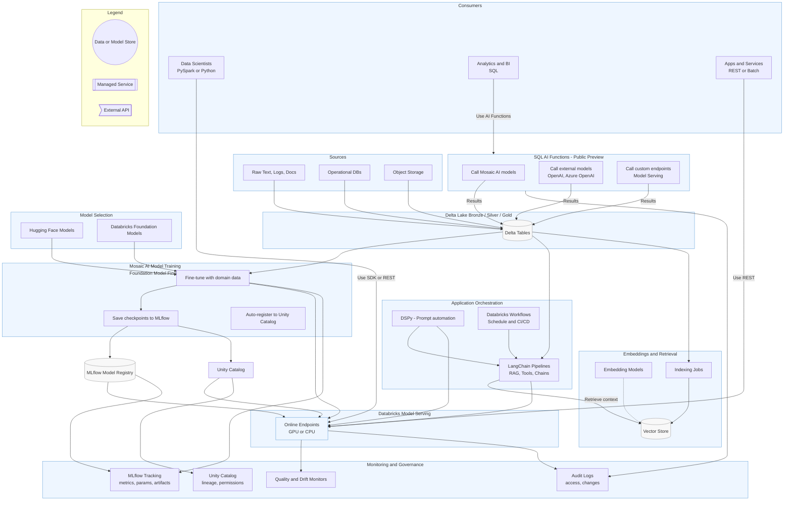

```mermaid
flowchart TB
  %% Databricks LLM Ecosystem - Refined Architecture

  %%========================
  %% Sources
  %%========================
  subgraph SRC["Sources"]
    S1[Raw Text, Logs, Docs]
    S2[Operational DBs]
    S3[Object Storage]
  end

  %%========================
  %% Data Lake
  %%========================
  subgraph LAKE["Delta Lake Bronze / Silver / Gold"]
    D1[(Delta Tables)]
  end

  S1 --> D1
  S2 --> D1
  S3 --> D1

  %%========================
  %% Model Options
  %%========================
  subgraph MODELS["Model Selection"]
    M1[Hugging Face Models]
    M2[Databricks Foundation Models]
  end

  %%========================
  %% Training and Fine-tuning
  %%========================
  subgraph TRAIN["Mosaic AI Model Training\nFoundation Model Fine-tuning - Public Preview"]
    T1[Fine-tune with domain data]
    T2[Save checkpoints to MLflow]
    T3[Auto-register to Unity Catalog]
  end

  D1 --> T1
  M1 --> T1
  M2 --> T1
  T1 --> T2 --> ML[(MLflow Model Registry)]
  T2 --> UC[Unity Catalog]

  %%========================
  %% Orchestration
  %%========================
  subgraph ORCH["Application Orchestration"]
    L1[LangChain Pipelines\nRAG, Tools, Chains]
    P1[DSPy - Prompt automation]
    W1[Databricks Workflows\nSchedule and CI/CD]
  end

  D1 --> L1
  P1 --> L1
  W1 --> L1

  %%========================
  %% Embeddings and Retrieval
  %%========================
  subgraph EMB["Embeddings and Retrieval"]
    E1[Embedding Models]
    E2[Indexing Jobs]
    VS[(Vector Store)]
  end

  D1 --> E2 --> VS
  E1 -.-> VS
  L1 -->|Retrieve context| VS

  %%========================
  %% Serving
  %%========================
  subgraph SERVE["Databricks Model Serving"]
    SVC1[Online Endpoints\nGPU or CPU]
  end

  ML --> SVC1
  UC --> SVC1
  T1 --> SVC1
  L1 --> SVC1
  P1 --> SVC1

  %%========================
  %% SQL AI Functions
  %%========================
  subgraph SQLF["SQL AI Functions - Public Preview"]
    Q1[Call Mosaic AI models]
    Q2[Call external models\nOpenAI, Azure OpenAI]
    Q3[Call custom endpoints\nModel Serving]
  end

  Q1 -->|Results| D1
  Q2 -->|Results| D1
  Q3 -->|Results| D1

  %%========================
  %% Consumers
  %%========================
  subgraph CONS["Consumers"]
    C1[Data Scientists\nPySpark or Python]
    C2[Analytics and BI\nSQL]
    C3[Apps and Services\nREST or Batch]
  end

  C1 -->|Use SDK or REST| SVC1
  C2 -->|Use AI Functions| SQLF
  C3 -->|Use REST| SVC1

  %%========================
  %% Monitoring and Governance
  %%========================
  subgraph GOV["Monitoring and Governance"]
    G1[MLflow Tracking\nmetrics, params, artifacts]
    G2[Unity Catalog\nlineage, permissions]
    G3[Audit Logs\naccess, changes]
    G4[Quality and Drift Monitors]
  end

  T1 --> G1
  ML --> G1
  UC --> G2
  SVC1 --> G4
  SVC1 --> G3
  SQLF --> G3

  %%========================
  %% Styling
  %%========================
  classDef store fill:#f8f8f8,stroke:#999,stroke-width:1px;
  classDef service fill:#eef6ff,stroke:#5b9bd5,stroke-width:1px;
  classDef ext fill:#fff7e6,stroke:#e0a800,stroke-width:1px;

  class D1,VS,ML store;
  class SVC1,SQLF,TRAIN,ORCH,SRC,LAKE,MODELS,SERVE,EMB,GOV,CONS service;

  %%========================
  %% Legend
  %%========================
  subgraph LEGEND["Legend"]
    Ld1((Data or Model Store))
    Ld2[[Managed Service]]
    Ld3>External API]
  end


```