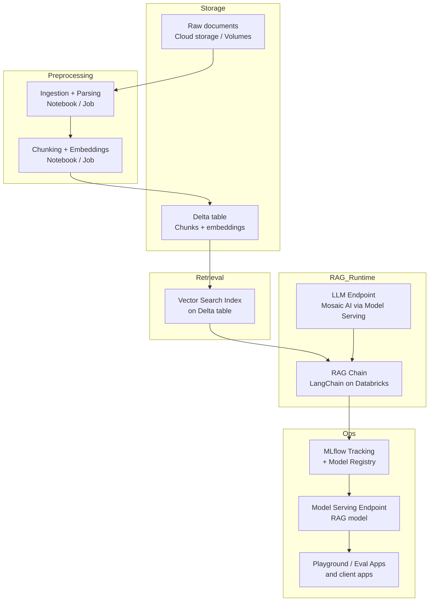
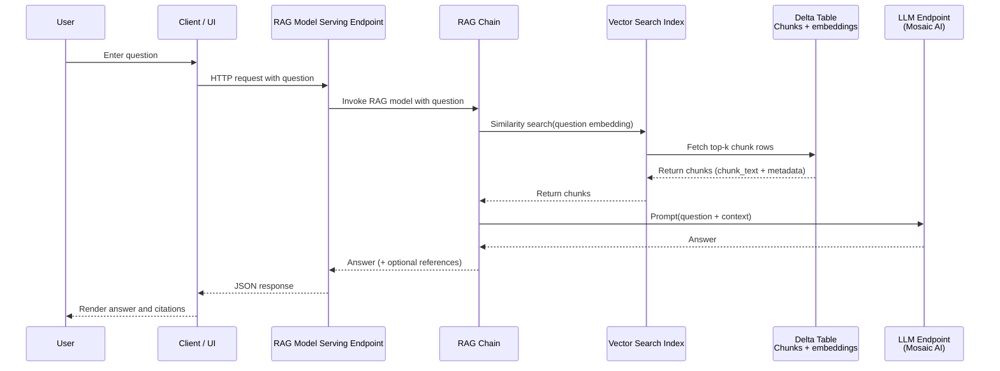

# Architecture

This section describes an end-to-end Retrieval Augmented Generation (RAG) architecture that runs entirely inside Databricks. No external preprocessing platforms are involved.

**Logical steps:**

1. Ingest raw documents into Databricks (Volumes or cloud storage paths).
2. Parse documents, extract text, chunk, and generate embeddings (in a notebook or jobs).
3. Store chunks + embeddings in a Delta table under Unity Catalog.
4. Build a Vector Search index on that Delta table.
5. Implement the RAG chain using:
   * Databricks Vector Search retriever
   * Mosaic AI-hosted LLM via Databricks model serving
   * LangChain chain logic
6. Use MLflow to:
   * Track runs and traces
   * Log the chain as a model
   * Register it in Unity Catalog
7. Serve the chain via Databricks Model Serving.
8. Use playground / eval apps to test and collect feedback.

Everything below focuses on how these pieces fit together and how data flows between them.

## High-level architecture

### Component overview

Main components:

* Storage and governance
  * Unity Catalog (catalogs, schemas, tables, models, permissions)
  * Delta tables for chunks and embeddings
  * Volumes or cloud storage for raw documents
* Compute
  * Databricks notebooks and Jobs for preprocessing
  * Vector Search service for similarity search
  * Mosaic AI LLM endpoints hosted via Model Serving
* Orchestration and observability
  * LangChain-based RAG chain running on Databricks
  * MLflow for logging, traces, model registry
  * Model Serving endpoints for inference
  * Playground and eval apps for manual testing and feedback

### High-level data flow

**Interpretation:**

* Raw files are ingested and normalized to text and metadata.
* Text is chunked and embedded, producing a Delta table with chunk_text + embedding.
* A Vector Search index is built on top of that Delta table.
* The RAG chain uses Vector Search and an LLM endpoint to answer questions.
* The RAG chain is tracked, registered, and served via MLflow and Model Serving.
* Playground, eval apps, and external clients call the RAG model serving endpoint.

## Step 1: Ingest raw documents into Databricks

### Storage choices

Two common options:

* Databricks Volumes:

  * Managed storage under Unity Catalog.
  * Good for governance and simple path management.
* Direct cloud paths:

  * S3, ADLS, or GCS paths accessible to clusters.

Examples:

* Volume path:

  * `/Volumes/company_knowledge/raw/sec_filings/`
* S3 path:

  * `s3://company-bucket/sec_filings/`

### Ingestion pattern

A standard ingestion pattern:

* A Databricks notebook or Job:

  * Enumerates files in the configured path(s).
  * Reads each file (PDF, DOCX, TXT, HTML, etc.).
  * Extracts raw text and simple metadata.
  * Writes them into a staging Delta table under Unity Catalog.

Example table structure `catalog.schema.docs_raw`:

* `file_id` (string): unique id per document.
* `file_name` (string): original file name.
* `source_path` (string): full path in storage.
* `page` (int): page number or section index.
* `raw_text` (string): extracted text.
* `ingestion_ts` (timestamp): ingestion time.
* Additional metadata as needed.

This staging table is the starting point for parsing and chunking.

## Step 2: Parse, extract text, chunk, and generate embeddings

### Parsing and normalization

Parsing responsibilities:

* Convert each file into a consistent text representation.
* Preserve enough structure for meaningful chunking:

  * Page boundaries
  * Headings, sections
  * Optional: lists, tables, captions

Implementation options:

* Use Python libraries on Databricks clusters:

  * `pypdf` for PDFs
  * `python-docx` for DOCX
  * HTML parsers for web content
* Run as:

  * Interactive notebook during development.
  * Databricks Job for scheduled ingestion.

Output of parsing:

* Clean text per page or per logical section.
* Basic metadata (page number, section name, document type).

### Chunking

Goal:

* Break long texts into semantically meaningful chunks that fit within context window constraints and work well with embeddings.

Typical chunking rules:

* Maximum characters or tokens per chunk (for example 512 to 1500 characters).
* Prefer to split on sentence or paragraph boundaries.
* Optional overlapping context between chunks to preserve continuity.

Resulting chunk table structure `catalog.schema.docs_chunks`:

* `chunk_id` (string or long): unique per chunk.
* `file_id` (string).
* `file_name` (string).
* `page` (int).
* `chunk_index` (int): index of chunk within document or page.
* `chunk_text` (string).
* `metadata` (struct or JSON):

  * section_title
  * document_type
  * language
  * customer_id
  * any relevant attributes.

This table is the canonical source for embedding.

### Embedding generation

Embeddings encode `chunk_text` into a fixed-size vector.

Databricks pattern:

* Deploy an embedding model as a Model Serving endpoint.
* Call that endpoint from a notebook or Job.
* Populate an `embedding` column (array<float>) on the chunks table.

Common approach:

* Batch embedding to reduce calls.
* Ensure consistent embedding model and config across jobs.
* Store embedding dimension as part of table metadata for consistency.

New table `catalog.schema.docs_chunks_embedded`:

* `chunk_id` (PK)
* `file_id`
* `file_name`
* `page`
* `chunk_index`
* `chunk_text`
* `metadata`
* `embedding` (array<float>)

This is the table used for Vector Search.

## Step 3: Store chunks + embeddings in a Delta table under Unity Catalog

All chunk and embedding data should live in a Delta table governed by Unity Catalog.

**Reasons:**

* Access control at catalog / schema / table level.
* Lineage and history features.
* Works natively with Vector Search and MLflow.
* Unified governance for all data and AI artifacts.

**Recommended practices:**

* Use a dedicated catalog, for example `knowledge_base`.
* Use separate schemas for different domains, for example `kb_finance`, `kb_support`.
* Partition by relevant columns if volume is large, for example by `ingestion_date`.

**Example fully qualified name:**

* `knowledge_base.kb_finance.docs_chunks_embedded`

Unity Catalog responsibilities:

* Grant and revoke SELECT permission for teams and services.
* Provide table-level lineage information for compliance and audit.
* Support discovery of the RAG knowledge base via the Databricks UI.

## Step 4: Build a Vector Search index

Vector Search exposes approximate nearest neighbor search over the `embedding` column in your Delta table.

### Conceptual responsibilities

Vector Search:

* Watches the underlying Delta table and maintains an index.
* Supports similarity search queries (by embedding).
* Returns:

  * Top k chunks.
  * Their chunk text and metadata.
* Integrates directly with Unity Catalog data.

### Index configuration

Key configuration elements:

* Index name:
  * For example `knowledge_base.kb_finance.vs_docs_chunks`.
* Vector Search endpoint:
  * Logical endpoint that hosts one or more indexes.
* Source table:
  * `knowledge_base.kb_finance.docs_chunks_embedded`.
* Primary key:
  * For example `chunk_id`.
* Embedding column:
  * `embedding`.
* Embedding dimension:
  * Must match the embedding model dimension.
* Sync mode:
  * Auto sync:
    * New rows and updates are indexed continuously.
  * Triggered:
    * Index update is controlled explicitly (for example after batch jobs).

Once configured, the index can be used from:

* Databricks SQL / Python APIs.
* LangChain retrievers.
* RAG chains running on Databricks.

## Step 5: Implement the RAG chain (Vector Search + Mosaic AI + LangChain)

The RAG chain is the core inference logic.

### Components inside the chain

The chain uses:

* Retriever:
  * Based on the Vector Search index.
  * Given a user question, it:
    * Embeds the question (internally or via the same embedding model).
    * Queries the index.
    * Returns top-k chunks with their text and metadata.
* Prompt template:
  * System message:
    * Instructions about style and constraints.
  * Human message:
    * The question plus serialized context (chunks).
* LLM:
  * Mosaic AI LLM exposed via a Databricks Model Serving endpoint.
* Orchestration:
  * LangChain chain that:
    * Accepts a question.
    * Calls the retriever.
    * Formats the prompt.
    * Calls the LLM.
    * Returns an answer (optionally with references).

### Data flow inside the chain

Internal logical steps:

1. Input:

   * User question string.
2. Retrieval:
   * Compute embedding for question (with same embedding model used for documents).
   * Query Vector Search index for top-k chunks.
   * Get chunk_text and metadata.
3. Prompt construction:
   * Build a context string by concatenating chunk_text values.
   * Inject question and context into a prompt template.
4. Generation:
   * Call LLM endpoint with the constructed prompt.
   * Receive answer.
5. Optional:
   * Attach references:
     * List of chunk ids, file names, page numbers used as context.

### RAG query flow

This sequence is the runtime behavior for each query.

## Step 6: Use MLflow for tracking, logging, and registration

MLflow is the central mechanism for:

* Tracking experiments and runs.
* Capturing traces of RAG chains.
* Logging models.
* Registering models under Unity Catalog.

### Tracing and debug visibility

For each RAG query during development:

* Log:
  * Input question.
  * Parameters (k, filters, prompt version).
  * Retrieved chunk ids and texts.
  * Full prompt sent to the LLM.
  * LLM raw output.
  * Final formatted answer.

This enables:

* Checking whether retrieval is relevant.
* Inspecting prompt quality.
* Debugging hallucinations by comparing answer vs context.

LangChain and MLflow integration can capture these traces automatically or via explicit logging code.

### Logging the RAG chain as a model

When the RAG chain is stable:

* Wrap it as an MLflow model:

  * Define expected input schema (for example `question` string).
  * Define output schema (for example `answer` string plus `references`).
* Log the chain as an artifact using MLflow.
* Register it to Unity Catalog with a fully qualified model name.

Model registry structure:

* `catalog_name.schema_name.model_name`

For example:

* `knowledge_base.kb_finance.rag_finance_assistant`

The registry tracks:

* Versions of the RAG chain.
* Stages (None, Staging, Production).
* Lineage information (runs, data, code).

## Step 7: Serve the chain via Databricks Model Serving

Model Serving hosts the RAG chain as an HTTP endpoint.

### Serving endpoint responsibilities

The serving endpoint:

* Receives JSON payloads with user questions.
* Calls the registered RAG chain model:

  * The chain internally calls:

    * Vector Search index.
    * LLM endpoint.
* Returns JSON responses with answers and optional references.

Benefits:

* Managed scaling.
* Integrated authentication using Databricks tokens or workspace identity.
* Observability on latency, error rates, throughput.

### Integration with other components

Relationships:

* The serving endpoint depends on:

  * The RAG model registered in Unity Catalog.
  * The Vector Search index accessible via Unity Catalog.
  * The LLM endpoint (Mosaic AI) accessible in the workspace.
* Permissions must be configured so:

  * Serving runtime can access:

    * The Delta table(s) used by Vector Search.
    * The Vector Search index.
    * The LLM endpoint.

## Step 8: Use playground and eval apps for testing and feedback

Databricks provides interactive UIs on top of serving endpoints.

### Playground

The playground:

* Binds to a specific serving endpoint.
* Allows interactive queries:

  * Type question.
  * See answer.
  * Optionally see references, traces, and prompts (depending on setup).
* Useful for:

  * Quick manual testing.
  * Comparing behavior between model versions.
  * Demonstrating RAG behavior without building a custom UI.

### Evaluation apps (review apps)

Evaluation apps extend simple playground behavior with feedback collection.

Capabilities:

* Provide a UI where users:

  * Enter questions.
  * See answers (and references).
  * Rate responses for:

    * Accuracy.
    * Relevance.
    * Safety.
    * Helpfulness.
  * Optionally write free-text comments.
* Collect responses into evaluation datasets.

Uses of evaluation data:

* Identify frequent failure patterns.
* Drive prompt iterations and retrieval tuning.
* Train ranking models or fine-tuned LLMs on real feedback.

## End-to-end lifecycle summary

End-to-end lifecycle inside Databricks:

1. Ingestion:

   * Raw documents are loaded into Storage (Volumes or cloud).
2. Preprocessing:

   * Notebooks / Jobs parse, chunk, and embed documents.
   * Results are stored in a Delta table governed by Unity Catalog.
3. Retrieval index:

   * Vector Search index is built on top of the embeddings.
4. RAG chain:

   * LangChain orchestrates Vector Search + Mosaic AI LLM into a chain.
5. Observability and registration:

   * MLflow tracks runs, logs models, and registers the RAG chain.
6. Serving:

   * The registered RAG model is exposed via a Model Serving endpoint.
7. Evaluation:

   * Playground and eval apps are used for manual testing and user feedback.
8. Iteration:

   * Feedback and metrics drive changes in:

     * Chunking strategies.
     * Embedding settings.
     * Vector Search configuration.
     * Prompt templates.
     * LLM choice or fine-tuning.

This architecture keeps all data, models, and execution flows inside Databricks, under Unity Catalog governance and Databricks runtime control.
