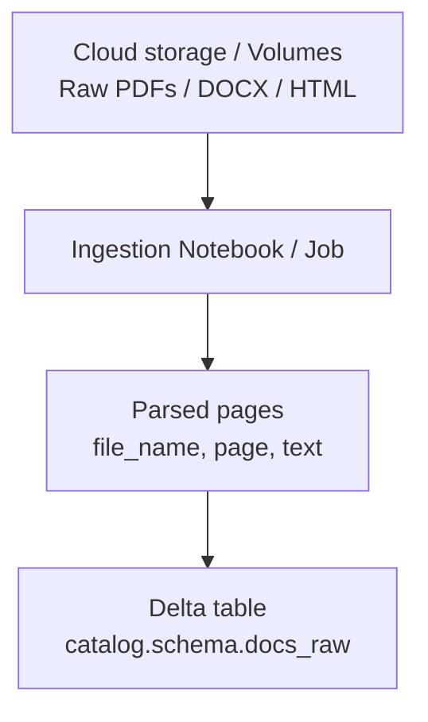
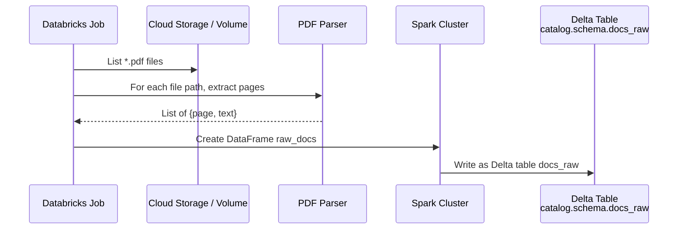
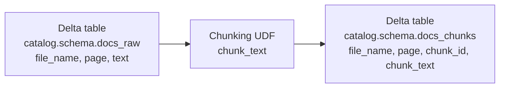

# Data ingestion and preprocessing on Databricks

This section describes how to bring raw documents into Databricks and turn them into chunked text suitable for RAG.

We focus on:

* Where documents are stored.
* How to parse them into text.
* How to chunk the text into retrieval-friendly segments.
* How to persist everything in Delta tables under Unity Catalog.

## Where documents live

Documents must be accessible to your Databricks cluster. Typical locations:

* Directly in cloud storage referenced by Databricks:

  * `s3://bucket/path/...`
  * `abfss://container@account.dfs.core.windows.net/path/...`
  * `gs://bucket/path/...`
* Databricks Volumes (recommended; managed storage under Unity Catalog):

  * `/Volumes/<catalog>/<schema>/<volume_name>/...`

Example (Volume):

```python
doc_dir = "/Volumes/company_docs/raw/sec_filings"
```

On Databricks, you normally list files with `dbutils.fs.ls` or Spark `binaryFile` reader instead of `glob`, because paths are not local filesystem paths.

Example listing files in a Volume:

```python
files = [f.path for f in dbutils.fs.ls(doc_dir) if f.path.endswith(".pdf")]
```

### Ingestion flow overview



## Parsing PDFs / documents

Goal:

* Read each document.
* Extract text and basic metadata (file name, page number, optionally sections/headings).
* Write a clean, normalized representation to a staging Delta table.

You can run this logic:

* In an interactive notebook during development.
* As a scheduled Databricks Job in production.

### Libraries

Typical Python libraries inside the notebook:

* PDFs:

  * `pypdf` or `pdfplumber`
* Word:

  * `python-docx`
* HTML:

  * `beautifulsoup4` or `lxml`
* Plain text:

  * Native Python string handling

For simplicity, below is PDF-only.

### Example: simple PDF parser (page-level)

```python
import os
from pypdf import PdfReader

def extract_pdf(doc_path: str):
    """Extract text per page from a PDF file."""
    reader = PdfReader(doc_path)
    pages = []
    for i, page in enumerate(reader.pages):
        text = page.extract_text() or ""
        pages.append({"page": i + 1, "text": text})
    return pages
```

On Databricks, `doc_path` might be something like:

* `/dbfs/Volumes/company_docs/raw/sec_filings/file.pdf` if accessed via local FS mount, or
* `dbfs:/Volumes/company_docs/raw/sec_filings/file.pdf` for `dbutils.fs` operations.

You should be consistent in how you address paths.

### Iterating over files and building raw records

Replace the `glob`-based iteration (local filesystem) with Databricks-aware listing:

```python
import os

doc_dir = "/Volumes/company_docs/raw/sec_filings"

raw_docs = []

file_infos = dbutils.fs.ls(doc_dir)
pdf_paths = [f.path for f in file_infos if f.path.lower().endswith(".pdf")]

for path in pdf_paths:
    # For pypdf you need local /dbfs path
    local_path = path.replace("dbfs:", "/dbfs")
    file_name = os.path.basename(path)
    pages = extract_pdf(local_path)
    for p in pages:
        raw_docs.append(
            {
                "file_name": file_name,
                "page": p["page"],
                "text": p["text"],
            }
        )
```

Convert to a Spark DataFrame and write into a staging Delta table:

```python
df_raw = spark.createDataFrame(raw_docs)

df_raw.write.format("delta").mode("overwrite").saveAsTable(
    "catalog.schema.docs_raw"
)
```

This will create a Unity-Catalog-governed table:

* `catalog.schema.docs_raw`

with schema:

* `file_name` string
* `page` int
* `text` string

### Production considerations

In a real system you typically also:

* Normalize encodings and unwanted whitespace.
* Remove boilerplate (headers, footers, page numbers).
* Extract additional metadata such as:

  * document type (e.g. "10-K", "policy", "manual"),
  * customer or business unit,
  * language,
  * ingestion timestamp,
  * version or revision id.
* Handle parsing errors robustly (log failures and skip corrupt files).
* Support multiple formats (PDF, DOCX, HTML, TXT) with per-format parsing functions.

### Parsing flow



## Chunking

RAG quality depends heavily on how you chunk documents.

Objectives:

* Create chunks that:

  * Are small enough to fit the LLM context window.
  * Are large enough to contain coherent information.
  * Respect sentence or paragraph boundaries as much as reasonably possible.
* Optionally introduce overlap so that important context near boundaries is not lost.

The basic chunker here:

* Splits text into sentences with a regex.
* Accumulates sentences until a maximum character length.
* Adds optional overlapping context between chunks using trailing characters of the previous chunk.

### Naive sentence splitting and chunking

```python
import re
from typing import List

def split_into_sentences(text: str) -> List[str]:
    # Very naive splitter; replace with something robust if needed.
    sentences = re.split(r"(?<=[.!?])\s+", text.strip())
    return [s for s in sentences if s]

def chunk_text(text: str, max_chars: int = 1000, overlap: int = 200) -> List[str]:
    sentences = split_into_sentences(text)
    chunks = []
    current = ""
    for s in sentences:
        if len(current) + len(s) + 1 <= max_chars:
            current = (current + " " + s).strip()
        else:
            if current:
                chunks.append(current)
            # start new chunk with overlap from the previous chunk
            if overlap > 0 and chunks:
                tail = chunks[-1][-overlap:]
                current = (tail + " " + s).strip()
            else:
                current = s
    if current:
        chunks.append(current)
    return chunks
```

Notes:

* The overlap uses the last `overlap` characters from the previous chunk.
* In practice, token-based chunking (using tokenizer-aware logic) is more accurate than character-based chunking, but character-based is simpler and works reasonably well as a starting point.

### Using chunker as a Pandas UDF

We want to run chunking at scale on Spark.

We use a Pandas UDF that:

* Takes a batch of rows with `file_name`, `page`, `text`.
* Applies `chunk_text` to each row.
* Emits multiple rows per input row: one per chunk.

```python
from pyspark.sql.functions import pandas_udf
import pandas as pd

@pandas_udf("file_name string, page int, chunk_id int, chunk_text string")
def make_chunks(batch: pd.DataFrame) -> pd.DataFrame:
    rows = []
    for _, row in batch.iterrows():
        chunks = chunk_text(row["text"], max_chars=1000, overlap=200)
        for i, ch in enumerate(chunks):
            rows.append(
                {
                    "file_name": row["file_name"],
                    "page": int(row["page"]),
                    "chunk_id": int(i),
                    "chunk_text": ch,
                }
            )
    return pd.DataFrame(rows)
```

Invoke it on the raw table:

```python
df_chunks = (
    spark.table("catalog.schema.docs_raw")
    .groupBy("file_name", "page")
    .apply(make_chunks)
)

df_chunks.write.format("delta").mode("overwrite").saveAsTable(
    "catalog.schema.docs_chunks"
)
```

Now you have a chunks table:

* `catalog.schema.docs_chunks`

with schema:

* `file_name` string
* `page` int
* `chunk_id` int
* `chunk_text` string

You can later enrich this with:

* Document-level identifiers (`file_id`).
* Section titles or headings if you extracted them earlier.
* Additional metadata columns.

### Chunking flow



### Chunking considerations

Some important tuning knobs:

* `max_chars`:

  * Too small:

    * Many tiny chunks, weak context, higher retrieval noise.
  * Too large:

    * Fewer chunks, but risk exceeding LLM context and mixing unrelated topics.
* `overlap`:

  * 0:

    * Simpler, but context at boundaries can be fragmented.
  * 100-300 chars:

    * Often a good compromise; you get continuity across chunks.
* Sentence splitting:

  * The provided regex is naive.
  * For better results, use:

    * NLP libraries like spaCy or NLTK, or
    * token-based chunkers tied to the target LLM tokenizer.

At this point in the pipeline:

* Raw documents have been ingested and parsed.
* Text has been normalized and written to `catalog.schema.docs_raw`.
* Text has been chunked and written to `catalog.schema.docs_chunks`.

The next steps (not covered in this section) are:

* Generate embeddings for `chunk_text`.
* Store them in a Delta table under Unity Catalog.
* Build a Vector Search index on top of the embedding column.
