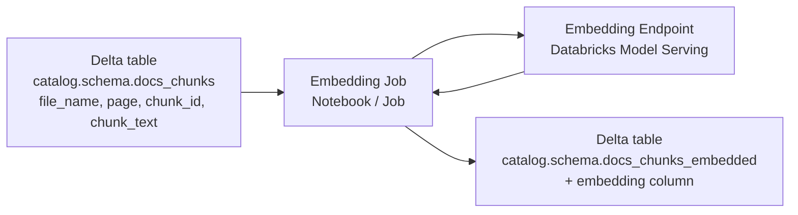
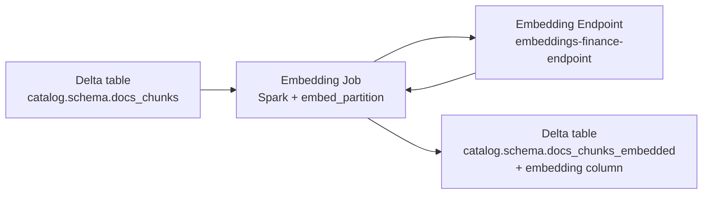

# Embeddings on Databricks

This section describes how to generate embeddings for your chunks on Databricks and persist them in a Delta table that will later back Vector Search.

The flow:

1. Deploy an embedding model as a Databricks Model Serving endpoint (Mosaic AI or your own).
2. Call that endpoint from a notebook or Job to embed `chunk_text`.
3. Store embeddings as an `array<float>` column in a Delta table under Unity Catalog.

High-level embedding flow:



---

## Embedding endpoint

You expose an embedding model as a Databricks Model Serving endpoint.

Typical options:

* Mosaic AI hosted embedding model.
* Custom embedding model (for example, sentence-transformers) containerized and served.
* Vendor model proxied through Databricks, if supported in your environment.

Assume there is a serving endpoint:

* `embeddings-finance-endpoint`

and that its host and auth token are available via environment variables.

### Example: calling the embedding endpoint from a Job

```python
import requests
import json
import os

DATABRICKS_HOST = os.environ["DATABRICKS_HOST"]  # e.g. "https://<workspace>.cloud.databricks.com"
DATABRICKS_TOKEN = os.environ["DATABRICKS_TOKEN"]
ENDPOINT_NAME = "embeddings-finance-endpoint"

def embed_batch(texts):
    """
    Call the Databricks embedding endpoint in batch mode.

    texts: list of strings
    returns: list of embedding vectors (list[float] per text)
    """
    url = f"{DATABRICKS_HOST}/serving-endpoints/{ENDPOINT_NAME}/invocations"
    headers = {
        "Authorization": f"Bearer {DATABRICKS_TOKEN}",
        "Content-Type": "application/json",
    }

    # The exact request/response structure depends on your endpoint contract. [Unverified]
    payload = {"inputs": texts}

    resp = requests.post(url, headers=headers, data=json.dumps(payload))
    resp.raise_for_status()

    # Again, exact field name depends on your serving contract. [Unverified]
    return resp.json()["embeddings"]
```

Important details:

* `DATABRICKS_HOST` should be the full workspace URL including `https://`.
* `DATABRICKS_TOKEN` must be a PAT or workload identity token with permission to invoke the endpoint.
* The request payload structure and response structure must match the model serving endpoint contract. For Mosaic AI embeddings, there will be a specific schema your workspace documentation defines. [Unverified]

### Endpoint contract design

A practical, clean contract is:

* Request:

  ```json
  {
    "inputs": [
      "first text",
      "second text"
    ]
  }
  ```

* Response:

  ```json
  {
    "embeddings": [
      [0.1, 0.2, ...],
      [0.05, -0.3, ...]
    ]
  }
  ```

If multiple embedding models or additional options exist (for example, `model`, `instruction`, `truncate`), you can extend the payload, but the outer pattern remains a list of texts to embeddings.

---

## Embedding chunks table

You now need to embed each `chunk_text` in `catalog.schema.docs_chunks` and write a new embedded table.

Base chunks table schema:

* `file_name` string
* `page` int
* `chunk_id` int
* `chunk_text` string

Target embedded table schema:

* `file_name` string
* `page` int
* `chunk_id` int
* `chunk_text` string
* `embedding` array<float>

This is the table that will back Vector Search.

### Simple driver-side embedding pattern

For small to moderate data volumes, you can:

* Collect the chunks to the driver in batches.
* Call the embedding endpoint for each batch.
* Rebuild a Spark DataFrame with embeddings.
* Write it as a Delta table.

```python
from pyspark.sql.functions import col
from pyspark.sql.types import ArrayType, FloatType, StructType, StructField, StringType, IntegerType

# Read chunks
df = spark.table("catalog.schema.docs_chunks")

# Collect to driver (not suitable for very large datasets)
rows = df.select("file_name", "page", "chunk_id", "chunk_text").collect()

embedded_rows = []
batch_size = 64

for i in range(0, len(rows), batch_size):
    batch = rows[i:i + batch_size]
    texts = [r["chunk_text"] for r in batch]
    vectors = embed_batch(texts)  # list[list[float]]

    for r, vec in zip(batch, vectors):
        embedded_rows.append(
            (
                r["file_name"],
                int(r["page"]),
                int(r["chunk_id"]),
                r["chunk_text"],
                vec,
            )
        )

schema = StructType(
    [
        StructField("file_name", StringType(), False),
        StructField("page", IntegerType(), False),
        StructField("chunk_id", IntegerType(), False),
        StructField("chunk_text", StringType(), False),
        StructField("embedding", ArrayType(FloatType()), False),
    ]
)

df_emb = spark.createDataFrame(embedded_rows, schema=schema)

df_emb.write.format("delta").mode("overwrite").saveAsTable(
    "catalog.schema.docs_chunks_embedded"
)
```

This is intentionally simple and works for:

* Prototyping.
* Demo-sized corpora.
* Offline batch embedding where you can control corpus size.

For anything beyond small-scale, you should avoid collecting all chunks on the driver.

### Production pattern: partition-wise embedding

For large corpora:

* Use Spark to parallelize embedding calls.
* Call the embedding endpoint per partition (for example, using `mapInPandas` or `mapPartitions`).
* Respect rate limits and batching constraints of your embedding endpoint.

Example with `mapInPandas`:

```python
import pandas as pd
from pyspark.sql.functions import col
from pyspark.sql.types import StructType, StructField, StringType, IntegerType, ArrayType, FloatType

schema = StructType(
    [
        StructField("file_name", StringType(), False),
        StructField("page", IntegerType(), False),
        StructField("chunk_id", IntegerType(), False),
        StructField("chunk_text", StringType(), False),
        StructField("embedding", ArrayType(FloatType()), False),
    ]
)

def embed_partition(iterator):
    for pdf_batch in iterator:
        texts = pdf_batch["chunk_text"].tolist()
        embeddings = embed_batch(texts)  # list[list[float]]

        pdf_batch = pdf_batch.copy()
        pdf_batch["embedding"] = embeddings
        yield pdf_batch

df_chunks = spark.table("catalog.schema.docs_chunks")

df_emb = df_chunks.mapInPandas(embed_partition, schema=schema)

df_emb.write.format("delta").mode("overwrite").saveAsTable(
    "catalog.schema.docs_chunks_embedded"
)
```

Characteristics:

* Work is distributed across executors.
* Each partition calls the embedding endpoint once per batch of rows.
* Batching logic can be adjusted inside `embed_partition` if partitions are large.

Caveats:

* Be careful about hitting rate limits or throughput limits on the model serving endpoint.
* Ensure network egress and auth settings on clusters allow calling the serving endpoint.
* Consider backoff and retries around `embed_batch`.

### Embedding dimension and consistency

To use the embeddings later:

* You need the embedding dimension for Vector Search configuration.
* Keep the same embedding model for:

  * Document chunks.
  * User queries.
* If you ever change the embedding model, you must:

  * Recompute all embeddings, or
  * Store separate columns and separate indexes with explicit versioning.

You can store embedding metadata in:

* Table comments.
* A separate config table.
* The Vector Search index configuration.

---

## Embedding pipeline summary



At the end of this step:

* `catalog.schema.docs_chunks_embedded` contains `chunk_text` and `embedding` for each chunk.
* All data is governed by Unity Catalog.
* The table is ready to be indexed by Databricks Vector Search in the next stage of the pipeline.
