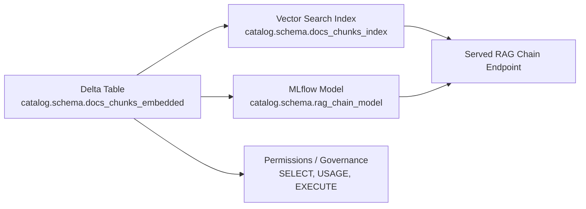

# Delta Table and Unity Catalog

At this stage in the pipeline you have a fully prepared Delta table containing all chunked documents along with their embedding vectors:

**`catalog.schema.docs_chunks_embedded`**

This table is the foundation for Databricks Vector Search and for every downstream RAG component (retrievers, LLM chains, evaluation, model serving).

---

## Table schema

Your final table contains:

* `file_name` (string)
* `page` (int)
* `chunk_id` (int)
* `chunk_text` (string)
* `embedding` (array<float>)

Internally, Delta Lake stores the vector column as an array of floats, which Databricks Vector Search can index directly.

The table lives in:

```
catalog.schema.docs_chunks_embedded
```

which is fully governed by Unity Catalog.

---

## Why Unity Catalog matters

Unity Catalog provides a single, centralized governance and security layer across:

* **Tables**
  Such as your embedded chunks table.

* **Vector Search Indexes**
  The vector index you create will also live in the same catalog/schema and inherit governance.

* **Models**
  Any LLM or RAG chain registered via MLflow will also be catalog-governed.

Thus, governance behaves consistently across:

* Data (Delta tables)
* Indexes (vector search)
* Models (LLM endpoints, RAG chain artifacts)
* Functions and other AI assets

This makes it possible to manage privileges, lineage, CI/CD, and auditing across the entire RAG pipeline under the same security model.

---

## Privilege assignment

Unity Catalog supports fine-grained access controls.

To grant read access on the embedded chunk table:

```sql
GRANT SELECT ON TABLE catalog.schema.docs_chunks_embedded TO `analyst_group`;
```

Or for a specific workspace principal:

```sql
GRANT SELECT ON TABLE catalog.schema.docs_chunks_embedded TO `service-principal:rag-app-sp`;
```

You can additionally restrict:

* `UPDATE` and `INSERT` for ingestion pipelines only.
* `SELECT` for LLM-serving endpoints or downstream dashboards.
* `ALL PRIVILEGES` for administrators or CI/CD jobs.

Because Vector Search indexes are also UC objects, you will later grant privileges similarly:

```sql
GRANT USAGE ON INDEX catalog.schema.docs_chunks_index TO `rag_app_group`;
```

and for RAG model assets:

```sql
GRANT EXECUTE ON MODEL catalog.schema.rag_chain_model TO `app_backend_role`;
```

---

## Lineage and auditability

By placing all assets under UC, Databricks automatically captures lineage:

* Raw documents → parsed pages → chunked table → embedded table → vector index → RAG model → model serving
* You can inspect lineage via the UC interface or via system tables.
* This is especially important for regulated workloads (finance, insurance, public sector).

---

## Unity Catalog integration overview 



---

## Summary

* The embedded chunk table is the authoritative knowledge base for your RAG system.
* Unity Catalog enforces consistent governance across tables, vector indexes, and models.
* Access control is implemented with SQL grants.
* Lineage and audit logs give full visibility into how the RAG system uses enterprise data.

Next stage: building the Vector Search index on this table.
