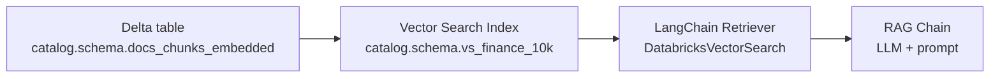
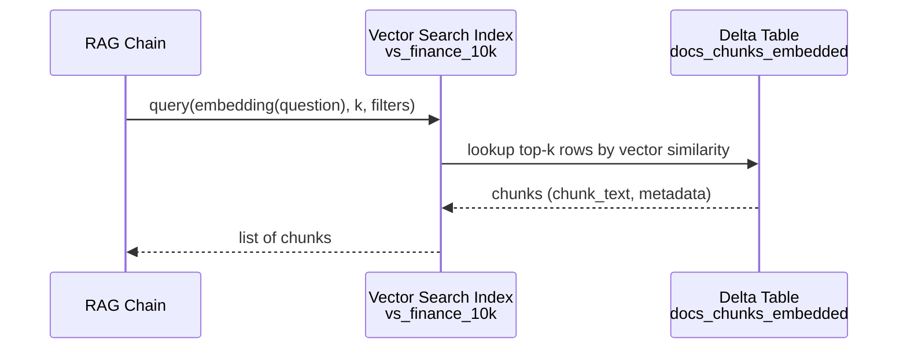

# Databricks Vector Search

Once you have `catalog.schema.docs_chunks_embedded`, the next step is to expose it via Databricks Vector Search. This gives you efficient nearest-neighbor search over the `embedding` column and a clean integration point for RAG.

High-level flow:



---

## Create index from UI

Using Databricks Data Explorer (recommended for first setup):

1. Open the embedded chunks table:

   * Navigate: Data -> your `catalog` -> `schema` -> `docs_chunks_embedded`.
2. Click:

   * `Create vector search index`.
3. Configure the index with the following fields:

   * Endpoint name:

     * Example: `vs-finance-endpoint`.
     * This is the logical Vector Search endpoint on which the index will live.
   * Index name:

     * Example: `catalog.schema.vs_finance_10k`.
     * Use a fully qualified Unity Catalog name for consistency.
   * Primary key:

     * Must uniquely identify each row in `docs_chunks_embedded`.
     * If you do not yet have a PK column, create one (see below).
   * Embedding column:

     * Set this to `embedding`.
   * Embedding dimension:

     * Must match the dimension of the embedding vectors produced by your embedding endpoint (for example 768, 1536, etc.).
   * Sync config:

     * Auto sync:

       * Vector index stays in sync with new or updated rows in your Delta table.
     * Triggered sync:

       * You control when to refresh the index (for example after batch jobs).

After creation:

* The index becomes a UC-governed object:

  * `catalog.schema.vs_finance_10k`.
* You can use it via:

  * Databricks SQL/REST APIs.
  * LangChain DatabricksVectorSearch integration.
  * Native Vector Search APIs.

### Adding a primary key column

If the base table does not have a stable primary key, you must add one.

A simple pattern uses `monotonically_increasing_id`:

```python
from pyspark.sql.functions import monotonically_increasing_id

df = spark.table("catalog.schema.docs_chunks_embedded")

df_with_id = df.withColumn("id", monotonically_increasing_id())

df_with_id.write.format("delta") \
    .mode("overwrite") \
    .option("overwriteSchema", "true") \
    .saveAsTable("catalog.schema.docs_chunks_embedded")
```

This updates the table schema to include:

* `id` (bigint) as a synthetic primary key.

Use this `id` as the PK when configuring the Vector Search index.

Note:

* `monotonically_increasing_id` is stable within the write, but if you rewrite the table completely, IDs will change. For long-lived primary keys, using a deterministic ID (for example a hash of `file_name`, `page`, `chunk_id`) is more robust.

Example deterministic ID:

```python
from pyspark.sql.functions import sha2, concat_ws

df = spark.table("catalog.schema.docs_chunks_embedded")

df_with_id = df.withColumn(
    "id",
    sha2(concat_ws("||", "file_name", "page", "chunk_id"), 256)
)

df_with_id.write.format("delta") \
    .mode("overwrite") \
    .option("overwriteSchema", "true") \
    .saveAsTable("catalog.schema.docs_chunks_embedded")
```

Then the PK is a string hash rather than a monotonically increasing long.

---

## How Vector Search works conceptually

Conceptually, Vector Search:

1. Reads the `embedding` vectors from your Delta table.
2. Builds an index that supports approximate nearest neighbor queries.
3. Exposes an API:

   * Input: query vector (same dimension as table embeddings), plus `k` and optional filters.
   * Output: top-k rows with distances and associated columns.

In the RAG scenario:

* Query side:

  * Embed user question into a vector.
* Index side:

  * Use that embedding as query to find top-k most similar chunks.
* Return:

  * `chunk_text`, `file_name`, `page`, and possibly additional metadata.

These retrieved chunks are then passed as context to the LLM.

Query sequence (at a high level):



---

## LangChain Vector Search retriever

Databricks provides a LangChain integration that wraps the Vector Search index as a retriever. This is what you will plug into your RAG chain.

Pattern (API shape; verify exact import path in your workspace):

```python
from databricks.vector_search.langchain import DatabricksVectorSearch

retriever = DatabricksVectorSearch(
    endpoint_name="vs-finance-endpoint",
    index_name="catalog.schema.vs_finance_10k",
).as_retriever(
    search_kwargs={"k": 5}
)
```

Key elements:

* `endpoint_name`:

  * Must match the Vector Search endpoint you configured when creating the index.
* `index_name`:

  * Fully qualified UC name of the index, for example:

    * `knowledge_base.kb_finance.vs_finance_10k`.
* `.as_retriever(...)`:

  * Converts the vector search object into a LangChain retriever.
  * `search_kwargs`:

    * `k`: number of nearest neighbors to retrieve.
    * Additional options may include filters by metadata, similarity thresholds, etc., depending on actual API support. [Unverified]

Once you have `retriever`, you use it in a Runnables-based chain:

* The retriever expects a string query.
* Internally:

  * It embeds the query.
  * Calls the Vector Search index.
  * Returns `Document` objects (LangChain type) with:

    * `page_content` = `chunk_text`.
    * `metadata` including `file_name`, `page`, `id`, etc.

Example of how that flows in the chain (preview, will be elaborated in RAG section):

```python
def format_docs(docs):
    return "\n\n".join(d.page_content for d in docs)

from langchain.schema.runnable import RunnableMap, RunnablePassthrough
from langchain.schema import StrOutputParser
from langchain.prompts import ChatPromptTemplate
from langchain.chat_models import ChatDatabricks

system_template = """
You are a helpful assistant that answers questions using the provided context.
Use only the context. If the answer is not in the context, say you do not know.
"""

human_template = """
Question:
{question}

Context:
{context}
"""

prompt = ChatPromptTemplate.from_messages(
    [
        ("system", system_template),
        ("human", human_template),
    ]
)

llm = ChatDatabricks(endpoint="llm-finance-llama-endpoint")

rag_chain = (
    RunnableMap(
        {
            "question": RunnablePassthrough(),
            "context": retriever | format_docs,
        }
    )
    | prompt
    | llm
    | StrOutputParser()
)
```

In this chain:

* Input: question string.
* `retriever`:

  * Finds top-k chunks for that question via Vector Search.
* `format_docs`:

  * Serializes the chunks into a single context string.
* `prompt`:

  * Constructs a prompt combining system instructions, question, and context.
* `llm`:

  * Generates the answer.

---

## Sync and freshness considerations

Because Vector Search builds its index from `docs_chunks_embedded`, you need to ensure:

* When new documents are ingested and embedded:

  * The Delta table is updated (new rows inserted / updated).
  * The vector index is synced:

    * Auto sync:

      * Index is updated continuously.
    * Triggered:

      * Schedule a sync after your embedding Job completes.

If your RAG system needs fresh content quickly:

* Use auto sync, or
* Schedule embedding + sync jobs at a frequency that matches your SLAs.

If ingestion is large and periodic:

* Triggered sync may be more predictable and easier to control.

---

At the end of this step:

* You have a Vector Search index over the embedded chunks.
* You have a LangChain retriever wrapping that index.
* You are ready to connect this retriever to a Mosaic AI LLM endpoint and build the full RAG chain.
