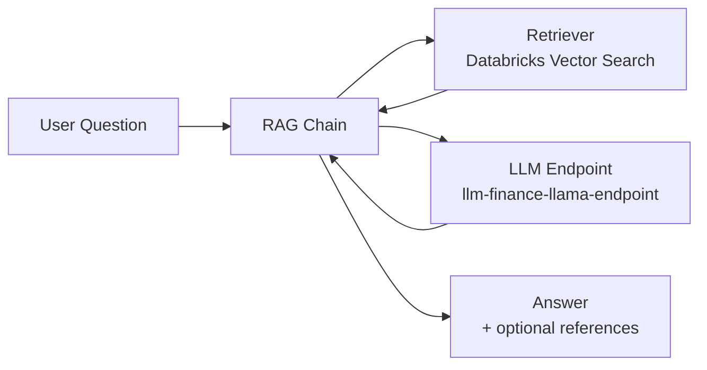

# LLM on Databricks (Mosaic AI)

This section describes how to plug a Databricks-hosted LLM (Mosaic AI via Model Serving) into your RAG pipeline using LangChain.

Assumptions:

* You already have:

  * A Vector Search retriever (as in section 5).
  * Chunked and embedded documents in a Delta table.
* You have deployed a chat LLM as a Databricks Model Serving endpoint, for example:

  * `llm-finance-llama-endpoint`.

The goal here:

* Wrap the LLM endpoint with `ChatDatabricks`.
* Define a prompt template that injects question + retrieved context.
* Assemble a RAG chain that:

  * Takes a user question.
  * Retrieves relevant chunks via Vector Search.
  * Calls the LLM with a structured prompt.
  * Returns an answer.

High-level interaction:



---

## LangChain ChatDatabricks

`ChatDatabricks` is LangChain’s wrapper around a Databricks-hosted chat model.

### Prompt design

You define two message templates:

* System message:

  * Global behavior, constraints, and expectations for the LLM.
* Human message:

  * Where you inject the user question and the retrieved context.

Example:

```python
from langchain.chat_models import ChatDatabricks
from langchain.prompts import ChatPromptTemplate
from langchain.schema import StrOutputParser
from langchain.schema.runnable import RunnableMap, RunnablePassthrough

system_template = """
You are a helpful assistant that answers questions about financial documents.
You must only use the given context. If information is missing, say you do not know.
Be concise and factual.
"""

human_template = """
Question:
{question}

Context:
{context}
"""

prompt = ChatPromptTemplate.from_messages(
    [
        ("system", system_template),
        ("human", human_template),
    ]
)
```

Key details:

* `system_template` enforces:

  * Use only provided context.
  * Avoid hallucinating.
  * Style: concise, factual.
* `human_template` defines the variables:

  * `{question}`: user question.
  * `{context}`: serialized text from retrieved chunks.

These variable names must match the keys you pass from the chain.

### LLM binding

You then create a `ChatDatabricks` instance pointing to your LLM endpoint:

```python
llm = ChatDatabricks(
    endpoint="llm-finance-llama-endpoint"
)
```

Requirements:

* `llm-finance-llama-endpoint` is an active Databricks Model Serving endpoint exposing a chat model.
* The endpoint contract must be compatible with `ChatDatabricks` in your Databricks runtime.
* The cluster or serving runtime must have permission to call this endpoint.

---

## Assemble the RAG chain

Now you connect:

* The retriever (from Vector Search).
* The prompt.
* The LLM.
* Output parsing.

### Helper: formatting retrieved documents

`retriever` returns a list of `Document` objects, each with:

* `page_content`: the chunk_text.
* `metadata`: anything you propagated (file_name, page, id, etc).

You need to convert this list into a single `context` string for the LLM:

```python
def format_docs(docs):
    return "\n\n".join(d.page_content for d in docs)
```

You can get fancier by:

* Adding document titles, file names, or page numbers.
* Prefixing each chunk with a numbered marker.
* Including citations inline.

But for a minimal RAG, simple concatenation is enough.

### RAG chain definition

You build the RAG pipeline using LangChain Runnables:

```python
rag_chain = (
    RunnableMap(
        {
            "question": RunnablePassthrough(),
            "context": retriever | format_docs,
        }
    )
    | prompt
    | llm
    | StrOutputParser()
)
```

Breakdown:

* `RunnableMap`:

  * Builds a dict with keys:

    * `"question"`: passes the original input through unchanged.
    * `"context"`: pipes the original input into:

      * `retriever`: does semantic search on the Vector Search index.
      * `format_docs`: creates a single context string from retrieved chunks.
  * Result: `{"question": <question>, "context": <context_string>}`.
* `| prompt`:

  * Maps that dict into a `ChatPromptValue` according to `ChatPromptTemplate`.
* `| llm`:

  * Sends the resulting prompt to the Databricks-hosted chat model.
* `| StrOutputParser()`:

  * Extracts the final text from the chat response.

Data flow through the chain:

```mermaid
flowchart LR
    Q[Question string] --> M[RunnableMap]
    M -->|question| P1[Prompt template: {question}]
    M -->|context| R[Retriever] --> F[format_docs] --> P2[Prompt template: {context}]
    P1 --> P[ChatPromptTemplate]
    P2 --> P
    P --> L[ChatDatabricks (LLM)]
    L --> O[StrOutputParser]
    O --> A[Answer string]
```

### Usage

You call the chain with a plain string:

```python
question = "Describe the competitive landscape for Walmart."
answer = rag_chain.invoke(question)
print(answer)
```

Behavior:

1. `RunnableMap`:

   * `question`: `"Describe the competitive landscape for Walmart."`
   * `context`:

     * `retriever` uses Vector Search to get top-k chunks relevant to the question.
     * `format_docs` concatenates them into a context string.
2. `prompt`:

   * Creates a chat-style prompt with:

     * system: instructions.
     * human: question + context.
3. `llm`:

   * Generates a response grounded in the retrieved chunks.
4. `StrOutputParser`:

   * Returns the assistant reply as a plain string.

This matches the demo behavior: asking about Walmart, with answers grounded on 10-K filings.

---

## Guardrails and prompt hardening

To make the RAG behavior robust:

* Strengthen system message:

  * Explicitly instruct the model not to fabricate data.
  * Require explicit indication when the answer is not known.
* Include explicit format instructions:

  * Bullet points.
  * JSON structure.
  * Short answers vs detailed ones.
* Include constraints:

  * No speculation.
  * No legal or financial advice disclaimers, if needed.
* Optionally add:

  * A safety / content filter layer after LLM output.

Example stronger system prompt:

```python
system_template = """
You are a retrieval-augmented assistant answering questions about financial documents.
Use only the supplied Context when answering.
If the Context does not contain the answer, say exactly: "I do not know based on the provided documents."
Do not guess or fabricate numbers or facts.
Be concise, factual, and reference specific figures or sentences from the Context when possible.
"""
```

---

## Multi-turn vs single-turn behavior

The RAG chain defined above is stateless and single-turn:

* Each call is independent.
* No chat history is kept.

If you need multi-turn behavior:

* Extend the prompt to include conversation history.
* Manage history separately (for example in the client or another store).
* Inject history alongside the latest question and retrieved context.

Pattern:

* Input:

  * `{"history": [...], "question": "..." }`
* Chain:

  * Use `RunnableMap` to combine:

    * `history` (previous messages).
    * `context` (retrieved for the new question).
  * Expand prompt to include history.

That is an extension of the same building blocks, not a different architecture.

---

At this point:

* You have a Vector Search retriever wired into a Mosaic AI LLM.
* You have a LangChain RAG chain that turns raw questions into grounded answers.
* Next steps (later sections) will cover:

  * MLflow integration to track runs and register this chain as a model.
  * Serving it as a Databricks Model Serving endpoint.
  * Using playground and eval apps for evaluation and feedback.
