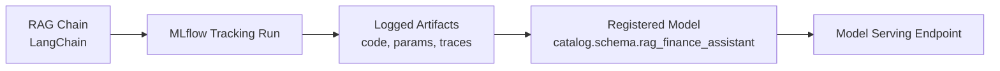
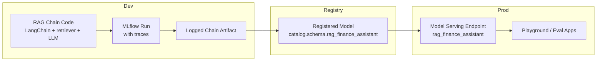

# MLflow integration

MLflow is the backbone for:

* Capturing traces and debugging your RAG chain.
* Packaging the chain as a model.
* Registering that model into Unity Catalog.
* Later: serving and evaluating it.

End-to-end view:



---

## Traces and autologging

Goal:

* Inspect RAG internals:

  * Input question.
  * Retrieval calls.
  * Retrieved chunks.
  * Prompt text.
  * LLM responses.
* Store all this under a single MLflow run so you can:

  * Debug behavior.
  * Compare different RAG configurations.
  * Audit what the model did for a given query.

MLflow has LangChain integration that can capture traces automatically. Exact APIs and capabilities depend on your Databricks runtime and MLflow version. [Unverified]

Pattern:

```python
import mlflow

# Enable LangChain autologging for MLflow [Unverified]
mlflow.langchain.autolog()

with mlflow.start_run():
    q = "What are the key risks highlighted in the latest 10-K for Walmart?"
    a = rag_chain.invoke(q)
    print(a)
```

Expected effects in the MLflow UI:

* One run under the current experiment with:

  * Parameters:

    * Any explicit params you set (for example `k`, model name, embedding model).
  * Metrics:

    * Any metrics you log manually (for example latency, token counts, quality scores).
  * Artifacts:

    * Serialized chain definition.
    * Optional prompt templates.
  * Traces:

    * Step-by-step calls for:

      * Retriever:

        * Query string.
        * Vector Search parameters.
        * Retrieved chunk ids and metadata.
      * LLM:

        * Prompt text.
        * Response text.
        * Possibly token usage.

### Manual logging if autologging is limited

If `mlflow.langchain.autolog()` is not available or incomplete in your environment, you can still get observability by logging key items manually.

Example:

```python
import mlflow
import time

with mlflow.start_run():
    question = "What are the key risks highlighted in the latest 10-K for Walmart?"
    mlflow.log_param("rag_version", "v1")
    mlflow.log_param("retriever_k", 5)

    t0 = time.time()
    answer = rag_chain.invoke(question)
    latency_s = time.time() - t0

    mlflow.log_metric("latency_s", latency_s)
    mlflow.log_text(question, "inputs/question.txt")
    mlflow.log_text(answer, "outputs/answer.txt")
```

You can extend this with:

* Logging retrieved chunks as JSON.
* Logging prompts.
* Logging custom evaluation metrics (for example heuristic scores).

This gives you a consistent audit trail even without deep trace integration.

---

## Log and register the RAG chain as a model

You want the RAG chain itself to be:

* Logged as an MLflow model artifact.
* Registered as a model under Unity Catalog so it can be:

  * Served as an endpoint.
  * Promoted across environments.
  * Governed like any other model.

MLflow provides a LangChain model flavor. API support depends on your MLflow version and Databricks runtime. [Unverified]

Pattern:

```python
with mlflow.start_run() as run:
    sample_question = "Describe the competitive landscape for Walmart."
    _ = rag_chain.invoke(sample_question)  # optional warm-up, good for signature inference 

    mlflow.langchain.log_model(
        lc_model=rag_chain,
        artifact_path="model",
        registered_model_name="catalog.schema.rag_finance_assistant"
    )
```

Effects:

* Under the current run:

  * Artifact `model` is created, representing the RAG chain.
* In the MLflow Model Registry (Unity Catalog aware):

  * A new registered model is created:

    * `catalog.schema.rag_finance_assistant`.
  * A new version (for example version 1) is associated with this run.

From that point:

* `catalog.schema.rag_finance_assistant` is a first-class model in Unity Catalog:

  * You can set permissions on it (`GRANT EXECUTE`).
  * You can track and promote versions (`Staging`, `Production`).
  * You can attach descriptions and tags (for example `domain=finance`, `rag=true`).

### If `mlflow.langchain.log_model` is not available

If your environment does not support the LangChain flavor, you can wrap the chain as a PythonModel.

Sketch:

```python
import mlflow
from mlflow.pyfunc import PythonModel

class RagPyfunc(PythonModel):
    def __init__(self, rag_chain):
        self.rag_chain = rag_chain

    def predict(self, context, model_input):
        # Expect a DataFrame or dict-like input; here assume a column "question"
        if isinstance(model_input, dict):
            q = model_input["question"]
        else:
            # For pandas DataFrame, take first row
            q = model_input["question"].iloc[0]
        return self.rag_chain.invoke(q)

rag_pyfunc = RagPyfunc(rag_chain)

with mlflow.start_run():
    mlflow.pyfunc.log_model(
        artifact_path="model",
        python_model=rag_pyfunc,
        registered_model_name="catalog.schema.rag_finance_assistant"
    )
```

Key points:

* `predict` must follow the MLflow PyFunc contract.
* Input format for serving will follow that `predict` contract.
* The model will still be registered as:

  * `catalog.schema.rag_finance_assistant`.

### Model registration and versioning behavior

Once logged:

* The first registration creates:

  * Model:

    * `catalog.schema.rag_finance_assistant`.
  * Version:

    * `1`.
* Subsequent registrations with the same `registered_model_name` create:

  * Versions `2`, `3`, etc.

You can manage:

* Stages:

  * `None`, `Staging`, `Production`, etc.
* Descriptions and tags:

  * For example:

    * `mlflow.set_tag("domain", "finance")`
    * `mlflow.set_tag("type", "rag_chain")`.

---

## MLflow-centric view of the RAG lifecycle

End-to-end RAG lifecycle with MLflow:



Roles:

* During development:

  * Use MLflow runs and traces to debug retrieval and prompting.
* When stable:

  * Log the chain as a model and register it in Unity Catalog.
* For production:

  * Serve a specific model version using Databricks Model Serving.
* For feedback and iteration:

  * Use eval apps, logs, and new MLflow runs to refine the chain and create new registered versions.

At this point, the RAG chain is fully captured in MLflow and registered as a Unity Catalog model, ready to be exposed as a serving endpoint in the next step.
