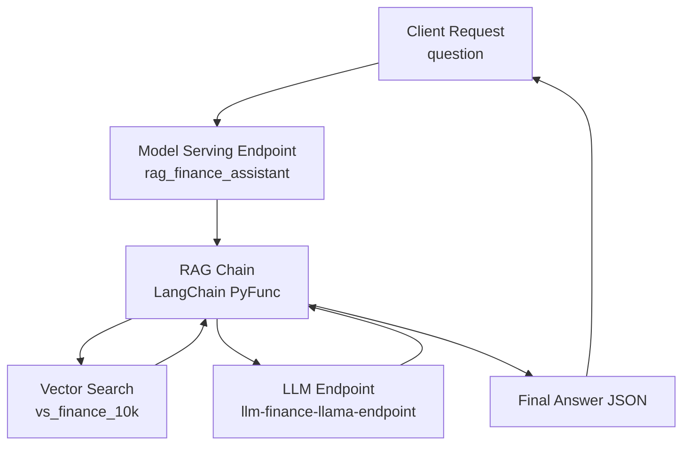

# Model Serving

With the RAG chain registered as a Unity Catalog model, Databricks Model Serving becomes the final operational layer. This turns your entire RAG pipeline into a production-grade, scalable, low-latency API endpoint.

End-to-end behavior of the served model:



The endpoint wraps everything:

* Embedding the user question
* Retrieving top-k chunks from Vector Search
* Formatting context
* Constructing prompt
* Calling Mosaic AI LLM
* Returning the answer

All inside a single REST call.

---

## Deploying the model as a serving endpoint

Once the model is registered as:

```python
catalog.schema.rag_finance_assistant
```

you can deploy it from the Databricks UI.

**Steps:**

1. Open **Serving & Endpoints** in Databricks.

2. Click **Create Serving Endpoint**.

3. Choose **Model** (not Function).

4. Select:

   ```python
   catalog.schema.rag_finance_assistant
   ```

5. Select a specific model version (e.g. version 1, 2, etc.).

6. Configure the serving compute:

   * **Serverless** (recommended where available).
   * Or **Classic/Pro** compute.
   * Autoscaling settings: min/max number of replicas.
   * Max concurrency per worker.

7. Click **Create & Deploy**.

The endpoint becomes accessible at:

```python
/serving-endpoints/rag-finance-assistant/invocations
```

or whatever name you choose.

---

## How the endpoint processes requests

When called, the endpoint executes the RAG chain you logged with MLflow:

1. Extracts field `question` from JSON input.
2. Passes `question` to the chain's `predict` or LangChain invocation.
3. Inside the chain:

   * Converts question to embedding.
   * Calls your Vector Search index.
   * Retrieves top-k relevant chunks.
   * Formats the context.
   * Builds the structured prompt (system + human messages).
   * Calls the Mosaic AI LLM serving endpoint.
   * Returns the generated answer.
4. Sends the result back as JSON.

Everything in the RAG workflow remains inside Databricks:

* No external services.
* No cross-cloud calls.
* Fully governed by Unity Catalog.

---

## Testing the endpoint via UI

Databricks lets you:

* Send a test query directly inside the endpoint page.
* Inspect latency and logs.
* View model version and lineage:

  * Registered Model → MLflow Run → Vector Search index → Delta tables.

This is extremely useful for debugging end-to-end behavior.

---

## Testing the endpoint via REST

Below is a typical client-side invocation.
**The exact JSON contract depends on the model flavor you logged.**
If you used:

* `mlflow.langchain.log_model`:

  * Expect the input form required by that MLflow flavor.
* `mlflow.pyfunc` wrapper:

  * Expect a DataFrame-style structure with a `"question"` field.

Example REST pattern:

```bash
curl -X POST \
  -H "Authorization: Bearer <TOKEN>" \
  -H "Content-Type: application/json" \
  https://<databricks_host>/serving-endpoints/rag-finance-assistant/invocations \
  -d '{"inputs": {"question": "Describe the competitive landscape for Walmart."}}'
```

The response will be JSON, typically:

```json
{
  "predictions": [
    "Walmart faces competition primarily from ... (summarized answer)"
  ]
}
```

This depends on:

* The MLflow model wrapper.
* The output parser (`StrOutputParser`).

---

## Production considerations

To make the endpoint production-ready:

* Enable **autoscaling** for variable workload.
* Apply appropriate **permissions** in Unity Catalog:

  ```sql
  GRANT EXECUTE ON MODEL catalog.schema.rag_finance_assistant TO `finance-app-role`;
  ```

* Use **monitoring**:

  * Latency, request counts, LLM token usage.
* Use **evaluation pipelines**:

  * To score model quality with internal metrics.
  * To automatically promote new versions.

You can also create:

* **A/B experiments** with two RAG model versions.
* **Shadow traffic** for evaluating a new model silently.

---

## At this stage

Your full RAG system is now:

* Indexed with Vector Search
* Backed by fully Delta + Unity Catalog–governed data
* Using a Mosaic AI LLM via Databricks Serving
* Packaged and versioned with MLflow
* Deployed as a reproducible, scalable serving endpoint
* Accessible via REST, SDKs, or the UI

Next steps (beyond this document) would typically include:

* User-facing applications
* Evaluation and monitoring dashboards
* Continuous ingestion / indexing pipelines
