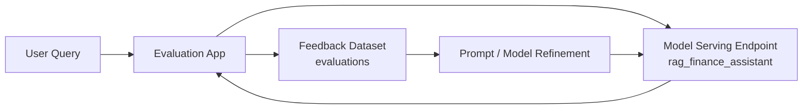
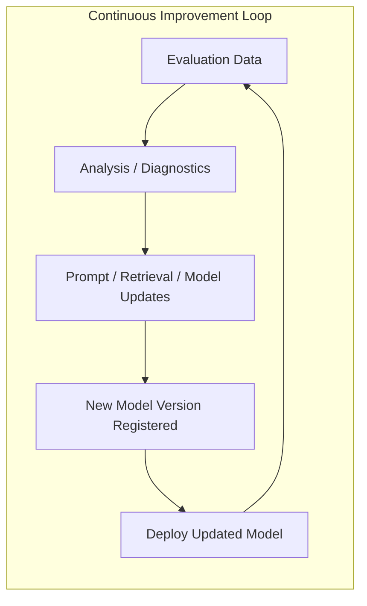

# Evaluation and feedback

With your RAG model deployed as a serving endpoint, the final operational stage is structured evaluation. Databricks provides built-in evaluation / review apps that allow you to collect grounded, human-rated feedback on your model’s outputs. This turns subjective user assessments into measurable datasets for continuous improvement.

High-level view:

---

## Creating an evaluation app from the model

Databricks enables you to launch an evaluation UI directly from either:

* The model registry page for `catalog.schema.rag_finance_assistant`, or
* The serving endpoint page if the endpoint is already deployed.

**Steps:**

1. Navigate to your model or serving endpoint.

2. Click the action labeled something like:

   * **Create evaluation app**
   * **Create review app**

3. Configure the evaluation app:

   **Input schema:**

   * Define the fields users will provide, typically:

     * `question`: string
       If your model accepts more structured input, include those as well.

   **Output fields:**

   * Show the model’s response fields. Usually:

     * `answer`: the final generated text.
     * `references`: optional, if your RAG chain returns citations or source metadata.

   **Evaluation questions:**

   * Decide which quality dimensions reviewers will score:

     * Accuracy (Did the answer reflect the document content?)
     * Relevance (Was the answer focused on the question?)
     * Completeness (Did it miss important context?)
     * Safety / Appropriateness (No policy-violating or harmful content?)
     * Helpfulness / Clarity.

4. Deploy the evaluation app.

Databricks will create a hosted web interface where users can:

* Enter arbitrary questions.
* Inspect model-generated answers.
* Provide structured feedback.

This UI is backed by model-serving requests and a feedback storage layer.

---

## How users interact with the evaluation app

Through the web UI, a reviewer:

1. Types a question into the input panel.
2. The app sends a request to your serving endpoint:

   * `rag_finance_assistant`.
3. The RAG pipeline runs:

   * Vector Search retrieval.
   * Prompt assembly.
   * LLM answer generation.
4. The answer is displayed on screen.
5. The reviewer provides labels:

   * **Accuracy:** correct / partially correct / incorrect.
   * **Relevance:** relevant / off-topic.
   * **Safety:** acceptable / potentially unsafe.
   * **Usefulness:** useful / not useful.

These form structured evaluation datapoints.

All feedback is automatically stored as an evaluation dataset.

---

## What happens to the evaluation dataset

Every submission becomes a row in a managed evaluation table that includes:

* The input question.
* The model’s response.
* Metadata:

  * Model version.
  * Endpoint ID.
  * Timestamp.
  * User (if enabled).
* Reviewer annotations:

  * Score for each evaluation dimension.
  * Optional comments.
* Optional context:

  * Retrieved chunk metadata (if you choose to log it).

You can export or query the dataset for:

* QA auditing.
* Regression testing.
* Analytics dashboards.
* Governance / compliance reporting.
* Dataset construction for fine-tuning.

---

## Using feedback for iterative improvement

The collected evaluation dataset becomes the backbone of your improvement pipeline:

* **Prompt engineering:**

  * Identify weak responses.
  * Adjust system instructions.
  * Modify context formatting or chunk metadata.
* **Retriever refinement:**

  * Increase `k`.
  * Add filters (e.g., document type, section).
  * Improve chunking heuristics.
* **Embedding model selection:**

  * Switch to higher-quality embedding models.
  * Re-embed documents and rebuild index.
* **Model selection / A/B testing:**

  * Compare LLM endpoints.
  * Promote versions in the registry based on evaluation scores.
* **Fine-tuning (optional):**

  * Use evaluated Q/A pairs to fine-tune an LLM specific to your domain.
  * Databricks supports fine-tuning workflows for various model families.

This closes the loop:

---

## Summary

The evaluation app provides a feedback-driven development cycle for your RAG system:

* Human-in-the-loop quality review.
* Centralized storage of feedback.
* Governance and lineage through Unity Catalog.
* A direct path to improve prompts, retrievers, and LLMs.
* Enables fine-tuning and version promotion workflows.

With evaluation in place, your RAG system becomes measurable, improvable, and production-grade.
