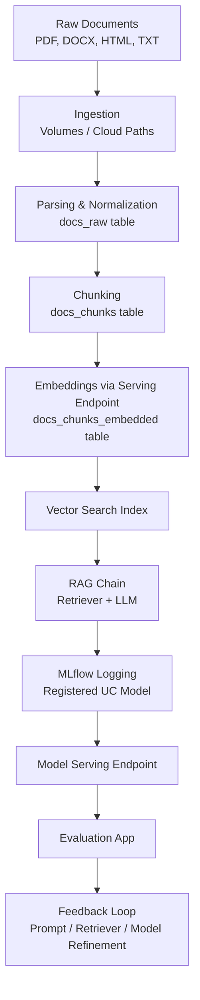
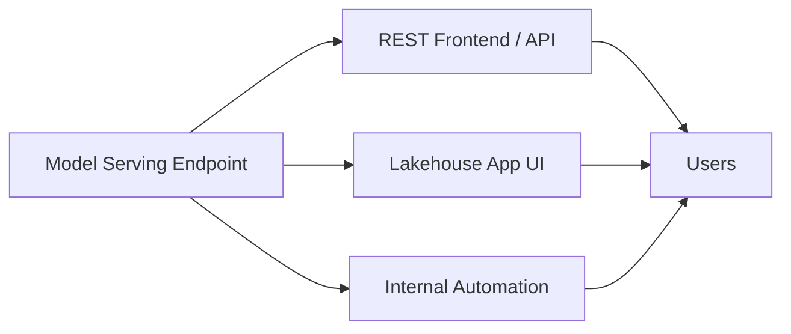

# Complete Databricks-only RAG checklist

The following checklist represents a full, production-grade Retrieval-Augmented Generation (RAG) implementation that uses **only Databricks-native capabilities**. No external preprocessors or third-party pipelines are assumed. Each step corresponds directly to Databricks features: Volumes, Delta, Unity Catalog, Vector Search, Mosaic AI Model Serving, LangChain integration, and MLflow logging.

To reinforce the full pipeline, diagrams are included.

---



---

## 1. Store docs

**Goal:** Raw documents become available inside the Databricks environment.

You place your files in one of:

* Databricks **Volumes** (recommended: governed storage under Unity Catalog).
* Cloud object storage paths (`s3://`, `abfss://`, `gs://`) referenced directly.

Example:

```python
doc_dir = "/Volumes/company_docs/raw/sec_filings"
```

---

## 2. Parse and normalize

You write a Databricks notebook or automated Job that:

* Walks through the document directory.
* Parses each document (PDF / DOCX / HTML / TXT).
* Extracts text (per-page or per-section).
* Produces structured rows:

  * `file_name`
  * `page`
  * `text`
  * any additional metadata.

Write to a Delta table:

```python
df_raw.write.format("delta").mode("overwrite").saveAsTable(
    "catalog.schema.docs_raw"
)
```

---

## 3. Chunk

You implement a chunking function in Python:

* Sentence-aware splitting.
* Configurable length (`max_chars`, `overlap`).
* Use Pandas UDFs or `mapInPandas` to scale.

Write chunks to:

* `catalog.schema.docs_chunks`

Each row includes:

* `file_name`
* `page`
* `chunk_id`
* `chunk_text`

---

## 4. Embed

You expose an embedding model as a Databricks **model serving endpoint**.

Your preprocessing job:

* Reads `docs_chunks`.
* Sends `chunk_text` to the embedding endpoint in batches.
* Receives vectors (`array<float>`).
* Saves enriched rows to:

  * `catalog.schema.docs_chunks_embedded`

Add a primary key (e.g., `id`) for Vector Search.

Example:

```python
df_with_id = df.withColumn("id", monotonically_increasing_id())
```

---

## 5. Vector Search

From the Databricks UI (Data Explorer):

* Open `docs_chunks_embedded`.
* Create a Vector Search index:

  * Endpoint name: `vs-finance-endpoint`
  * Index: `catalog.schema.vs_finance_10k`
  * Primary key: `id`
  * Embedding column: `embedding`
  * Auto-sync or triggered-sync.

In LangChain, use:

```python
retriever = DatabricksVectorSearch(
    endpoint_name="vs-finance-endpoint",
    index_name="catalog.schema.vs_finance_10k",
).as_retriever(search_kwargs={"k": 5})
```

---

## 6. RAG chain

A Mosaic AI LLM is deployed as a Databricks **LLM serving endpoint**.

You wire up LangChain:

* `DatabricksVectorSearch` retriever
* `ChatDatabricks` LLM
* Prompt template combining:

  * the question
  * retrieved document context

Assemble full RAG chain:

```python
rag_chain = (
    RunnableMap(
        {
            "question": RunnablePassthrough(),
            "context": retriever | format_docs,
        }
    )
    | prompt
    | llm
    | StrOutputParser()
)
```

---

## 7. MLflow

Use MLflow to:

* Capture traces.
* Inspect retrieved documents.
* View LLM calls.
* Register the chain as a model.

Example:

```python
mlflow.langchain.log_model(
    lc_model=rag_chain,
    artifact_path="model",
    registered_model_name="catalog.schema.rag_finance_assistant"
)
```

Unity Catalog now governs:

* Permissions
* Lineage
* Versioning
* Lifecycle policies

---

## 8. Serving

Deploy the registered model as a Databricks **Model Serving endpoint**.

The endpoint performs:

* Retrieval (Vector Search)
* Prompt construction
* LLM call
* Final answer assembly

It is fully callable from:

* REST
* In-platform UIs
* Databricks Lakehouse Apps

---

## 9. Evaluation

Create an **evaluation (review) app**:

* Input schema: `question`
* Output fields: `answer`, `references` (if added)
* Quality metrics: accuracy, relevance, safety, usefulness

Human reviewers generate a structured labeled dataset.

This dataset becomes a key asset for:

* Diagnostics
* Prompt iteration
* Embedding/LLM selection
* Fine-tuning workflows 

---

## 10. Productionize

Finally, harden the system:

* **Guardrails**

  * Limit hallucinations (prompt engineering, LLM moderation filters)
  * Restrict available tools or model abilities 
* **Rate limiting**

  * Configurable in Model Serving
* **Monitoring**

  * Endpoint latency
  * Retrieval depth
  * Model error rates
  * MLflow traces
* **Security**

  * Unity Catalog permissions on:

    * Delta tables
    * Vector Search indexes
    * Models
    * Volumes
* **Integration**

  * REST frontends
  * Internal business apps
  * Databricks Lakehouse Apps for UI



---

This completes the full Databricks-native RAG pipeline. The system is fully contained within Databricks governance, storage, compute, and serving layers, making it secure, scalable, and production-ready.
