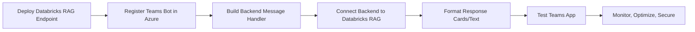

# How to Integrate a Databricks RAG Chatbot into Microsoft Teams

Multiple official and credible sources confirm Teams integration:

* Databricks confirms that Genie Conversation APIs can be embedded into collaboration platforms including Teams.  
  Source: [Databricks Blog](https://www.databricks.com/blog/genie-conversation-apis-public-preview)  
* Microsoft provides a fully documented example of a RAG bot in Teams using the Teams AI Library.  
  Source: [Microsoft Learn](https://learn.microsoft.com/en-us/microsoftteams/platform/toolkit/build-a-rag-bot-in-teams)  
* Pipedream demonstrates functional API interactions between Databricks and Teams.  
  Source: [Pipedream](https://pipedream.com/apps/databricks/integrations/microsoft-teams)  

Together these sources confirm that a Databricks RAG chatbot **can be integrated** into Microsoft Teams.

---

## High-level architecture

```mermaid
flowchart LR
    A[Teams User] --> B[Teams Bot]
    B --> C[Backend Service]
    C --> D[Databricks RAG Pipeline<br>Vector Search + LLM]
    D --> C
    C --> B
    B --> A
````

Detailed architecture reference: [Microsoft Learn RAG Bot Architecture](https://learn.microsoft.com/en-us/microsoftteams/platform/toolkit/build-a-rag-bot-in-teams)

---

## Components required

### Bot registration (Teams + Azure Bot Service)

* Create a Teams App manifest and register a bot through Azure Bot Service.
* Configure messaging endpoint, allowed domains, and Teams channel.
* Optional: Configure OAuth or on-behalf-of token flows (Azure AD / Entra).

Reference implementation:

[GitHub example for Teams–Genie integration](https://github.com/HariGS-DB/TeamsGenieIntegration)

### Authentication and security

* Authenticate backend to Databricks using Genie API credentials (host, space_id, access token).
  * [Genie API documentation:](https://docs.databricks.com/gcp/en/genie/conversation-api)
* Handle user identity mapping for secure data access (Unity Catalog permissions).
* Secure bot endpoint and ensure only approved users can interact with backend.
  * [Azure AD on-behalf-of flow explained here:](https://techcommunity.microsoft.com/blog/analyticsonazure/supercharge-data-intelligence-build-teams-app-with-azure-databricks-genie--azure/4442653)

### Backend architecture

Your backend receives Teams messages, calls the Databricks RAG endpoint, and formats responses.

```mermaid
sequenceDiagram
    participant T as Teams User
    participant B as Teams Bot
    participant S as Backend Service
    participant R as Databricks RAG Endpoint

    T->>B: User query
    B->>S: Bot message event
    S->>R: RAG request (vector search + LLM)
    R-->>S: Generated answer
    S-->>B: Formatted response
    B-->>T: Teams message reply
```

[Databricks RAG implementation reference:](https://www.databricks.com/blog/implementing-rag-chatbot-using-databricks-and-pinecone)

### Latency, concurrency, and optimization

* Minimize embedding retrieval latency.
* Optimize prompt length.
* Scale model serving endpoints to handle multiple users.

### Conversation state management

* Store conversation memory (Redis, database, etc.) or rely on Genie API conversation_id.

[Genie API stateful features described here:](https://www.databricks.com/blog/genie-conversation-apis-public-preview)

### UI inside Teams

* Render responses using Adaptive Cards or plain messages.
* Optional: Display citations or document sources retrieved from vector search.

### Governance and auditing

* [Use Unity Catalog to enforce data access control.](https://docs.databricks.com/gcp/en/genie/conversation-api)
* Log all queries and responses.
* Monitor user behavior and endpoint performance.

---

## Mapping Teams integration onto your existing Databricks RAG pipeline

If you already have a Databricks-only RAG setup (ingest → index → serving endpoint), your changes are minimal.

Teams simply becomes the front-end interface.

Flow:

1. Teams user sends message.
2. Bot sends message payload to your backend.
3. Backend calls your Databricks RAG endpoint.
4. Databricks performs retrieval + LLM answer.
5. Backend returns formatted result to Teams.

---

## Implementation steps



Step-by-step references:

* [Databricks Genie API](https://docs.databricks.com/gcp/en/genie/conversation-api)
* [Microsoft Teams RAG bot tutorial](https://learn.microsoft.com/en-us/microsoftteams/platform/toolkit/build-a-rag-bot-in-teams)
* [Azure Teams app/Bot registration](https://github.com/HariGS-DB/TeamsGenieIntegration)

---

## Summary

All required components are available today:

* Databricks Genie API or custom RAG endpoint.
* A Teams bot registered in Azure.
* A backend service to connect them.
* Proper authentication, state management, and governance.

With the links above, you now have authoritative source material and the architecture needed to implement this integration.
